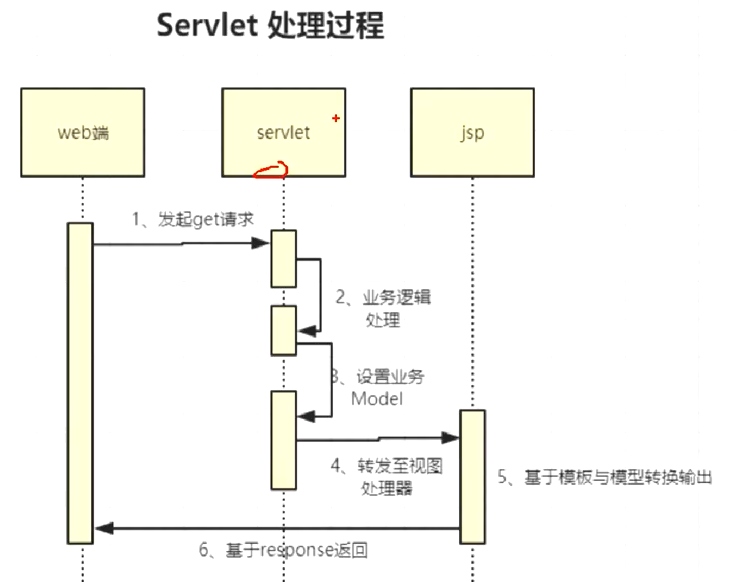
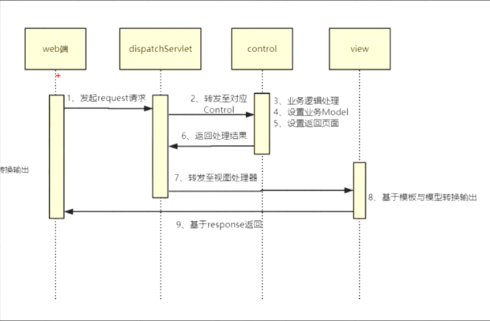

# mvc源码

## 1、servlet与jsp执行过程

## 2、spring mvc执行流程

## 3、spring mvc组件

- HandlerMapping: url与控制器的映射
- HandlerAdapter：控制器适配器
- ViewResolver：视图解析器
- view：具体解析视图
- HandlerExceptionResolver：异常解析器
- HandlerInterceptor：拦截器执行器

## 4、HandlerMapping类型

## 5、HandlerAdapter类型

- Controller：SimpleControllerHandlerAdapter 返回ModelAndView
- HttpRequestHandler：HttpRequestHandlerAdapter 业务自行处理
- Servlet：SimpleServletHandlerAdapter 基于标准的servlet处理
- HandlerMethod：RequestMappingHandlerAdapter 基于@RequestMaping进行处理