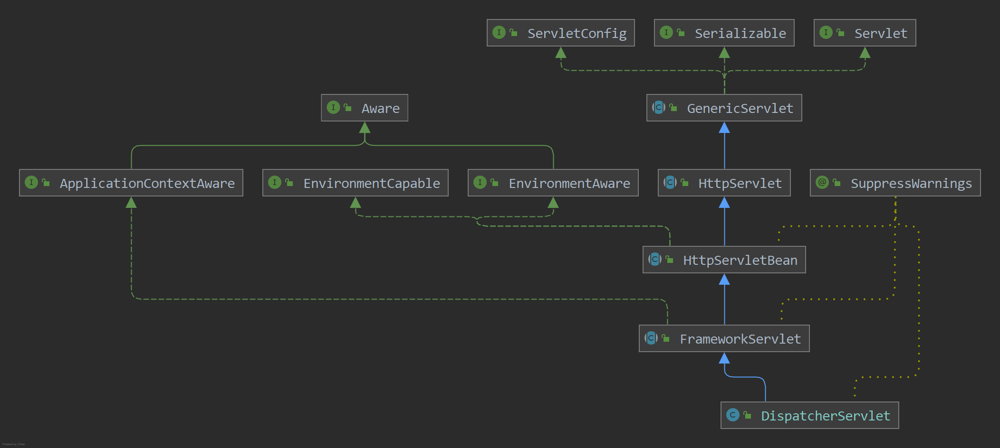

# Spring MVC源码流程

## 1. Spring Boot如何挂在DispatcherServlet？

在 **Springboot** 启动时我们都知道内部内置了一个 **tomcat** 的容器，然后将 **DispatcherServlet** 挂载到了容器的内部从而实现了 **Spring MVC** 机制，下面的链接说明了如何将 **DispatcherServlet** 挂载到了 **Spring Boot** 中

[SpringBoot如何挂载DispatcherServlet](https://blog.csdn.net/weixin_43915643/article/details/125421616)

## 2. DispatcherServlet

下面就是 **DispatcherServlet** 的继承图，从 **HttpServlet** 截至到上面部分都是 **Javax.servlet.http** 所提供的功能，而 **HttpServletBean** 开始就是 **spring** 实现的功能

### 2.1 init()

在 tomcat 启动时并不会去对 **DispatcherServlet** 进行初始化，而是会在 **tomcat** 接收到请求时，如果 **Dispatcher** 还没有被初始化时，这是就会调用 **DispatcherServlet** 的 **init()** 方法进行初始化。初始化方法 **init()** 定义在 **GenericServlet** 中，交给子类进行实现，实际实现类是 **HttpServletBean** 类中对其进行实现

