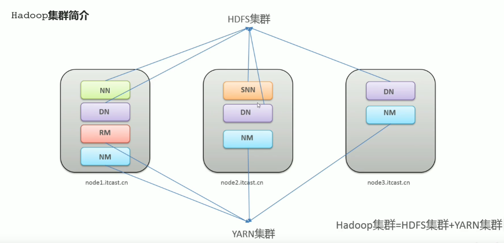
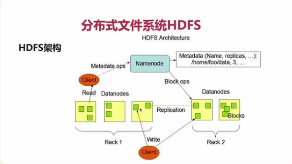
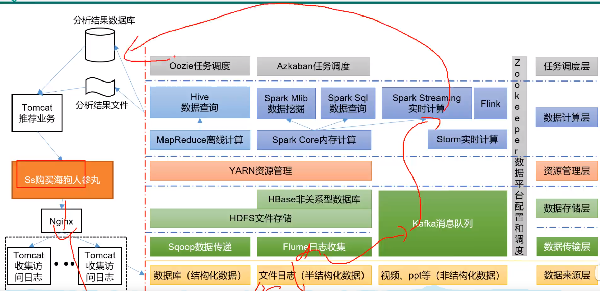

# hadoop

## 1、Hadoop介绍

### 1.1 是什么

- **Apache基金会开发的分布式系统基础架构**

- 海量数据的**存储**和海量数据的**分析计算**
- Hadoop通常指生态圈------hadoop生态圈，例如：hive、hbase

### 1.2 三大发行版本

- Apache：最基础，兼容性不好
- Cloudera：内部集成了很多大数据框架
- Hortionworks：文档比较好

### 1.3 Hadoop优势（4高）

- 高可靠性：Hadoop底层维护多个数据副本
- 高扩展性：在集群间分配任务数据，可方便的扩展数以千计的节点
- 高效性：在MapReduce的思想下，Hadoop是并行工作
- 高容错性：能够自动将失败的任务重新分配

### 1.4 Hadoop1.x  2.x  3.x 区别

- Hadoop1.x
  - HDFS（存储）
  - MapReduce（计算+资源调度）
  - Common（辅助工具）
- Hadoop 2.x
  - HDFS（存储）
  - YARN（资源调度）
  - MapReduce（计算）

## 2、核心组件



### 2.1 NameNode、2NN

- NameNode：管理数据存储在什么地方，存储文件的元数据，如文件名、文件目录结构

- Secondary NameNode(2NN)：每隔一段时间对NameNode的数据进行备份

### 2.2 DataNode

具体存储数据，每一台服务器就是DataNode

### 2.3 YARN

- ResourceManager（RM）：管理整个集群的资源（内存、CPU）

- NodeManager（NM）：单个节点服务器资源的老大

- ApplicationMaster（AM）：单个任务运行的老大
  - 先向RM申请资源，在每个DataNode开启一个MapTask，不管有没有都返回结果

- Container：容器，相当一台独立的服务器，里面封装了任务运行所需要的资源，如内存、CPU
  - 说明1：客户端可以有多个
  - 说明2：集群上可以运行多个ApplicationMaster
  - 说明3：每个NodeManager上可以有多个Container

### 2.4 MapReduce

- Map：划分任务
- Reduce：结果汇总

### 2.5 HDFS\YARN\MapReduce

- HDFS：NameNode、YARN等共同组成了HDFS



## 3、大数据技术生态体系

- 数据传输层：
  - 数据库（结构化数据）：Sqoop数据传递
  - 文件日志（半结构化数据）：Flume日志收集
  - 视频、ppt（非结构化数据）：Kafka消息队列
- 传输层：
  - HDFS
  - HBase
- 资源管理：
  - YARN
- 数据计算：
  - Spark
  - Hive
  - Flink\Spark Streaming：实时计算
- 任务调度：
  - Oozie
  - Azkaban
- Zookeeper：数据平台配置和调度
- 业务模型、数据可视化、业务应用

## 4、推荐系统项目架构



## 5、安装伪集群hadoop

- 下载hadoop二进制包：hadoop-3.2.2.tar.gz
- 解压hadoop包
- 将hadoop安装路径配置到 /etc/profile 中。source /etc/profile环境变量生效

```
export HADOOP_HOME=/usr/local/software/hadoop-3.2.2
export PATH=$PATH:${JAVA_HOME}/bin:${HADOOP_HOME}/bin
```

- 配置hadoop路径下 etc/hadoop/中  core-site.xml、hdfs-site.xml

```
core-site.xml
<configuration>
        <property>
                <name>fs.defaultFS</name>
                <value>hdfs://192.168.60.46:9000</value>
        </property>
        <property>
                <name>hadoop.tmp.dir</name>
                # 指定hadoop数据存储路径，包括namenode等数据
                <value>/usr/local/software/hadoop-3.2.2/tmp</value>
        </property>
</configuration>

hdfs-site.xml

<configuration>
        <property>
        		# 指定备份数，单机运行就1个备份
                <name>dfs.replication</name>
                <value>1</value>
        </property>
        		# 指定namenode和数据节点的存储位置
        <property>
                <name>dfs.namenode.dir</name>
                <value>file:/usr/local/software/hadoop-3.2.2/tmp/name</value>
        </property>
        <property>
                <name>dfs.datanode.data.dir</name>
                <value>file:/usr/local/software/hadoop-3.2.2/tmp/data</value>
        </property>
</configuration>

```

- 启动前使用 ssh localhost 是否需要密码，如果需要则运行下面的指令生成密钥
  - ssh-keygen -t rsa -P '' -f  ~/.ssh/id_rsa
  - cat ~/.ssh/id_rsa.pub >> ~/.ssh/authorized_keys
  - chmod 0600 ~/.ssh/authoried_keys

- hdfs namenode -format  格式化文件系统

- start-dfs.sh 启动服务

  - 如果遇到   ERROR: but there is no HDFS_NAMENODE_USER defined. Aborting operation. Starting datanodes

  ```
  start-dfs.sh 和 stop-dfs.sh写入
  HDFS_DATANODE_USER=root
  HADOOP_SECURE_DN_USER=hdfs
  HDFS_NAMENODE_USER=root
  HDFS_SECONDARYNAMENODE_USER=root
  
  start-yarn 和 stop-yarn.sh写入
  YARN_RESOURCEMANAGER_USER=root
  HADOOP_SECURE_DN_USER=yarn
  YARN_NODEMANAGER_USER=root
  ```

- 访问 ip:9870查看服务是否能够访问


## 贡献文档：

- https://baijiahao.baidu.com/s?id=1684233388094267967&wfr=spider&for=pc