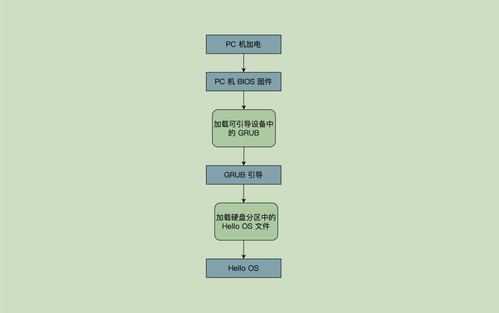
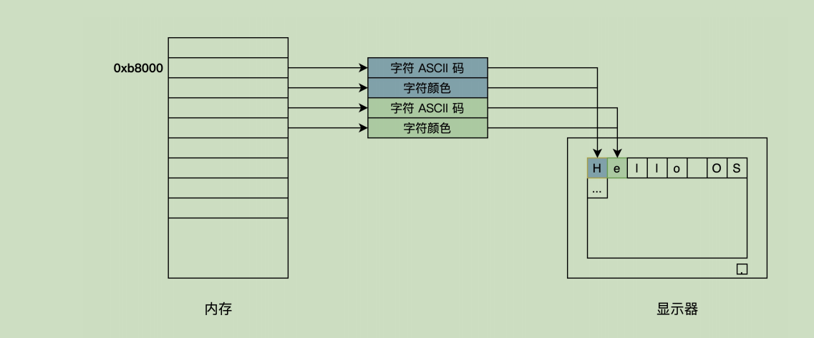
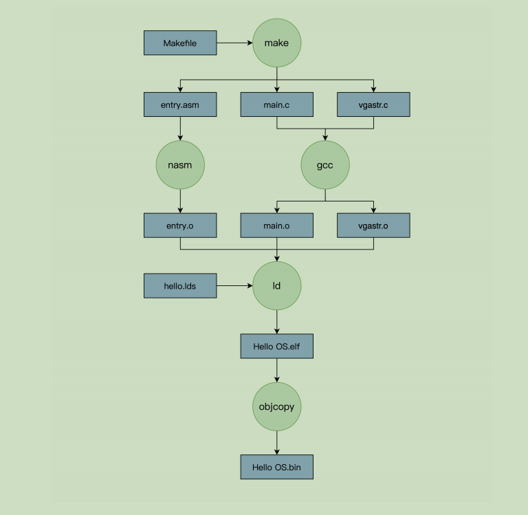

# 1. GRUB引导

GRUB用于计算机进行程序引导的程序，目前暂时不从GRUB开始写。以下是PC机的启动流程；PC机BIOS固件是固化在PC机主板上面的，PC机开机第一条指令就是BIOS固件中的指令，它负责**检查和初始化CPU、内存以及主板平台**，然后加载引导设备，从第一个扇区数据，到0X7C00地址开始的内存空间，再接着跳转到0X7C00处执行指令



# 2. 代码

## 2.1 entry.asm

- 1 - 40 行：定义GRUB多引导协议头，固定的写法；有两个GRUB目的是兼容 GRUB1和2
- 44 - 52行：设定CPU的工作模式
- 54 - 73：初始化CPU的寄存器和C语言的运行环境
- 78 - 87：GDT_START开始的是CPU工作模式所需要的数据

```asm
MBT_HDR_FLAGS	EQU 0x00010003
MBT_HDR_MAGIC	EQU 0x1BADB002 ;多引导协议头魔数
MBT_HDR2_MAGIC	EQU 0xe85250d6 ;第二版多引导协议头魔数
global _start ;导出_start符号
extern main ;导入外部的main函数符号

[section .start.text] ;定义.start.text代码节
[bits 32] ;汇编成32位代码
_start:
	jmp _entry
ALIGN 8
mbt_hdr:
	dd MBT_HDR_MAGIC
	dd MBT_HDR_FLAGS
	dd -(MBT_HDR_MAGIC+MBT_HDR_FLAGS)
	dd mbt_hdr
	dd _start
	dd 0
	dd 0
	dd _entry

;以上是GRUB所需要的头
ALIGN 8
mbt2_hdr:
	DD	MBT_HDR2_MAGIC
	DD	0
	DD	mbt2_hdr_end - mbt2_hdr
	DD	-(MBT_HDR2_MAGIC + 0 + (mbt2_hdr_end - mbt2_hdr))
	DW	2, 0
	DD	24
	DD	mbt2_hdr
	DD	_start
	DD	0
	DD	0
	DW	3, 0
	DD	12
	DD	_entry
	DD      0
	DW	0, 0
	DD	8
mbt2_hdr_end:
;以上是GRUB2所需要的头
;包含两个头是为了同时兼容GRUB、GRUB2

ALIGN 8

_entry:
	;关中断
	cli
	;关不可屏蔽中断
	in al, 0x70
	or al, 0x80
	out 0x70,al
	;重新加载GDT
	lgdt [GDT_PTR]
	jmp dword 0x8 :_32bits_mode

_32bits_mode:
	;下面初始化C语言可能会用到的寄存器
	mov ax, 0x10
	mov ds, ax
	mov ss, ax
	mov es, ax
	mov fs, ax
	mov gs, ax
	xor eax,eax
	xor ebx,ebx
	xor ecx,ecx
	xor edx,edx
	xor edi,edi
	xor esi,esi
	xor ebp,ebp
	xor esp,esp
	;初始化栈，C语言需要栈才能工作
	mov esp,0x9000
	;调用C语言函数main
	call main
	;让CPU停止执行指令
halt_step:
	halt
	jmp halt_step


GDT_START:
knull_dsc: dq 0
kcode_dsc: dq 0x00cf9e000000ffff
kdata_dsc: dq 0x00cf92000000ffff
k16cd_dsc: dq 0x00009e000000ffff
k16da_dsc: dq 0x000092000000ffff
GDT_END:

GDT_PTR:
GDTLEN	dw GDT_END-GDT_START-1
GDTBASE	dd GDT_START

```

## 2.2 main.c

C语言写的main函数代码，用于打印 **Hello OS** ;

```c
void main() { printf("Hello OS!"); return; }


void printf(char* fmt, ...) { _strwrite(fmt); return; }

//指向显存的开始地址 0xb8000，每次+2 就是跳过字符的颜色信息的空间
void _strwrite(char* string) { char* p_strdst = (char*)(0xb8000); while (*string) { *p_strdst = *string++; p_strdst += 2;} return;}
```

PC无论是什么显卡，它们都⽀持⼀种叫 **VESA** 的标准，这种标准下有两种⼯作模式：字符模式和图形模式。所有显卡的厂商为了兼容这个标准，自己实现了一种叫做 **VGABIOS** 的固件程序；

它把屏幕分成24⾏，每⾏80个字符，把这（24*80）个位置映射到以 **0xb8000** 地址开始的内存中，每两个字节对应⼀个字符，其中⼀个字节是字符的ASCII码，另⼀个字节为字符的颜⾊值



# 3. 编译

 下面是编译流程图



