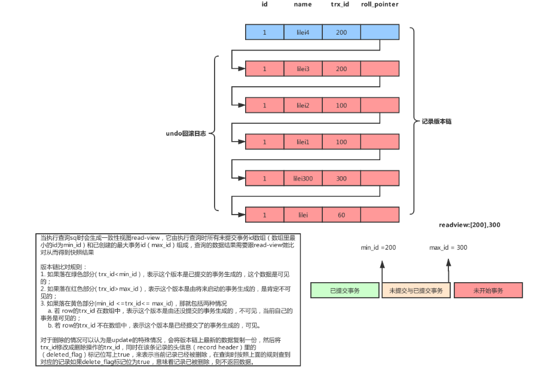

# 一、MVCC机制

## 1. undo日志

​	mysql使用了大量的 **undo日志**、**trx_id** 字段以及 **roll_pointer** 字段来实现的数据回滚。版本链比对规则图：



## 2. 一致性视图（read-view）

​	当mysql开启一个查询时 遇到的select语句会创建一个 **read-view** 一致性视图，这个视图里面保存 一个未提交事务的数组（数组中最小的id为min_id）以及下一个需要分配的最大事务id（max_id）。read-view遇到第一个查询就会生成，不管查询的是哪个表，都会延用第一个一致性视图
​	当mysql遇到查询时，会把版本链数据里面的事务id跟read-view里面的事务id进行对比。read-view是用来解决可重复读的隔离机制对于全表只会生成一次。如果是读未提交那么read-view每一次查询都会更新一次

- trx_id：标识当前生成一致性视图的事务id
- m_ids：表示活跃的事务数组（未提交）
- min_id：在创建一致性视图时，活跃的最小事务id（未提交）
- max_id：下一个需要分配的事务id

```text
例如：
A开启事务，事务id为50：
	trx_id=50，
	m_ids=[50],
	min_id=50,
	max_id=51
B开启事务事务id为51：
	trx_id=51，
	m_ids=[50，51],
	min_id=50,
	max_id=52
根据版本链的比对规则，查询到每行数据时，获取隐藏字段 trx_id 时进行对比，如果不满足再通过 roll_pointer字段再向上查找

版本链对比规则：
    mysql会根据事务id进行划分成 已经提交事务、未提交事务与提交事务、未开始事务
    trx_id < min_id：证明是已经提交事务，那么证明数据可见
    min_id <= trx_id <= max_id：分为两种情况
        如果row的trx_id存在在read-view数组里面，那么就证明还没有提交事务，数据不可见，当前事务可见
        如果row的trx_id不存在在read-view数组里面，那么这个版本是已经提交了的事务生成的，可见
    max_id < trx_id: 表示还未开始的事务生成的，不可见
```


## 3. 修改

​	Mysql会给每个表新增两个字段 trx_id 事务id以及 roll_pointer 回滚指针。如果执行修改语句会先插入数据并且删除原来老的数据并且将其放到undo日志中，然后新的数据roll_pointer字段就存放undo日志中的指针。

## 4. 删除

update的特殊情况，会将版本链中最新的数据复制一份，然后将trx_id修改为删除操作的trx_id，同时将数据头信息（record header）里面的（delete_flag）标记上true代表删除

参考：https://www.cnblogs.com/luozhiyun/p/11216287.html

# 二、事务隔离机制

## 1. 锁分类

- 从性能上分为乐观锁（版本比对）和悲观锁
- 对数据库操作的类型分为读锁和写锁（都属于悲观锁）
 - 读锁（共享锁）：同一份数据，多个读操作可以同时进行不会相互影响
 - 写锁（排它锁）：当前写操作没有完成前，它会阻断其他写锁和读锁
- 从对数据操作的粒度分为，表锁和行锁

## 2. MyISAM

表锁：
 每次都锁住整张表，开销小，加锁快；不会出现死锁；锁的粒度大，发生锁冲突的概率最高，并发度最低表锁一般用在需要数据迁移的时候，做全表操作时候

```mysql
CREATE TABLE `mylock` (
  `id` int(11) NOT NULL AUTO_INCREMENT,
  `NAME` varchar(20) DEFAULT NULL,
  PRIMARY KEY (`id`)
) ENGINE=MyISAM AUTO_INCREMENT=5 DEFAULT CHARSET=utf8;

# 手动添加锁
lock table 表名称 read(write),表名称2 read(write);
# 产看添加过的锁
show open tables;
#删除锁
unlock tables;

INSERT INTO`test`.`mylock` (`id`, `NAME`) VALUES ('1', 'a');
INSERT INTO`test`.`mylock` (`id`, `NAME`) VALUES ('2', 'b');
INSERT INTO`test`.`mylock` (`id`, `NAME`) VALUES ('3', 'c');
INSERT INTO`test`.`mylock` (`id`, `NAME`) VALUES ('4', 'd');
```

```mysql
lock table mylock read;
# 加读锁，当前session和其它session都可以读该表，当前session中插入或者更新锁定表都会报错，其它session等待

lock table mylock write;
# 当前session增删改查都没得问题，其它session对该表所有操作都会阻塞
```

## 3. InnoDB

行锁：
 每次锁操作锁住一行数据，开销大，加锁慢；会出现死锁；锁粒度最小，发生锁冲突的概率最低，并发度最高。commit之后就会释放掉锁

事务隔离级别：

- 读未提交（Read uncommited） 脏读、不可重复读、幻读都可能
- 读已提交（Read commited）不可重复读、幻读可能
- 可重复读（Repeatable read）幻读可能
- 串行化（Serializable）都不可能

```mysql
# 查看当前数据库的事务隔离性
show variables like 'tx_isolation';

# 设置事务隔离级别
set tx_isolation='REPEATABLE-READ';

# 读未提交 无法解决脏读、不可重复读、幻读
set tx_isolation='read-uncommitted';  #客户端A
set session transaction isolation level read uncommitted; #客户端B更新事务隔离级别

# 读以提交 无法解决不可重复读、幻读
set tx_isolation='read-committed';

# 可重复读 无法解决 幻读
set tx_isolation='repeatable-read';
```

## 4. 并发带来的问题

- 更新丢失：10个库存，线程1查询出来为10，线程2查询出来也是10，线程1减掉5个库存这时数据库就是5个，而线程2减掉2个库存并且更新到数据库中就成了8
- 脏读：事务1正在对一条数据进行修改，但是没有提交，而事务2查询出已经修改过的数据，但是事务1遇到错误回滚了，这时候事务2查的数据就有问题
- 不可重复读：一个事务读取某些数据后的某个时间，再次读取以前读过的数据，却发现其读出的数据已经发生了改变、或者某个记录被删除了。 一句话：事务A读取到了事务B已经提交的修改过的数据
- 幻读：一个事务按相同的条件查询重新读已经检索过的数据，发现其他事务插入了满足其条件的新数据。一句话：事务A读取到了事务B提交的新增数据

## 5. 间隙锁

**在某些情况下可以解决幻读**

```mysql
# 这个时候数据之间的所有间隙就会被锁上，其它事务插入时就会被阻塞，就不能插入进去
update account set name='123' where id > 8 and id < 20
```

**InnoDB的行锁是针对索引加的锁，不是针对记录加的锁，并且该索引不能失效，否则都会从行锁升级为表锁**

## 7. 死锁

```mysql
# 查看近期死锁日志信息,大多数情况下mysql可以自动检测死锁并回滚产生死锁的事务
show engine innodb status
```

## 8. 锁优化

- 尽可能让所有的数据检索都通过索引来完成，避免无索引行锁升级为表锁
- 合理设计索引，尽量缩小锁的范围
- 尽可能减少检索条件范围，避免间隙锁
- 尽量控制事务大小，减少锁定资源和时间长度，涉及事务加锁的sql尽量放在最后执行
- 尽可能降低事务隔离级别

## 9. 锁分析

```mysql
show status like'innodb_row_lock%'; 行锁分析

/**
Innodb_row_lock_current_waits: 当前正在等待锁定的数量 
Innodb_row_lock_time: 从系统启动到现在锁定总时间长度 
Innodb_row_lock_time_avg: 每次等待所花平均时间 
Innodb_row_lock_time_max：从系统启动到现在等待最长的一次所花时间 
Innodb_row_lock_waits:系统启动后到现在总共等待的次数
**/
```

