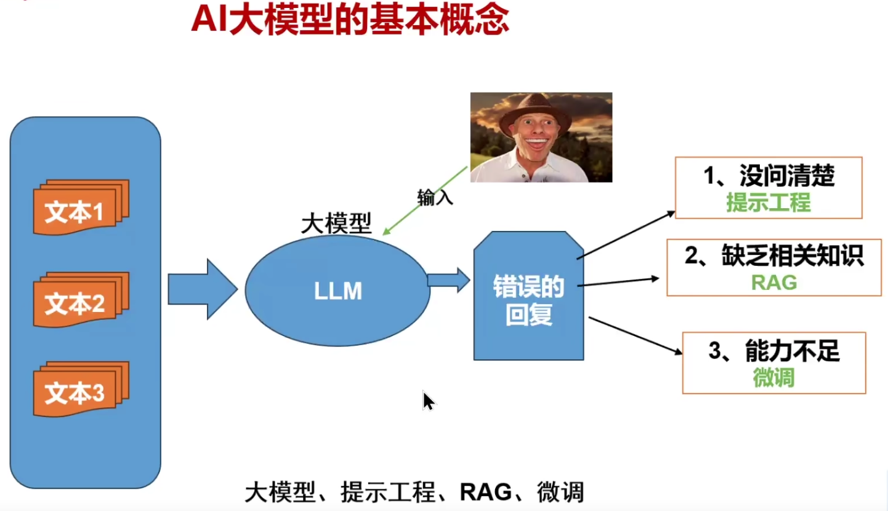
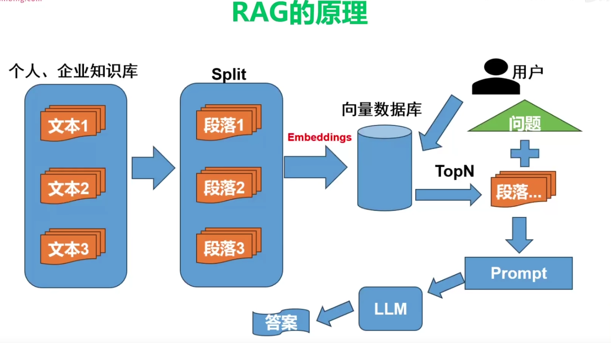
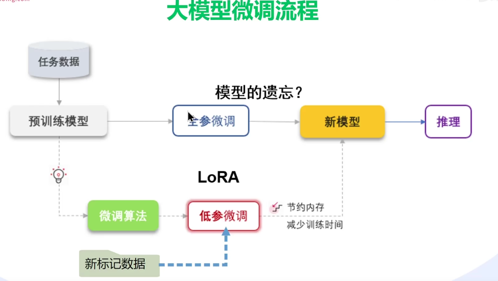
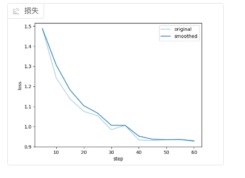
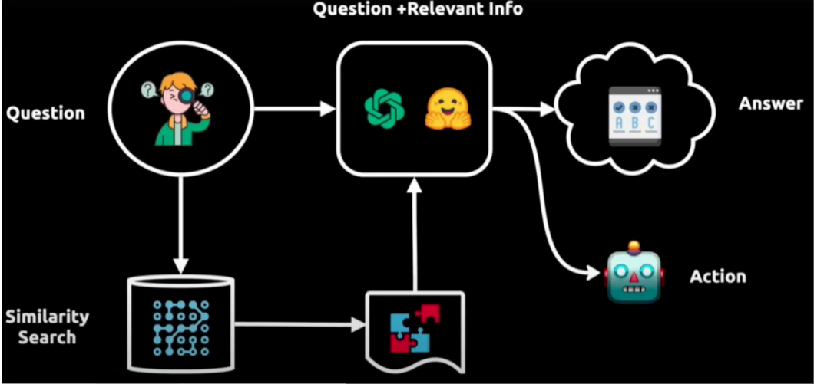
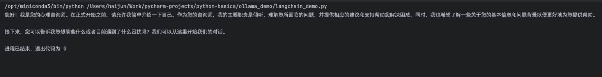
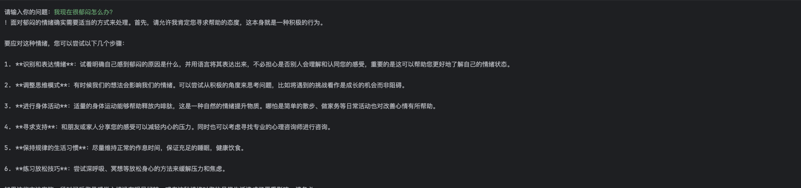

# 1. LLM



- LLM：大语言模型
- Token：是指已经清洗后的词语
- 提示工程：构建提示词
- RAG：增强文本检索技术

# 2. RAG

自己内部的文本资料数据，进行 **Split** 分词，然后将分词后的词语通过 **Embeddings** 对词语进行向量化；用户输入数据后，通过向量数据库的数据段落根据相适度进行匹配，将获取到到数据组成一个 **Prompt** 提示词传递给 LLM



- 向量数据库：存储将词语进行向量化后的数据库
- Embeddings：RAG核心技术，将词语进行向量化的模型 [什么是Embeddings模型？](https://blog.csdn.net/2301_81940605/article/details/143814539)

# 3. 大模型微调



## 3.1 大模型的微调方法

- Adapter Tuning：在训练时，**固定住原来预训练模型的参数不变，只对新增的 Adapter 结构进行微调**
- Prefix Tuning：与Full-finetuning 更新所有参数的方式不同，该方法是**在输入 token 之前构造一段任务相关的 virtual tokens 作为 Prefix，然后训练的时候只更新 Prefix 部分的参数**，而 Transformer 中的其他部分参数固定
- Prompt Tuning：该方法可以看作是 Prefix Tuning 的简化版本，**只在输入层加入 prompt tokens，并不需要加入 MLP 进行调整来解决难训练的问题，主要在 T5 预训练模型上做实验。**
- P-Tuning：P-Tuning 提出将 Prompt 转换为可以学习的 Embedding 层
- P-Tuning v2：P-Tuning v2 的目标就是要让 Prompt Tuning 能够在不同参数规模的预训练模型、针对不同下游任务的结果上都达到匹敌 Fine-tuning 的结果。
- LoRA：大语言模型的低阶适应，是一种PEFT（Parameter-Efficient Tuning，简称PEFT），这是微软的研究人员为了解决大语言模型微调而开发的一项技术。LoRA的基本原理是冻结预训练好的模型权重参数，在冻结原模型参数的情况下，通过往模型中加入额外的网络层，并只训练这些新增的网络层参数。由于这些新增参数数量较少，这样不仅 finetune 的成本显著下降，还能获得和全模型微调类似的效果。
- QLoRA：QLoRA 是一种在微调过程中进一步减少内存占用的技术。在反向传播过程中，QLoRA 将预训练的权重量化为 4-bit，并使用分页优化器来处理内存峰值。使用LoRA时可以节省33%的GPU内存。然而，由于QLoRA中预训练模型权重的额外量化和去量化，训练时间增加了39%。
- LoRA+MoE：由于大模型全量微调时的显存占用过大，LoRA、Adapter、IA 3 这些**参数高效微调**方法便成为了资源有限的机构和研究者微调大模型的标配。PEFT方法的总体思路是冻结住大模型的主干参数，引入一小部分可训练的参数作为适配模块进行训练，以节省模型微调时的显存和参数存储开销。

## 3.2 LLama-Factory

### 3.2.1 安装

[LLaMa-Factory文档说明](https://llamafactory.readthedocs.io/zh-cn/latest/getting_started/installation.html)

> 如果官方的git拉取失败，可以使用：https://gitee.com/hiyouga/LLaMA-Factory 镜像仓库进行拉取

无参数启动

> llamafactory-cli webui

指定显卡启动（多卡）

> CUDA_VISIBLE_DEVICES=1,2 llamafactory-cli webui

使用魔搭下载模型

> export USE_MODELSCOPE_HUB=1 && llamafactory-cli webui

### 3.2.2 参数说明

https://blog.csdn.net/m0_69655483/article/details/138229566

- AdamW学习率：5e-5比较常见（在预先已经训练好的模型上进行微调）
  - 预训练（Pretraining）：1e-4 ～ 5e-4，从头训练时分布变化大
  - 全参微调（Full Fine-tunning）：1e-5 ～ 5e-5：微调时需小幅调整参数，避免破坏预训练知识
  - LoRA/QLoRA：2e-5 ～ 3e-4，仅调整少量参数，可以适当提高学习率加速收敛

- 训练轮数：越多越好，测试的话1-3就行，数据越大花的时间也越久

- 微调方法：使用lora方法进行

- loss（损失）：损失值是一个衡量模型预测与实际标签之间差异的指标，损失值越小，表示模型的预测结果越接近真实值

- 批处理大小：对训练速度、模型性能、资源消耗、梯度更新频率、学习率调整、泛化能力和训练稳定性等方面有显著影响；显存比较紧张的设置小一点例如：2

- 梯度累计（grad）：在训练大规模深度学习模型时，特别是当模型和数据集都非常大时，显存限制可能使得一次性处理大批量数据变得困难。较小的批处理大小虽然可以缓解显存压力，但可能会导致梯度估计的方差较大，从而影响模型的收敛速度和性能；显存比较紧张的设置小一点例如：4

- 温度系数：温度系数越小模型回答的越保守，温度系数越大模型回答的越有创造力
- LoRA秩：影响模型的表达能力、训练稳定性
  - 2-16：参数少，显存占用低，训练快；表达能力有限，可能欠拟合；适用于简单任务、显存紧张、快速实验
  - 16-64：平衡表达力与效率；需调参优化；通用任务（文本生成、分类等）
  - 大64+：捕捉复杂模式，性能潜力高；显存要求高，易过拟合；复杂任务（数学推理、长文本生成）

### 3.2.3 微调

以 **DeepSeek-R1-Distill-Qwen-1.5B** 模型使用魔搭 **Robin021/DISC-Law-SFT** 提取1000数据进行微调

#### 微调1

- 学习率：4e-5
- 轮数：1
- 批处理：2
- 梯度累计：8
- LoRA秩：128
- 缩放系数：256



结论：训练出的模型通过使用训练集的问题进行问答，出现了重复回答的情况并且结果对应不上

#### 微调2

- 学习率：4e-5
- 轮数：10
- 批处理：1
- 梯度累计：8
- LoRA秩：128
- 缩放系数：256

# 4. Langchain

开源框架，它允许开发人员将像GPT-4这样的大型语言模型与外部的计算和数据源结合起来；**LangChain是一个用于开发由语言模型驱动的应用程序的框架**（类似java的Spring Boot框架）

- Components：为LLMs提供接口封装，模板提示和信息检索；
- Chains：他将不同的组件结合起来解决特定的任务，比如在大量文本中查找信息；
- Agents：它们使得LLMs能够与外部环境进行交互，例如通过API请求执行操作；

## 4.1 Langchain的核心

- Models：模型，包装器允许连接到大模型
- Prompt Templates：模板可以避免硬编码文本输入。可以动态的将用于输入插入到模板中，并发送给语言模型
- Chains：链允许将多个组件组合在一起，觉得特定的任务，并构建完成的语言模型应用程序
- Agents：代理，允许语言模型与外部Api交互
- Embedding：嵌入与向量存储VectorStore是数据表示和检索的手段，为模型提供比较多语言理解基础
- Indexes：索引帮助从语言模型中提取相关信息

## 4.2 Langchain的底层原理



举例：上图展示了一个智能问答系统的工作流程。

- 从用户提出的问题（Question）开始，然后通过相似性搜索（Similarity Search）在一个大型数据库或向量空间中找到与之相关的信息
- 得到的信息与原始问题结合后，由一个处理模型分析，以生成一个答案（Answer）
- 这个答案接着被用来知道一个代理采取行动（Action），这个代理可能会执行一个API调用或者与外部系统交互以完成任务

## 4.3 实战操作

> pip install langchain #核心库
>
> pip install langchain-openapi #openapi实现库
>
> pip install langchain-ollama #ollama实现库

这里我们通过ollama实现一个大模型的数据调用。

- 安装ollama
- 通过ollama启动qwen2.5b的模型
- 通过python代码进行调用

### 4.3.1 普通调用

```python
from langchain_ollama import ChatOllama
llm = ChatOllama(
    base_url = "http://127.0.0.1:11434",
    model = "qwen2.5:7b",
    temperature = 0.8,
    num_predict = 256,
)
messages = [
    ("system", "你的身份是一个心理辅导师，你将给用户提供最专业的心理辅导"),
    ("human", "你好，你是谁？"),
]
print(llm.invoke(messages).content)
```



### 4.3.2 流式调用

```python
from langchain_ollama import ChatOllama

llm = ChatOllama(
    base_url = "http://192.168.2.236:11434",
    model = "qwen2.5:7b",
    temperature = 0.8,
    num_predict = 256,
)

messages = [
    ("system", "你的身份是一个心理辅导师，你将给用户提供最专业的心理辅导"),
    ("human", "你好")
]
response = llm.invoke(messages)
print(response.content)
while True:
    prompt = input("\n请输入你的问题：")
    messages.append(("human", prompt))
    stream = llm.stream(messages)
    full = next(stream)
    for chunk in stream:
        print(chunk.content, end='')
        full += chunk
    messages.append(("assistant", full.content))
```



### 4.3.3 链式调用

将两个组件构建为一个链式来进行处理，也是 **langchain** 的核心组件方式

```python
from langchain_core.output_parsers import StrOutputParser
from langchain_ollama import ChatOllama


llm = ChatOllama(
    base_url = "http://192.168.2.236:11434",
    model = "qwen2.5:7b",
    temperature = 0.8,
    num_predict = 256,
)

messages = [
    ("system", "你的身份是一个心理辅导师，你将给用户提供最专业的心理辅导"),
    ("human", "你好")
]
# 最简单的字符串解析器
parser = StrOutputParser()
# 通过链的方式来调用
chain = llm | parser
print(chain.invoke(messages))
```

### 4.3.4 提示词模板

```python
from langchain_core.output_parsers import StrOutputParser
from langchain_core.prompts import ChatPromptTemplate
from langchain_ollama import ChatOllama

llm = ChatOllama(
    base_url="http://192.168.2.236:11434",
    model="vanilj/qwen2.5-32b-instruct_iq4_xs:latest",
    temperature=0.8,
    num_predict=256,
)
# 提示词模板
system_template = ChatPromptTemplate.from_messages([
    ("system", "你的身份是一个心理辅导师，你将给用户提供最专业的心理辅导"),
    ("user", "{text}")
])

# 最简单的字符串解析器
parser = StrOutputParser()
# 通过链的方式来调用
chain = system_template | llm | parser
print(chain.invoke({'text': '我很郁闷怎么办'}))
```

### 4.3.5 聊天机器人


### 4.3.6 构建向量数据库

支持从向量数据库和其他来源检索数据，以便于与LLM工作流集成。它们对应应用程序来说非常重要，这些应用程序需要获取数据作为模型推理的一部分进行推理。

> pip install langchain-chroma


# 5. LangSmith

是一个用于构建生产级 LLM 应用程序的平台，它提供了调试、测试、评估和监控基于任何 LLM 框架构建的链和智能代理的功能，并能与 LangChain 无缝集成。其主要作用包括:

- 调试与测试:通过记录langchain构建的大模型应用的中间过程，开发者可以更好地调整提示词等中间过程，优化模型响应。评估应用效果:langsmith可以量化评估基于大模型的系统的效果，帮助开发者发现潜在问题并进行优化。
- 监控应用性能:实时监控应用程序的运行情况，及时发现异常和错误，确保其稳定性和可靠性。数据管理与分析:对大语言模型此次的运行的输入与输出进行存储和分析，以便开发者更好地理解模型行为和优化应用。
- 团队协作:支持团队成员之间的协作，方便共亨和讨论提示模板等可扩展性与维护性:设计时考虑了应用程序的可扩展性和长期维护，允许开发者构建可成长的系统。

LangSmith是Langchain的一个子产品，是一个大模型应用开发平台。它提供了从原型到生产的全流程工具和服务，帮助开发者构建、测试、评估和监控基于LangChain或其他 LLM 框架的应用程序。


# Spring AI

Spring框架中提供的用于接入 **Ai大模型** 的抽象封装框架 [Spring AI](https://docs.spring.io/spring-ai/reference/getting-started.html)

