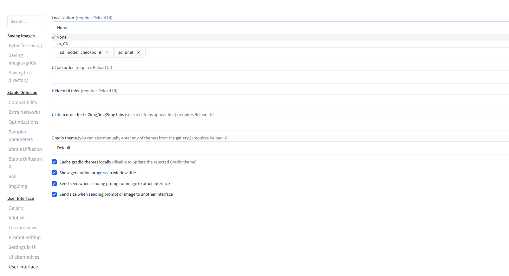
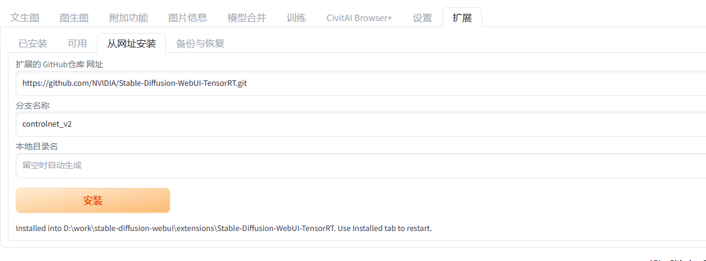
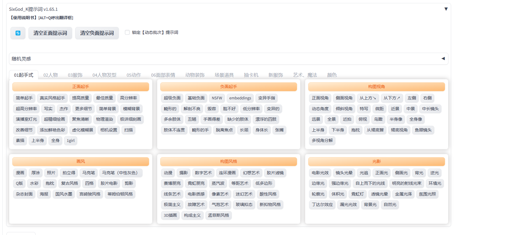
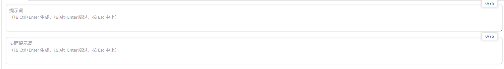
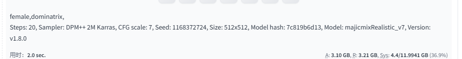

# 1. 部署SD

安装miniconda，通过pytorch官网提供的命令下载对应的pytorch就可以了

配置conda的数据源管道

```config
channels:
  - https://mirrors.tuna.tsinghua.edu.cn/anaconda/cloud/conda-forge/
  - https://mirrors.tuna.tsinghua.edu.cn/anaconda/pkgs/main/
  - https://mirrors.tuna.tsinghua.edu.cn/anaconda/pkgs/free/
  - defaults
show_channel_urls: true
default_channels:
  - https://mirrors.tuna.tsinghua.edu.cn/anaconda/pkgs/main
  - https://mirrors.tuna.tsinghua.edu.cn/anaconda/pkgs/r
  - https://mirrors.tuna.tsinghua.edu.cn/anaconda/pkgs/msys2
custom_channels:
  conda-forge: https://mirrors.tuna.tsinghua.edu.cn/anaconda/cloud
  msys2: https://mirrors.tuna.tsinghua.edu.cn/anaconda/cloud
  bioconda: https://mirrors.tuna.tsinghua.edu.cn/anaconda/cloud
  menpo: https://mirrors.tuna.tsinghua.edu.cn/anaconda/cloud
  pytorch: https://mirrors.tuna.tsinghua.edu.cn/anaconda/cloud
  simpleitk: https://mirrors.tuna.tsinghua.edu.cn/anaconda/cloud
```

下载pytorch，conda中下载pytorch自带就有cuda的工具包，可以不需要单独在电脑上面安装cuda-toolkit的工具包了

> ```cmd
> conda install pytorch torchvision torchaudio pytorch-cuda=12.1 -c pytorch -c nvidia
> ```


## 1.1 安装SD

git仓库中下载sd源码 **https://github.com/AUTOMATIC1111/stable-diffusion-webui.git**

- 安装依赖，使用 pip 下载根目录下面的 **requirements_versions.txt** 文件
- 如果pip缺少安装依赖，那么使用conda来进行对应的依赖下载
- huggingface下载默认的模型：v1-5-pruned-emaonly.safetensors
- 依赖下载完成后直接启动 **python launch.py** 即可

## 1.2 插件

- [安装中文插件](https://github.com/dtlnor/stable-diffusion-webui-localization-zh_CN)：user interface中选择 Localization为中文即可



- [Stable-Diffusion-WebUI-TensorRT加速插件)](https://github.com/NVIDIA/Stable-Diffusion-WebUI-TensorRT)

通过sd扩展进行下载，分支名称使用 **controlnet_v2** 安装成功了后就重启sd



页面上找到 **sd_unet** 选项打开

- [openvino低配置电脑加速插件)](https://github.com/openvinotoolkit/openvino)

- [提示词插件](https://github.com/thisjam/sd-webui-oldsix-prompt)：NSFW 标签的提示词可以放到对应插件的 yours路径下面然后重启



## 1.3 资源

- https://pan.quark.cn/s/656afd3bce60：b站小王子的AI 全资料

- https://pan.quark.cn/s/ac0ff19bed5c：网上找到一下模型和插件的资源

# 2. 参数详解

- checkpoint：大模型，文件使用safetensors/ckpt结尾
- lora：微调模型，一般对checkpoint的大模型进行微调，有些也是以 safetensors结尾

## 2.1 模型的VAE

变分自编码器

作用：增加图片饱和度、降低灰度、让图片有更多色彩

常用：vae-ft-mse-840000-ema-pruned-safetensors (可选)

安装路径：models路径中的VAE

## 2.2 Clip跳过层

语言与图片对比预训练

作用：让tag与图片建立关系；数值越高tag和图片关系就会低，数值越低tag和图片关系就越高，不要调整太高（关键词和图片会出现没有关系），默认1-4

## 2.3 正向提示词和反向提示词

正向提示词用于想要出现在图片中的元素，反向提示词用于不想要出现在图片中的元素

正向提示词描述内容（人物例子）：主体、表情、服装、场景、环境、镜头、灯光、风格、画质、渲染器（其他的元素提示词）



Tag的格式：

- 英文
- 单词
- 词组
- 语句（推荐，ai识别度高）

注意事项：

- tag之间用英文的逗号进行分割
- 靠前的tag权重比较高

权重：

- 括号法制
  - ()  = 增加1.1倍
  - {} = 增加1.05倍
  - [] = 减少1.1 倍
- 数字法则：
  - (tag:1.3) = 增加1.3倍
  - (tag:0.5) = 1/2的权重
  - 大于一就是增加
  - 小于一就是减少

- 混合法则：

  - tag AND tag

  - [tag|tag]

    

## 2.4 采样步数（Steps）

范围 **1 - 50**

- 数值越高：细节越多，渲染越慢
- 数值越低：细节越少，渲染越快
- 建议范围：20 - 40


## 2.5 采样器

根据名称进行划分，**步数越少图片效果越好的采样器就好**

- 采样器带a的：噪点不居中，关键词识别稍低
- karras：去噪快
- DDIM & PLMS：sd最早的采样器（过时）
- DPM：**比较建议使用DPM++SDE Karras** 做人像


## 2.6 面部修复

渲染任务图时记得勾上，提高sd对人体面部的细节捕捉

## 2.7 无缝贴图

主要用来做纹理图按背景的，平时不要用

## 2.8 高分辨率修复

用于修复图片的

## 2.9 宽度和高度

像素稳准，跟显存有关系

- 512x512
- 768x768

## 2.10 生成次数和每次数量

- 生成次数：一个一个生成x张图片（显存低用这个）
- 每次数量：同时生成x张图（高显存用这个）

## 2.11 提示词相关性（CFG Scale）

文字和图片的相关度 **建议4 - 9之间**，有可能跟采样器有关系

- 数值高：tag和图片的相关度就高
- 数值低：tag和图片的相关度就低

## 2.12 随机种子（Seed）

如果是 -1 那么生成的图片全部都会是随机

循环标志：复制上一张图的种子



## 2.13 随机数差异种子

有点像是两个随机数的相总和

## 2.14 差异强度

随机种子和差异随机种子各占不同的比例