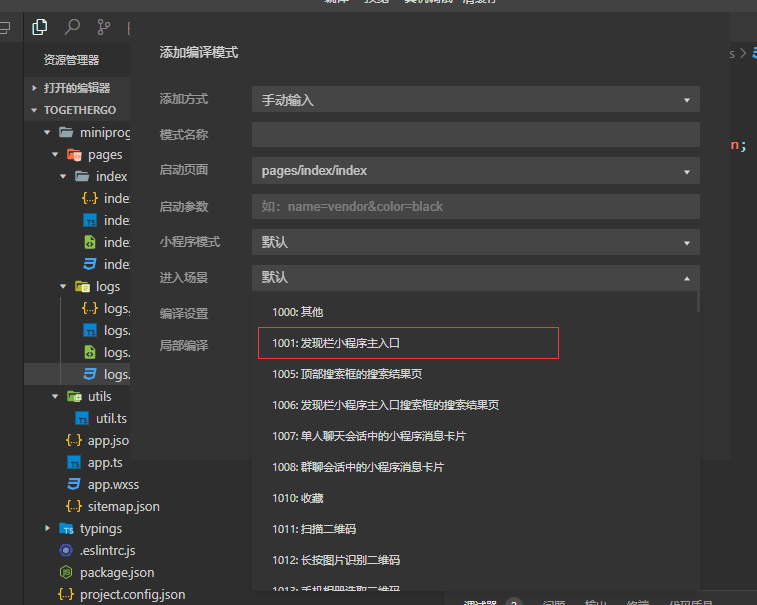
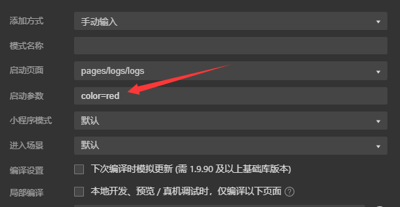
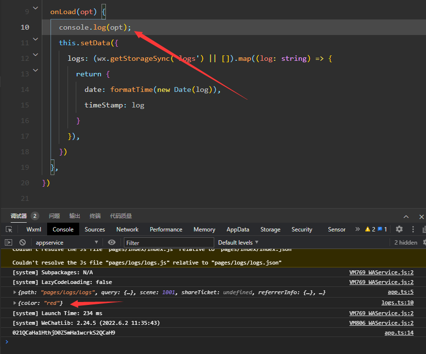
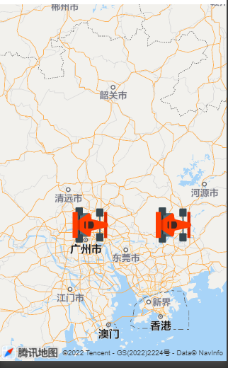

# 1. 文件结构

- wxml：类似html，描述页面布局
- wxss：类似css
- ts：js代码用于描述事件等
- json：配置文件

# 2. 修改数据

```html
<button class="btn" type="primary" bindtap="onBtnTap">
      修改motto数据
</button>
```

通过 **this.setData()** 可以修改字段的数据

```js
onBtnTap() {
    this.setData({
        'motto': "update motto"
    })
}
```

# 3. 进入场景

编译模式中可以设置进入的场景，通过进入的场景可以知道是通过什么样的场景进行到小程序中，例如：扫描二维码，通过群里面分享等



可以在启动参数的地方添加上通过当前场景进入的页面可以携带的参数



在App启动的时候就可以打印出对应的参数


进入到对应页面时就可以获取到对应的参数



# 4. setdata渲染机制

## 4.1 setData


比较重的方法，如果是毫秒级的调用，就会感觉到卡顿，如果小程序遇到比较卡顿，那么就要考虑到是否频繁的 **setData**

# 5. 页面及app的生命周期

## 5.1 App

- onLaunch：启动小程序的时候
- onShow：显示app
- onHide：点击右上角隐藏的时候，右上角小程序并不会被销毁，只会隐藏

## 5.2 页面

- onLoad：装载页面
- onShow：显示页面
- onReady：渲染完毕
- onHide：点击右上角小圆点隐藏

## 5.3 翻页

- onLoad：装载页面
- onShow：显示页面
- onReady：渲染完毕
- onHide：点击右上角小圆点隐藏
- onUnload：点击回退的时候，会销毁（页面栈）

## 5.4 页面栈

类似方法栈，每一个页面的打开都会执行入栈

- wx.navigateTo()：将一个页面执行入栈
- wx.redirectTo()：将当前页面清理掉，然后跳到另外一个页面

# 6. 添加一个地图组件

## 6.1 map组件

```html
<map
				class="map"
        id="map"
				latitude="{{location.latitude}}"
				longitude="{{location.longitude}}"
				scale="{{scale}}"
				setting="{{setting}}"
				enable-overlooking="{{isOverLooking}}"
				enable-3D="{{is3D}}"
        markers="{{markers}}"
			>
      </map>
```

data中添加数据

```json
setting: {
      skew: 0,
      rotate: 0,
      showLocation: false,
      showScale: false,
      subKey: '',
      layerStyle: 1,
      enableZoom: true,
      enableScroll: true,
      enableRotate: false,
      showCompass: false,
      enable3D: false,
      enableOverlooking: false,
      enableSatellite: false,
      enableTraffic: false
    },
    location: {
      latitude: 31,
      longitude: 120
    },
    scale: 10, //设置比例尺
    markers: [ //设置汽车图标的marker图标的位置
      {
        iconPath: "/resources/car.png",
        id: 0,
        latitude: 23.09994,
        longitude: 113.324520,
        width: 50,
        height: 50
      },{
        iconPath: "/resources/car.png",
        id: 0,
        latitude: 23.09994,
        longitude: 114.324520,
        width: 50,
        height: 50
      }
    ]
```



## 6.2 实时汽车移动位置

### 6.2.1 数据

下面是生成的模拟数据点位

```js

export const raceData = {
    "car_ id": "5f6ca84bd426cf61ee8b182b",
    "path":
        [{
            "elapsed_ ms": 0, //毫秒数
            "lat": 29.756825521115363,
            "lng": 121.87222114786053
        },
        {
            "elapsed_ ms": 100, 
            "lat": 29.75684382898254,
            "lng": 121.87224327516209
        }, {
            "elapsed_ _ms": 200, 
            "lat": 29.756862303343542,
            "lng": 121.87226556885331
        }, {
            "elapsed_ _ms": 300,
            "lat": 29.756880443491006,
            "lng": 121.87228852797627
        },
        {
            "elapsed_ ms": 400,
            "lat": 29.756898917036104,
            "lng": 121.87231148714312
        },
        {
            "elapsed_ ms": 500,
            "lat": 29.75691722369424,
            "lng": 121.87233461267527
        },
        {
            "elapsed_ _ms": 600,
            "lat": 29.756935530156913,
            "lng": 121.8723579045862
        }, {
            "elapsed_ ms": 700,
            "lat": 29.756954003115577,
            "lng": 121.87238136288929
        },
        {
            "elapsed_ ms": 800,
            "lat": 29.75697264278144,
            "lng": 121.87240482122407
        },
        {
            "elapsed_ _ms": 900,
            "lat": 29.756991448943772,
            "lng": 121.87242844595153
        }, {
            "elapsed_ _ms": 1000,
            "lat": 29.757010254911805,
            "lng": 121.87245223705914
        }, {
            "'elapsed_ ms": 1100,
            "lat": 29.75702939427861,
            "lng": 121.87247602821199
        },
        {
            "elapsed_ ms": 1200,
            "lat": 29.757048533451606,
            "lng": 121.87249998574552
        },
        {
            "elapsed_ ms": 1300,
            "lat": 29.757067839332514,
            "lng": 121.87252394331159
        },
        {
            "elapsed_ ms": 1400,
            "lat": 29.75708714502009,
            "lng": 121.87254806725889
        }]

}

```

### 6.2.2 实例代码

```js
//初始图标的位置
    location: {
      latitude: 29.756825521115363,
      longitude: 121.87222114786053,
    },
    scale: 19, //设置比例尺
    markers: [ //设置汽车图标的marker图标的位置
      {
        iconPath: "/resources/car.png",
        id: 0,
        latitude: 23.09994,
        longitude: 113.324520,
        width: 50,
        height: 50
      }, {
        iconPath: "/resources/car.png",
        id: 1,
        latitude: 29.756825521115363,
        longitude: 121.87222114786053,
        width: 50,
        height: 50
      }
    ]
  onReady() {
    //移动单个marker，否则每次都使用setData很消耗性能
    const ctx = wx.createMapContext('map', this)
    this.translateMarker(ctx)
  },
  pathIndex: 0,
  translateMarker(ctx) {
    this.pathIndex++
    //超过了定位点的长度，就不画了
    if (this.pathIndex >= raceData.path.length) {
      return
    }
    //变换marker
    ctx.translateMarker({
      markerId: 1,
      destination: {
        latitude: raceData.path[this.pathIndex].lat,
        longitude: raceData.path[this.pathIndex].lng
      },
      duratino: 100, //在100毫秒之间进行平滑的移动
      //移动成功了之后，再次进行调用
      success: () => {
        this.translateMarker(ctx)
      }
    })
```

