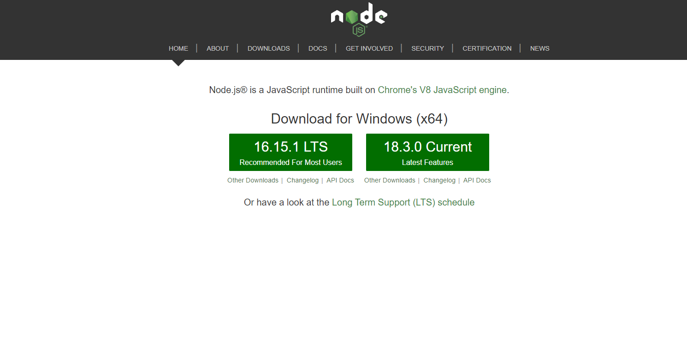

# 1. 安装Nodejs



选择 LTS 版本进行下载，直接安装即可；

修改国内源：**npm set registry https://registry.npm.taobao.org**

# 2. 安装Typescript

运行：**npm install -g typescript** 下载ts的依赖，然后再运行 **npx tsc**


# 3. 数据类型

- number
- boolean
- string
- literal：将值直接列举在后面
- 类型并集：将多个类型写在后面
- any类型
- undefined类型

## 3.1 literal类型

> let 变量名: 类型 例如：let s: string = 'hello'
>
> let answer: 'yes' | 'no' | 'maybe' = 'maybe'  枚举类型

## 3.2 类型并集

> let status: string | number

```typescript
let httpStatus: 200 | 400 | 500 | 'string' = 200
function f(s: 200| 400 | 500) {
    let status: string | number = s
}
```

## 3.3 动态类型

```typescript
let a: any = 'bac'
a = 123
a = {}

let b: undefined
b = false //b只能有 undefined数据值
```

## 3.4 枚举类型

```typescript
enum HTTPStatus {	
	OK = 200, 
    NOT_FOUND = 404,
    INTERNAL_SERVER_ERROR = 500
}
```


## 3.5 类型判断

> typeof s === 'number'

# 4. 逻辑控制

## 4.1 switch

```typescript
switch(value) {
    case 200:
        console.log('ok')
        break
    case 400:
        console.log('fail')
        break
}
```

## 4.2 for

```typescript
for(let i = 0; i < 100; i++) {
        
}
```

## 4.3 while

```typescript
while(i < 100) {
    
}
```

## 4.4 try/catch

```typescript
try {
	let v: number = i / 0
} catch(err) {
	console.error(err)
}
```

# 5. 数组

> let a: number[] = [1, 2, 3]
>
> let a: Array<number> = [1, 2, 3]

```typescript
let a: number[] = [1, 2, 3]

console.log(a[0])
console.log(a[9]) //undefined，不会数组越界
console.log(a.length)

let b: number[] = []
if(b.length !== 0) { //空数组的判断
   
}
```

## 5.1 数组操作

```typescript
let a: number[] = []
a.push(1)
a.push(2)
a.push(3) //1，2，3
a.pop() //1,2 从右边的数据弹出

a.unshift(1)
a.unshift(2)
a.unshift(3) // 3,2,1 从左边数据弹出
a.shift() //2, 1
```

# 6. 对象

```typescript
const emp1 = {
    name: 'john' as (string),
    gender: 'male' as (string),
    salary: 8000 as (number | undefined)
}

//json转换
const s: string = JSON.stringify(emp1)
console.log(s)
const emp2 = JSON.parse(s)
```

# 7. 函数

```typescript
//需要写上返回值的类型
function add(a: number, b: number): number {
    return a + b
}
//可选参数
function add(a: number, b: number, c?: number): number {
    return c ? a + b + c : a + b // 或者a + b + （c||0）
}

//可变参数列表
const numbers = [5,6,7,8]
add(...numbers)
function add(...e: number[]): number {
    for (let i = 0; i < e.length; i++) {

    }
    return 0
}
```

给对象定义方法，内部使用 **this** 代表当前对象

```typescript
const emp1 = {
    name: 'emp1',
    updateBonus() {
        console.log("hello: " + this.name)
    }
}
emp1.updateBonus()
```

# 8. 函数式编程

- 函数作为 **“一等公民”**：
  - 变量类型可以是函数
  - 值（literal）可以是函数
  - 对象的字段可以是函数
  - 对象的字段可以是函数
  - 函数的参数可以是函数
  - 函数的返回值可以是函数