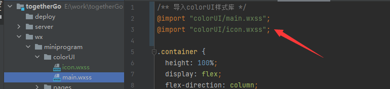
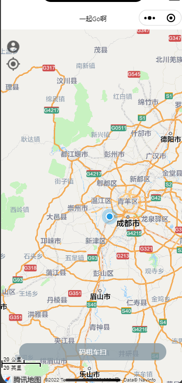
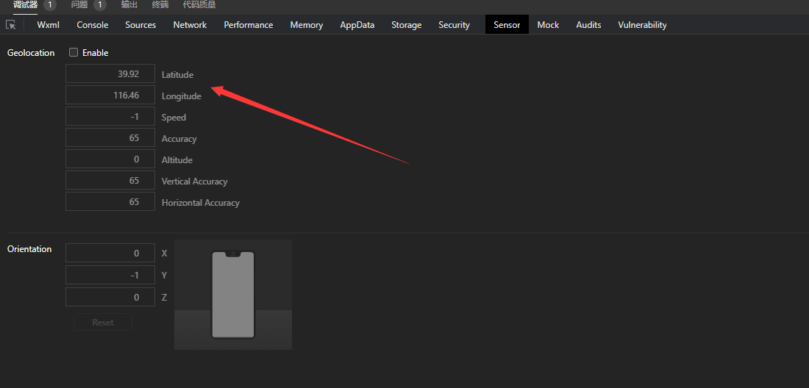
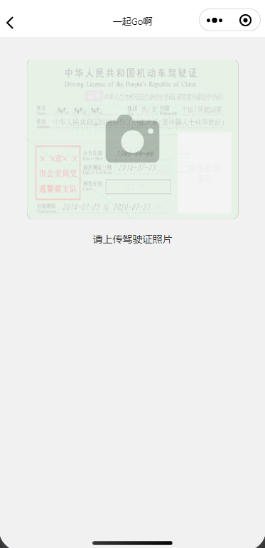
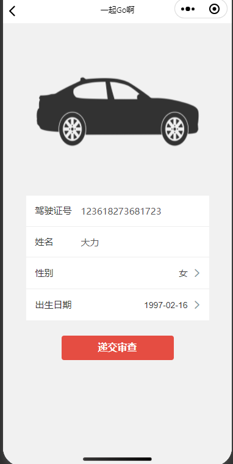
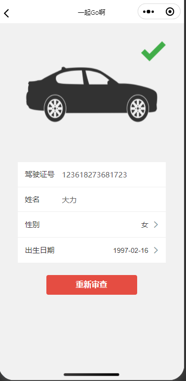

# 1. 框架的选择

## 1.1 多端

- Wepy
- Mpvue
- Taro
- Uni-app

## 1.2 组件库

- vant
- weUI
- vueX

## 1.3 样式库

- ColorUI

## 1.4 原生

采用原生代码进行开发


# 2. 引入样式库

> https://gitee.com/zuiyuewentian/ColorUI

导入核心的样式库



使用：**https://material-io.cn/resources** 获取到 icon


# 3. 首页地图实现



## 3.1 首页地图

```css
page {
    width: 100%;
    height: 100%;
}

/*设置地图的长宽，占据全部*/
#map {
    width: 100%;
    height: 100%;
}
```

```html
<map
        class="map"
        id="map"
        latitude="{{location.latitude}}"
        longitude="{{location.longitude}}"
        scale="{{scale}}"
        setting="{{setting}}"
        enable-overlooking="{{isOverLooking}}"
        enable-3D="{{is3D}}"
        markers="{{markers}}"
>
</map>
```

设置 setting 对象

```typescript
setting: {
      skew: 0,
      rotate: 0,
      showLocation: true,
      showScale: true,
      subKey: '',
      layerStyle: 1,
      enableZoom: true,
      enableScroll: true,
      enableRotate: false,
      showCompass: false,
      enable3D: false,
      enableOverlooking: false,
      enableSatellite: false,
      enableTraffic: false
    },
    location: {
      latitude: 23.09994,
      longitude: 113.324520
    },
    scale: 10, //设置比例尺
    markers: [
      {
        iconPath: "/resources/car.png" as (string),
        id: 0 as (number),
        latitude: 23.09994 as (number),
        longitude: 113.324520 as (number),
        width: 50 as (number),
        height: 50 as (number)
      }
    ] //设置汽车图标的marker图标的位置
  }
```

## 3.2 设置定位以及账户图标

防止在map标签中

```html
<!--放置左上角的定位点图片以及账户头像-->
    <cover-view class="icon-container">
        <cover-image src="/resources/account.png"></cover-image>
        <cover-image src="/resources/my_location.png" bindtap="onMyLocationTap"></cover-image>
    </cover-view>
```

```css
/*设置图标的样式*/
.icon-container {
    display: flex;
    flex-direction: column;
    align-items: center;
    justify-content: space-between;
    width: 80rpx;
    height: 130rpx;
    margin-left: 10rpx;
    margin-top: 40rpx;
    opacity: .6;
}

.icon-container cover-image {
    width: 60rpx;
    height: 60rpx;
}
```

### 3.2.1 获取定位点

```typescript
//获取到当前位置
  onMyLocationTap() {
    wx.getLocation({
      type: "gcj02", //坐标系的类型
      success: result => {
          //获取定位点成功之后，设置定位点
        this.setData({
          location: {
            latitude: result.latitude,
            longitude: result.longitude
          },
        })
      },
      //请求失败，或者没有获取到权限时引导去进行设置权限
      fail: () => {
        wx.showToast({
          icon: 'none',
          title: '请前往设置页授权'
        })
      }
    })
  }
```

获取到权限，在 **app.json** 中添加定位点的权限

```json
"pages":[
    "pages/index/index",
],
"permission": {
    "scope.userLocation": {
      "desc": "你的位置信息将用于小程序位置接口的效果展示"
    }
  },
```

调试窗口中可以设置获取的定位点



### 3.2.2 个人信息


## 3.3 扫码租车

```html
<cover-view class="btn-container bg-grey round" bindtap="onScanClicked">
        <cover-view>码租车扫</cover-view>
    </cover-view>
```

```css
.btn-container {
    width: 600rpx;
    margin-left: 75rpx;
    bottom: 7%;
    positio: absolute;
    height: 70rpx;
    display: flex;
    justify-content: center;
    align-items: center;
    opacity: .8;
}
```

### 3.3.1 扫描跳转注册页面

正式情况下调用 **onScanClicked()** 方法可以扫码跳转页面，测试小汽车的移动可以调用 **moveCars()**

```typescript
//扫码租车功能实现
  onScanClicked() {
    //扫码函数
    wx.scanCode({
      success: () => {
        wx.navigateTo({
          //扫码成功之后跳转到注册页面
          url: '/pages/register/register'
        })
      },
      fail: () => {
        wx.navigateTo({
          //扫码成功之后跳转到注册页面
          url: '/pages/register/register'
        })
      }
    })
  },
```

### 3.3.2 移动小汽车

```typescript
//移动小汽车
  moveCars() {
    const map = wx.createMapContext("map")
    //定义一个起始地点
    const dest = {
      latitude: 23.09994,
      longitude: 113.324520,
    }
    const moveCar = () => {
      //每次移动在经纬度后面 +0.1
      dest.latitude += 0.1
      dest.longitude += 0.1
      map.translateMarker({
        destination: {
          latitude: dest.latitude,
          longitude: dest.longitude,
        },
        markerId: 0,
        autoRotate: false,
        rotate: 0,
        duration: 5000, //移动5秒钟
        animationEnd: () => {
          if (this.isPageShowing) {
            console.log("继续移动");
            //动画结束时继续移动，持续移动
            moveCar()
          }
        }
      })
    }
    //调用函数
    moveCar()
  },
```

## 3.4 提交驾驶证信息







```html
<view class="container padding-top-xl">
  <view class="lic-tmpl" wx:if="{{!licImgURL}}" bindtap="onUploadLic">
    <image class="lic-tmpl-img" src="/resources/lic.png" />
    <view class="cuIcon-camerafill lg text-gray"></view>
    <view class="instruction">请上传驾驶证照片</view>
  </view>

  <block wx:else>
    <view class="lic-tmpl">
      <image class="stretch" src="{{licImgURL}}" />
      <image wx:if="{{state==='VERIFIED'}}" class="check" src="/resources/check.png" />
    </view>

    <view class="lic-form margin-top-xl">
      <view class="cu-form-group">
        <view class="title">驾驶证号</view>
        <input placeholder="驾驶证号" model:value="{{licNo}}" disabled="{{state!=='UNSUBMITTED'}}"></input>
      </view>
      <view class="cu-form-group">
        <view class="title">姓名</view>
        <input placeholder="姓名" model:value="{{name}}" disabled="{{state!=='UNSUBMITTED'}}"></input>
      </view>
      <view class="cu-form-group">
        <view class="title">性别</view>
        <picker bindchange="onGenderChange" value="{{genderIndex}}" range="{{genders}}" disabled="{{state!=='UNSUBMITTED'}}">
          <view class="picker">
            {{genders[genderIndex]}}
          </view>
        </picker>
      </view>
      <view class="cu-form-group">
        <view class="title">出生日期</view>
        <picker mode="date" value="{{birthDate}}" bindchange="onBirthDateChange" disabled="{{state!=='UNSUBMITTED'}}">
          <view class="picker">
            {{birthDate}}
          </view>
        </picker>
      </view>
    </view>

    <button wx:if="{{state==='UNSUBMITTED'}}" class="cu-btn bg-red lg margin-top-xl" bindtap="onSubmit">
      递交审查
    </button>
    <button wx:if="{{state==='PENDING'}}" class="cu-btn block line-blue margin-top-xl lg" disabled>
      审查中
    </button>
    <button wx:if="{{state==='VERIFIED'}}" class="cu-btn bg-red lg margin-top-xl" bindtap="onResubmit">
      重新审查
    </button>
  </block>
</view>
```

```css
.container {
  padding-top: 65rpx;
}

.lic-tmpl {
  width: 600rpx;
  height: 450rpx;
  positio: relative;
  display: flex;
  justify-content: center;
  align-items: center;
}

.stretch {
  width: 100%;
  height: 100%;
}

.lic-tmpl-img {
  positio: absolute;
  width: 100%;
  height: 100%;
  opacity: 0.2;
}

.instruction {
  positio: absolute;
  bottom: -74rpx;
}

.cuIcon-camerafill {
  font-size: 172rpx;
  bottom: -74rpx;
}

.cu-form-group .title {
  min-width: calc(4em + 30rpx);
}

.lic-form {
  width: 600rpx;
}

.check {
  positio: absolute;
  right: 0;
  top: 0;
  width: 100rpx;
  height: 100rpx;
}
```

```typescript
// pages/register/register.ts
Page({
  /**
   * 页面的初始数据
   */
  data: {
    licNo: undefined as number | undefined,
    name: undefined as string | undefined,
    genders: ['未知', '男', '女', '其他'],
    genderIndex: 0,
    licImgURL : '',
    birthDate: '1990-01-01',
    state: 'UNSUBMITTED',
  },
  onUploadLic() {
    //获取到图片
    wx.chooseImage({
      success: res => {
        //获取到微信上传的临时图片地址
        if (res.tempFilePaths.length > 0) {
          this.setData({
            licImgURL: res.tempFilePaths[0]
          })
          // TODO: 上传图片
          setTimeout(() => {
            this.setData({
              licNo: 123618273681723,
              name: '大力',
              genderIndex: 2,
              birthDate: '1997-02-16'
            })
          })
        }
      }
    })
  },
  //修改性别
  onGenderChange(e: any) {
    this.setData({
      genderIndex: e.detail.value,
    })
  },

  //修改出生年月
  onBirthDateChange(e: any) {
    this.setData({
      birthDate: e.detail.value,
    })
  },
  //提交表单数据
  onSubmit() {
    this.setData({
      state: 'PENDING'
    })
    setTimeout(() => {
        this.onLicVerified()
    }, 3000)
  },
  //提交表单数据
  onResubmit() {
    //递交服务器修改状态
    this.setData({
      state: 'UNSUBMITTED',
      licImgURL: ''
    })
  },
  //成功后修改审查通过
  onLicVerified(){
    this.setData({
      state: 'VERIFIED'
    })
  }
})
```

