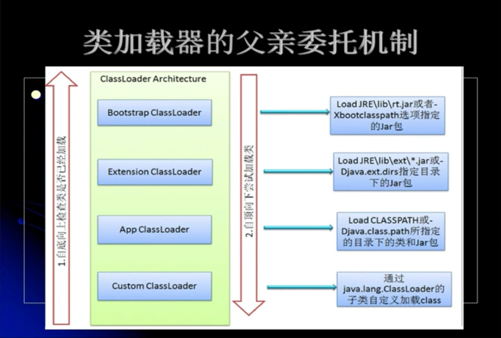
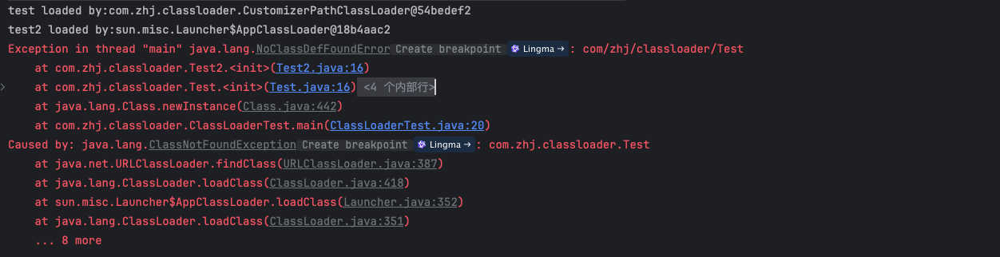

# jVM字节码技术

## 1. Class文件加载过程

Class文件的加载一共分为5个步骤：

### 1.1 加载

将class文件的二进制文件加载到方法区中进行存储，在加载时会在内存中创建一个**java.lang.Class**的对象，虚拟机规范中没有规定Class对象存放在哪里，hotspot虚拟机存放在方法区当中，用来封装类在方法区内的数据结构

### 1.2 连接

连接阶段又分为3个小步骤

#### 验证

验证class文件的格式是否是符合虚拟机的标准

#### 准备

为类的变量分配内存空间并且赋值默认值，分配的地方是在方法区当中

#### 解析

主要是在类型的常量池中寻找类、接口、字段和方法的符号引用转变为直接引用

- 符号引用：在编译源码时生成保存在.class文件的常量池中的，每个类文件都有一个常量池来保存类、方法、字段等的符号引用；符号引用只是名字（字符串）
- 直接引用：直接引用是对实际内存地址的引用，是在运行时通过引用解析后得到的引用地址

### 1.3 初始化

在class进行初始化时有7种方式进行触发：

- 当创建一个类的实例时，比如使用new关键字，或者通过反射、克隆、反序列化方式
- 当调用类的静态方法，即当使用了字节码invokestatic指令
- 使用某个接口的静态变量，即使用了字节码getstatic、putstatic指令
- 当使用java.lang.reflect包中的方法反射类的方法时
- 当初始化子类时，必须先初始化父类
- java虚拟机启动时被标明启动类的类
- jdk1.7开始提供的动态语言支持（例如：动态代理）

除了上述情况为主动使用外，其他情况均属于被动使用，被动使用不会引起类的初始化，只会加载类。可以使用 -**XX:+ThraceClassLoading** 来追踪类的加载信息并且打印出来。

**注意：-XX:+\<Option>：表示开启，-XX:-\<Option>：表示关闭，这是对应boolean类型的参数值，-XX:\<Option>=\<Value>，表示赋值的形式**

#### 实例1

```java
class MyTest {
  //MyTest2.str的常量存放到了MyTest的常量池中，之后MyTest与MyTest2没有任何关系，甚至将MyTest2编译后的字节码文件删除都可以执行
  public static void main() {
    System.out.println(MyTest1.str);
    System.out.println(MyTest2.str);
  }
  
}

class MyTest1 {
  public static String str = "hello mytest2"
    
    static {
    	System.out.println("mytest1 static block");
  }
}

class MyTest2 {
  public static final String str = "hello mytest2"
    
    static {
    	System.out.println("mytest2 static block");
  }
}
```

**结论：常量在编译阶段会存入到调用这个常量的方法所在的类的常量池中，本质上，调用类并没有直接引用到定义类常量的类，因此并不会直接触发定义常量类的初始化**

#### 实例2

```java
class MyTest {

  public static void main() {
    System.out.println(MyTest1.str);
  }
  
}

class MyTest1 {
  public static String str = UUID.randomUUID().toString();
    
    static {
    	System.out.println("mytest1 static block");
  }
}
```

**结论：被动触发了MyTest1类进行实例化了（只能在运行期中进行确定），编译期能够确定下来才会放到使用类的常量池当中**

#### 实例3

```java
class MyTest {

  public static void main() {
    MyTest1[] test = new MyTest1[1];
  }
  
}

class MyTest1 {
    static {
    	System.out.println("mytest1 static block");
  }
}
```

**结论：数组的类型是虚拟机在运行期帮我们创建的一个类型，类型为 [L 开头的类型，二维数组就是 [[L 开头的类型；**

#### 实例4

```java
class MyTest {

  public static void main() {
    System.out.println(MyTest2.b);
  }
  
}

interface MyTest1 {
    public static int a = 5;
}

interface MyTest2 extends MyTest1 {
    public static int b = 6;
}
```

**结论：当一个接口在初始化时，并不要求其父接口都完成了初始化；对于接口来说，成员变量都是常量**

#### 实例5

```java
class MyTest {

  public static void main() {
    Singleton s = Singleton.getInstance();
    System.out.println(s.counter1); //输出的1
    System.out.println(s.counter2); //根据两个顺序的位置输出
  }
  
}

class Singleton {
  public static int counter1;
  //public static int counter2 = 0; //输出的是1
  private static Singleton singleton = new Singleton();
  
  private Singleton() {
    counter1++;
    counter2++; //准备阶段的重要意义，在准备阶段赋值默认值就可以使用了
  }
  public static int counter2 = 0; //输出的0
  
  public static Singleton getInstance() {
    return singleton;
  }
}
```

结论：一个类里面声明的变量是从上往下执行的

- 调用getInstance()触发类的初始化
- 准备阶段将counter1、counter2分配内存地址并且赋值默认值为0
- Singleton singleton = new Singleton() 创建一个实例对象赋值给 singleton静态变量，执行构造方法，将counter1、counter2进行加1
- 再次执行counter2显示的赋值为0，将初始化为1的值给覆盖掉了

#### 实例6

```java
class MyTest {

  public static void main() {
    ClassLoader loader = ClassLoader.getSystemClassLoader();
    Class<?> clz = loader.loadClass("com.zhj.test.A")
    System.out.println(clz);
    clz = Class.forName("com.zhj.test.A") //会触发静态代码快的初始化
    System.out.println(clz);  
  }
  
}

class A {
  static {
    System.out.println("Class A");
  }
}
```

**结论：使用ClassLoader的loadClass()方法不会触发对象的初始化**

### 1.4 类的实例化

- 为新的对象分配内存
- 为实例变量赋默认值
- 为实例变量赋正确的初始值
- java编译器为它编译的每一个类都至少生成一个实例初始化方法，在java的class文件中，这个实例方法被称为\<init> 

### 1.5 使用


### 1.7 卸载

- java虚拟机自带的类加载类所加载的类，在虚拟机的生命周期中，始终不会被卸载。java虚拟机自带的类加载器包括根加载器、扩展类加载器和系统类加载器。java虚拟机本身会始终引用这些类加载器，而这些类加载器则会始终引用它们所加载到类Class对象，因此这些Class对象始终是可触及的。
- 由用户自定义的类加载所加载的类是可以被卸载的

## 2. 类加载器

- java虚拟机自带的加载器
  - 根类加载器（Bootstrap）：加载sun.boot.class.path所指定的目录中加载类库
  - 扩展类加载器（Extension）：从java.ext.dirs或者jdk安装目录jre\lib\ext子目录加载
  - 系统（应用）类加载器（System）：从classpath路径中进行加载
- 用户自定义加载器
  - java.lang.ClassLoader的字类
  - 用户可以定制类的加载方式



自定义类加载器

```java
public class ClassLoaderTest {

    public static void main(String[] args) throws ClassNotFoundException {
        CustomizerClassLoader loader = new CustomizerClassLoader("customizer_classloader");
        Class<?> clz = loader.findClass("com.zhj.classloader.Test");
        System.out.println(clz);
    }
}
public class CustomizerClassLoader extends ClassLoader {

    /** Class loader name */
    private String classLoaderName;

    /** 文件后缀 */
    private String fileExtension = ".class";

    /** 获取到当前项目的class编译路径 */
    private static final String PATH = CustomizerClassLoader.class.getResource("/").getPath();

    /**
     * Customizer class loader
     *
     * @param classLoaderName class loader name
     * @since 1.0.0
     */
    public CustomizerClassLoader(String classLoaderName) {
        super();
        this.classLoaderName = classLoaderName;
    }

    /**
     * Customizer class loader
     *
     * @param parent          parent
     * @param classLoaderName class loader name
     * @since 1.0.0
     */
    public CustomizerClassLoader(ClassLoader parent, String classLoaderName) {
        super(parent);
        this.classLoaderName = classLoaderName;
    }

    /**
     * 获取到对应的类
     *
     * @param clzName clz name
     * @return the class
     * @throws ClassNotFoundException class not found exception
     * @since 1.0.0
     */
    @Override
    protected Class<?> findClass(String clzName) throws ClassNotFoundException {
        byte[] bytes = this.loadClassData(clzName);
        return super.defineClass(clzName, bytes, 0, bytes.length);
    }

    /**
     * 根据名称去获取到类的二进制数据
     *
     * @param clzName clz name
     * @return the byte [ ]
     * @since 1.0.0
     */
    private byte[] loadClassData(String clzName) {
        // 将名称替换成对应的路径
        clzName = clzName.replace(".", File.separator);
        byte[] bytes;
        try {
            bytes = Files.readAllBytes(Paths.get(PATH + "/" + clzName + this.fileExtension));
        } catch (IOException e) {
            throw new RuntimeException(e);
        }
        return bytes;
    }

}
```

## 3. 常用API

常用的**ClassLoader**的API说明

### 3.1 findClass

交给字类进行实现，去定义从哪里读取出class类

```java
protected Class<?> findClass(String name) throws ClassNotFoundException {
        throw new ClassNotFoundException(name);
}
```

### 3.2 loadClass

双亲委派机制的实现，优先通过父类进行加载对应的类，如果没有加载到才通过自己定义的 **findClass** 来进行加载

```java
protected Class<?> loadClass(String name, boolean resolve)
        throws ClassNotFoundException
    {
        synchronized (getClassLoadingLock(name)) {
            // 检查class是否已经被加载过
            Class<?> c = findLoadedClass(name);
            if (c == null) {
                long t0 = System.nanoTime();
                try {
                  //如果指定了父类，那么优先通过父类进行读取class
                    if (parent != null) {
                        c = parent.loadClass(name, false);
                    } else {
                      //如果没有指定父类，通过全局加载器进行类的加载
                        c = findBootstrapClassOrNull(name);
                    }
                } catch (ClassNotFoundException e) {
                    // ClassNotFoundException thrown if class not found
                    // from the non-null parent class loader
                }

                if (c == null) {
                    long t1 = System.nanoTime();
                  	//如果都没有加载到那么才从当前自己定义的findClass进行加载
                    c = findClass(name);
                    sun.misc.PerfCounter.getParentDelegationTime().addTime(t1 - t0);
                    sun.misc.PerfCounter.getFindClassTime().addElapsedTimeFrom(t1);
                    sun.misc.PerfCounter.getFindClasses().increment();
                }
            }
            if (resolve) {
                resolveClass(c);
            }
            return c;
        }
    }
```

### 3.3 defineClass

**ProtectionDomain：用于定义代码源和操作权限**

```java
protected final Class<?> defineClass(String name, byte[] b, int off, int len,
                                         ProtectionDomain protectionDomain)
        throws ClassFormatError
{
  	/**
    	* 1. 检查名称不能为空，并且是否允许以数组的的名称[开头
    	* 2. 名称不能以java.开头
    	* 3. 检查令牌
    **/
    protectionDomain = preDefineClass(name, protectionDomain);
    String source = defineClassSourceLocation(protectionDomain);
  	//调用native方法
    Class<?> c = defineClass1(name, b, off, len, protectionDomain, source);
    postDefineClass(c, protectionDomain);
    return c;
}
```

### 3.4 命名空间

- 每一个类加载器都有自己都命名空间，命名空间由该加载器及所有父类加载器所加载的类组成
- 在同一个命名空间中，不会出现类的完整名字（包括类的包名）相同的两个类
- 在不同的命名空间中，可能会出现类的完整名字（包括类的包名）相同的两个类

```java
public class ClassLoaderTest {

    public static void main(String[] args) throws ClassNotFoundException, MalformedURLException, InstantiationException, IllegalAccessException {
      //自定义个路径加载class类
        String path = "/Users/A/Documents/";
        CustomizerPathClassLoader loader = new CustomizerPathClassLoader(Thread.currentThread().getContextClassLoader(), "classLoader", path);
        Class<?> loaded = loader.loadClass("com.zhj.classloader.Test");
        Object o = loaded.newInstance();
    }
}
```

Test类放在自定义的 **/Users/A/Documents/** 路径下面通过 **CustomizerPathClassLoader** 去进行加载

```java
public class Test {

    public Test() {
        System.out.println("test loaded by:" + this.getClass().getClassLoader());
        new Test2();
    }

}
```

Test2类放在classpath下面通过，**AppClassLoader** 进行加载，父级加载器就看不到由字类加载器加载的类

```java
public class Test2 {

    public Test2() {
        System.out.println("test2 loaded by:" + this.getClass().getClassLoader());
        System.out.println("test:" + Test.class);
    }

}
```



## 助记符

java中助记符通过 **rt.jar包中的 com.sun.org.apache.bcel.internal.generic 类来进行操作的**

- ldc：表示将int、float或者是String类型的常量值从常量池中推送到桟顶
  - bipush：表示将单字节（-128 - 127）的常量值从常量池推送到栈顶
  - sipush：表示将一个短整形（-32768 - 32767）常量值推送至桟顶
  - Iconst_1：将int类型值为1推送至栈顶（iconst_1 ~ iconst_5），虚拟机认为1 - 5最常用，超过6又会使用bipush。范围是-1 ～ 5，-1就是iconst_m1
- invokestatic：调用静态方法
- getstatic：获取到静态属性值
- anewarray：创建一个引用类型（类、接口、数组）的数组，并将其引用值推送至栈顶
- newarray：创建一个指定的原始类型（int、float、char）的数组，并且将其引用值推送至桟顶