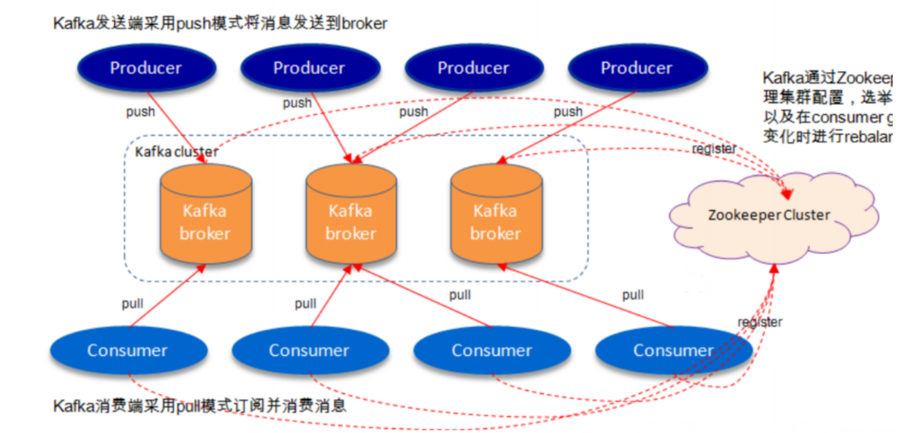

# kafka

## 一、特点



### 1.1 Topic（主题）

一个类别的名称

### 1.2 Partition（分区）

#### 1.2.1 特点

一个topic下面有多个分区，分区就类似mq中的队列来存储消息；message都存储在一个叫做commit log的文件中，每个信息都有唯一的编号称之为offset

**为什么要对topic下数据进行分区存储？**

- commit log文件会受到所在机器的文件系统大小的限制，分区之后，理论上一个topic可以处理任意数量的数据
- 提高并行度

### 1.3 Producers

消息的生产者，将消息发送到topic中，同时负责将msg发送到对应的partition，然后通过round-robin做简单的负载均衡，也可以根据消息中的某一个关键字来进行区分

### 1.4 Consumers

#### 1.4.1 消费模式

每个consumer都是基于commit log中消息的offset来进行消费，**offset由consumer自己来维护**

#### 1.4.1 消息的传递模式

- queue：多个consumer从服务器中读取数据，消息只会到达一个consumer
- publish-subscribe：消息会广播给所有的consumer

#### 1.4.2 消费顺序

- 一个partition在同一时刻在一个consumer group中只有一个consumer instance在消费，从而保证有序性
- 一个consumer group中的consumer instance不能比partition中的分区多，否者多出来的实例会消费不了消息

## 二、单机搭建

```
下载安装 kafka_2.12-2.6.0.gz
tar -zxvf kafka_2.12-2.6.0.gz

修改配置文件server.properties
zookeeper.connect=192.168.60.46:2181  #zk地址，会注册很多节点信息到zk，包括brokers以及topics等信息；如果多个用逗号隔开

log.retention.hours=168  #消息过期时间，默认是7天，单位是小时
log.dirs=/usr            #commit log文件的存储位置，每一个分区都会对应一个文件
```

### 2、 常用命令

- 启动：bin/kafka-server-start.sh -daemon server.properties文件的路径    #daemon后台启动

- 创建topic：
  		bin/kafka‐topics.sh ‐‐create ‐‐zookeeper 127.0.0.1:2181 ‐‐replication‐factor 1 ‐‐partitions 1 ‐‐topic test    # replication‐factor备份因子指，有多少个集群副本

- 查看topic：
  		bin/kafka‐topics.sh ‐‐list ‐‐zookeeper 127.0.0.1:2181  #所有的topic都会保存到zk当中

- 删除topic
  		bin/kafka‐topics.sh ‐‐delete ‐‐topic test ‐‐zookeeper 127.0.0.1:2181  #如果生产者发送消息没有对应的topic的话就会自动创建

- 发送消息：
  bin/kafka‐console‐producer.sh ‐‐broker‐list 对应broker服务的ip ‐‐topic test

- 消费消息：
  		bin/kafka‐console‐consumer.sh ‐‐bootstrap‐server 对应broker服务的ip ‐‐consumer‐property group.id=testGroup ‐‐topic test    #默认只会消费启动之后的消息，如果要消费之前的消息加上  ‐‐from‐beginning

- 查看组名：
  		bin/kafka‐consumer‐groups.sh ‐‐bootstrap‐server 对应broker服务的ip ‐‐list

- 查看消费的偏移量：
  		bin/kafka‐consumer‐groups.sh ‐‐bootstrap‐server 对应broker服务的ip ‐‐describe ‐‐group testGroup  #current-offset和log-end-offset还有lag，分别代表当前消费的位置，结束的位置，落后的消息数

**注意：同一条消息，只能被同一个组里面的一个消费者所消费，如果要实现多个消费者消费，只需要将消费者放在不同的组中即可**

## 三、集群搭建


## 四、代码实战


## 五、原理

### 1、位移主题

说明：__consumer_offsets，kafka默认创建50个分区，数据都是自己定义，不能随意写入数据，不能修改

Broker 端参数 **offsets.topic.num.partitions** 的取值了。它的**默认值是 50**，因此 Kafka 会自动创建一个 50 分区的位移主题

### 2、唯一主题三种消息格式

**1.保存消费者消费位移的消息. Key 中应该保存 3 部分内容：\**[ Group ID , 主题名 , 分区号 ]\****

**2.用于保存 Consumer Group 信息的消息。  注册 Consumer Group使用.**

**3.用于删除 Group 过期位移甚至是删除 Group 的消息。 也叫 tombstone 消息，即墓碑消息，也称 delete mark。主要特点是它的消息体是 null，即空消息体。一旦某个 Consumer Group 下的所有 Consumer 实例都停止了，而且它们的位移数据都已被删除时，Kafka 会向位移主题的对应分区写入 tombstone 消息，表明要彻底删除这个 Group 的信息。**

### 3、Compact策略

说明：Compact 策略来删除位移主题中的过期消息，避免该主题无限期膨胀；对于同一个 Key 的两条消息 M1 和 M2，如果 M1 的发送时间早于 M2，那么 M1 就是过期消息。Compact 的过程就是扫描日志的所有消息，剔除那些过期的消息，然后把剩下的消息整理在一起。

**Kafka 提供了专门的后台线程定期地巡检待 Compact 的主题，看看是否存在满足条件的可删除数据。这个后台线程叫 Log Cleaner。**很多实际生产环境中都出现过位移主题无限膨胀占用过多磁盘空间的问题，如果你的环境中也有这个问题，我建议你去检查一下 Log Cleaner 线程的状态，通常都是这个线程挂掉了导致的。