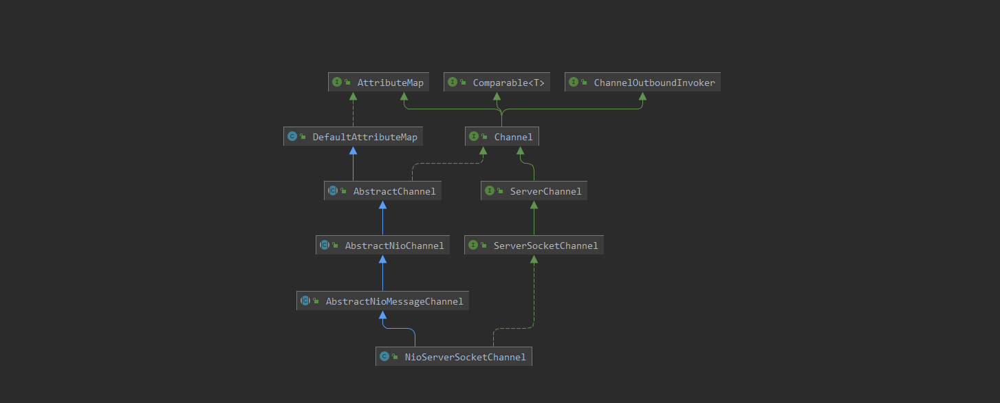
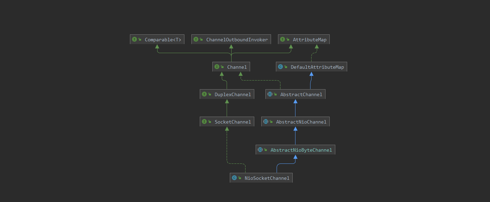
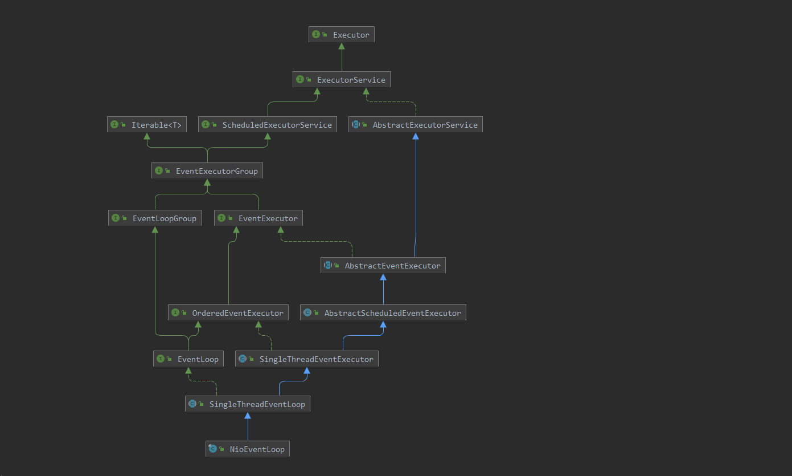

# netty核心类组件使用

- Channel：netty定义的管道，负责底层通讯并关联netty组件
- ChannelHandler：管道处理器
- ChannelPipeline：管道流水处理器，主要用于对一个请求的多个处理
- ChannelHandlerContext：管道处理器的上下文，通过上下文来调用 **ChannelHandler**
- EventLoop：用于对应具体的事件循环，每个 channel 对象都会对应一个 EventLoop，每个EventLoop又对应一个 Selector，用于循环处理
- EventLoopGroup：用于管理多个 EventLoop，用于将 channel 跟 EventLoop进行关联
- BootStrap


## 1. Channel


### AttributeMap

父接口持有属性的能力，通过 `attr` 方法获取属性，`hasAttr` 判断属性是否存在

```java
public interface AttributeMap {
    <T> Attribute<T> attr(AttributeKey<T> key);
    <T> boolean hasAttr(AttributeKey<T> key);
}
```

### ChannelOutboundInvoker

父接口线程出栈执行器，**Channel** 出栈执行器，具备底层通讯能力，可以看到 **Netty** 的操作都是异步的，方法调用都是返回 **Future** 或者 **Promise** 对象，当方法完成后会通过 **Future** 或 **Promise** 收到通知

```java
public interface ChannelOutboundInvoker {
    //绑定接口
    ChannelFuture bind(SocketAddress localAddress);
    ChannelFuture bind(SocketAddress localAddress, ChannelPromise promise);
    //建立连接
    ChannelFuture connect(SocketAddress remoteAddress);
    ChannelFuture connect(SocketAddress remoteAddress, SocketAddress localAddress); 	     ChannelFuture connect(SocketAddress remoteAddress, ChannelPromise promise);
    ChannelFuture connect(SocketAddress remoteAddress, SocketAddress localAddress, ChannelPromise promise);
    //断开关闭连接
    ChannelFuture disconnect();
    ChannelFuture disconnect(ChannelPromise promise);
    ChannelFuture close();
    ChannelFuture close(ChannelPromise promise);
    //从EventLoop注销
    ChannelFuture deregister();
    ChannelFuture deregister(ChannelPromise promise);
    //设置关心的 I/O 事件为 OP_READ
    ChannelOutboundInvoker read();
    //写数据
    ChannelFuture write(Object msg);
    ChannelFuture write(Object msg, ChannelPromise promise);
    ChannelOutboundInvoker flush();
    ChannelFuture writeAndFlush(Object msg, ChannelPromise promise);
    ChannelFuture writeAndFlush(Object msg);
    //构造future/promise
    ChannelPromise newPromise();
    ChannelProgressivePromise newProgressivePromise();
    ChannelFuture newSucceededFuture();
    ChannelFuture newFailedFuture(Throwable cause);
    ChannelPromise voidPromise();
}
```

### Comparable

父接口提供管道之间的比较，泛型为 **Channel**

```java
public interface Comparable<T> {
    public int compareTo(T o);
}
```

### Channel

**Channel** 接口本身提供 **通道状态** 和 **Netty组件** 的关联关系

```java
public interface Channel extends AttributeMap, ChannelOutboundInvoker, Comparable<Channel> {
    //管道的Id
    ChannelId id();
    //当前管道 Channel注册的EventLoop
    EventLoop eventLoop();
    //被ServerSocketChannel接受的SocketChannel将返回ServerSocketChannel作为其parent
    Channel parent();
    //返回管道的配置对象
    ChannelConfig config();
    //是否打开
    boolean isOpen();
    //是否注册到 EventLoop
    boolean isRegistered();
    //是否已经激活（建立连接）
    boolean isActive();
    ChannelMetadata metadata();
    //管道的本地地址
    SocketAddress localAddress();
    //管道连接的远程地址
    SocketAddress remoteAddress();
    //返回 Future当管道关闭后会收到通知
    ChannelFuture closeFuture();
    //是否可以执行写操作
    boolean isWritable();
    //当isWritable返回true时，返回可写字节数，否则返回0
    long bytesBeforeUnwritable();
    //当前isWritable返回false时，返回可读字节数，否则返回0
    long bytesBeforeWritable();
    //跟底层进行关联时，并不是由 Channel 进行而是由 Channel.Unsafe进行关联操作
    Unsafe unsafe();
    //返回管道处理流水线
    ChannelPipeline pipeline();
    //ByteBuf分配器
    ByteBufAllocator alloc();
    //读取管道
    @Override
    Channel read();
    //刷新管道
    @Override
    Channel flush();
}
```

### Channel.Unsafe

**Channel** 接口里面声明的内部接口，是 **Netty** 自己使用的，不会被用户代码直接调用，它负责真正的底层通讯

```java
interface Unsafe {
        RecvByteBufAllocator.Handle recvBufAllocHandle();
    //本地地址
        SocketAddress localAddress();
    //远程地址
        SocketAddress remoteAddress();
    //注册到 EventLoop上
        void register(EventLoop eventLoop, ChannelPromise promise);
    //绑定
        void bind(SocketAddress localAddress, ChannelPromise promise);
    //开启连接
        void connect(SocketAddress remoteAddress, SocketAddress localAddress, ChannelPromise promise);
    //断开连接
        void disconnect(ChannelPromise promise);
    //关闭
        void close(ChannelPromise promise);
    //强行关闭
        void closeForcibly();
    //注销
        void deregister(ChannelPromise promise);
    //开启一个读操作
        void beginRead();
    //写操作
        void write(Object msg, ChannelPromise promise);
    //刷新
        void flush();
    //返回一个空的 Promise
        ChannelPromise voidPromise();
        ChannelOutboundBuffer outboundBuffer();
    }
```


### ServerSocketChannel（服务端）

标记接口，继承至 **Channel** 接口，通过 **ServerChannel.aceept()** 来创建一个 **Channel**，实现的例子就是 **NioServerSocketChannel**



```java
public interface ServerSocketChannel extends ServerChannel {
    //配置对象
    @Override
    ServerSocketChannelConfig config();
    //本地地址
    @Override
    InetSocketAddress localAddress();
    //远程连接地址
    @Override
    InetSocketAddress remoteAddress();
}
```

### SocketChannel（客户端）

客户端管道对象



```java
public interface SocketChannel extends DuplexChannel {
    @Override
    ServerSocketChannel parent();

    //配置对象
    SocketChannelConfig config();
    //本地地址
    InetSocketAddress localAddress();
    //远程地址
    InetSocketAddress remoteAddress();
}
```


## 2. ChannelHandler

 **ChannelHandler** 接口提供了ChannelHandler被 **ChannelHandlerContext** 加入或移除时的钩子 

```java
public interface ChannelHandler {
    //将其加入到 Context上下文中
    void handlerAdded(ChannelHandlerContext ctx) throws Exception;
    //从上下文中移除
    void handlerRemoved(ChannelHandlerContext ctx) throws Exception;
    //捕获异常
    void exceptionCaught(ChannelHandlerContext ctx, Throwable cause) throws Exception;
    
    @Inherited
    @Documented
    @Target(ElementType.TYPE)
    @Retention(RetentionPolicy.RUNTIME)
    @interface Sharable {
        // no value
    }
}
```

**ChannelHandler** 又分为入栈和出栈，**ChannelInboundHandler、ChannelOutboundHandler**

### 2.1 ChannelOutboundHandler

```java
public interface ChannelOutboundHandler extends ChannelHandler {
    //当bind操作时触发
    void bind(ChannelHandlerContext ctx, SocketAddress localAddress, ChannelPromise promise) throws Exception;

    //当connect操作时触发
    void connect(
            ChannelHandlerContext ctx, SocketAddress remoteAddress,
            SocketAddress localAddress, ChannelPromise promise) throws Exception;

    //断开disconnect时触发
    void disconnect(ChannelHandlerContext ctx, ChannelPromise promise) throws Exception;

    //关闭close操作时触发
    void close(ChannelHandlerContext ctx, ChannelPromise promise) throws Exception;

    //从EventLoop移除时触发
    void deregister(ChannelHandlerContext ctx, ChannelPromise promise) throws Exception;

    //当读取时触发
    void read(ChannelHandlerContext ctx) throws Exception;

    //当写操作时触发
    void write(ChannelHandlerContext ctx, Object msg, ChannelPromise promise) throws Exception;

    //当刷新操作时触发
    void flush(ChannelHandlerContext ctx) throws Exception;
}
```

### 2.2 ChannelInboundHandler

```java
public interface ChannelInboundHandler extends ChannelHandler {

    //管道注册到 EventLoop时触发
    void channelRegistered(ChannelHandlerContext ctx) throws Exception;

    //管道从 EventLoop移除时触发
    void channelUnregistered(ChannelHandlerContext ctx) throws Exception;

    //管道激活后触发（如连接）
    void channelActive(ChannelHandlerContext ctx) throws Exception;

    //Channel未激活后触发（如连接关闭）
    void channelInactive(ChannelHandlerContext ctx) throws Exception;

    //当Channel读取到数据后触发
    void channelRead(ChannelHandlerContext ctx, Object msg) throws Exception;

    //当Channel读取完成后触发
    void channelReadComplete(ChannelHandlerContext ctx) throws Exception;

    //用户自定义事件触发
    void userEventTriggered(ChannelHandlerContext ctx, Object evt) throws Exception;

    //管道的isWritable发生变化后触发
    void channelWritabilityChanged(ChannelHandlerContext ctx) throws Exception;

    //发生异常时触发
    @Override
    @SuppressWarnings("deprecation")
    void exceptionCaught(ChannelHandlerContext ctx, Throwable cause) throws Exception;
}
```

**ChannelInboundHandler、ChannelOutboundHandler** 中的方法子类不可能都实现，所以就提供了 **ChannelInboundHandlerAdapter、ChannelOutboundHandlerAdapter** 两个类将所有方法都进行了默认实现，用户只需要自己实现对应的方法就行

```java
public class ChannelInboundHandlerAdapter extends ChannelHandlerAdapter implements ChannelInboundHandler {

    //方法名都一一对应，其中Skip用于标识方法是否需要跳过
    @Skip
    @Override
    public void channelRegistered(ChannelHandlerContext ctx) throws Exception {
        ctx.fireChannelRegistered();
        
    }
    
    
    @Skip
    @Override
    public void channelUnregistered(ChannelHandlerContext ctx) throws Exception {
        ctx.fireChannelUnregistered();
    }
}
```

如果用户需要同时处理 **入栈、出栈** 的方法，可以通过 **ChannelDuplexHandler** 实现

```java
public class ChannelDuplexHandler extends ChannelInboundHandlerAdapter implements ChannelOutboundHandler {
    @Skip
    @Override
    public void bind(ChannelHandlerContext ctx, SocketAddress localAddress,
                     ChannelPromise promise) throws Exception {
        ctx.bind(localAddress, promise);
    }
    // ... 省略其他ChannelOutboundHandler方法实现
}
```

## 3. ChannelPipeline

有了ChannelHandler之后存在以下几个问题：

- 单个 **ChannelHandler** 无法处理整个网络请求，往往一个 **ChannelHandler** 只会处理一次请求的部分业务。比如编解码和业务处理往往是不同的Handler。
- 当存在多个 **ChannelHandler** 的情况下，如何编排 **ChannelHandler**
- Channel接口继承了 **ChannelOutboundInvoker** 接口，可以触发 **ChannelOutboundHandler出栈Handler** 执行，如何触发入栈Handler执行。

**ChannelPipeline** 就是为了解决这些问题而生的，他不但继承了ChannelOutboundInvoker接口可以触发出栈事件，同时继承了 **ChannelInboundInvoker** 可以触发入栈事件。这些 **fireXXX** 与 **ChannelInboundHandler** 的方法一一对应

```java
public interface ChannelPipeline
        extends ChannelInboundInvoker, ChannelOutboundInvoker, Iterable<Entry<String, ChannelHandler>> {

    //将 Handler 添加到队首
    ChannelPipeline addFirst(String name, ChannelHandler handler);

    ChannelPipeline addFirst(EventExecutorGroup group, String name, ChannelHandler handler);

    //添加到队尾
    ChannelPipeline addLast(String name, ChannelHandler handler);

    ChannelPipeline addLast(EventExecutorGroup group, String name, ChannelHandler handler);

    //添加到某个 Handler之前
    ChannelPipeline addBefore(String baseName, String name, ChannelHandler handler);

    ChannelPipeline addBefore(EventExecutorGroup group, String baseName, String name, ChannelHandler handler);

    //添加到某个 Handler之后
    ChannelPipeline addAfter(String baseName, String name, ChannelHandler handler);

    ChannelPipeline addAfter(EventExecutorGroup group, String baseName, String name, ChannelHandler handler);

    //添加多个到队首
    ChannelPipeline addFirst(ChannelHandler... handlers);

    ChannelPipeline addFirst(EventExecutorGroup group, ChannelHandler... handlers);

    //添加多个到队尾
    ChannelPipeline addLast(ChannelHandler... handlers);

    ChannelPipeline addLast(EventExecutorGroup group, ChannelHandler... handlers);

    //移除某个 handler
    ChannelPipeline remove(ChannelHandler handler);

    ChannelHandler remove(String name);

    <T extends ChannelHandler> T remove(Class<T> handlerType);

    //移除队首
    ChannelHandler removeFirst();

    //移除队尾
    ChannelHandler removeLast();

    //替换
    ChannelPipeline replace(ChannelHandler oldHandler, String newName, ChannelHandler newHandler);

    ChannelHandler replace(String oldName, String newName, ChannelHandler newHandler);

    <T extends ChannelHandler> T replace(Class<T> oldHandlerType, String newName,
                                         ChannelHandler newHandler);

    //返回队首
    ChannelHandler first();

    //返回队首的上下文
    ChannelHandlerContext firstContext();

    //返回队尾
    ChannelHandler last();

    //队尾的上下文
    ChannelHandlerContext lastContext();

    //获取某个handler
    ChannelHandler get(String name);

    <T extends ChannelHandler> T get(Class<T> handlerType);

    //获取某个handler的上下文
    ChannelHandlerContext context(ChannelHandler handler);

    //对应名称的上下文
    ChannelHandlerContext context(String name);

    ChannelHandlerContext context(Class<? extends ChannelHandler> handlerType);

    //返回管道
    Channel channel();

    //获取所有handler的名称
    List<String> names();

    //转换成map
    Map<String, ChannelHandler> toMap();

    /**
     * 下面是覆写了触发入栈方法的实现
     */
    @Override
    ChannelPipeline fireChannelRegistered();

    @Override
    ChannelPipeline fireChannelUnregistered();

    @Override
    ChannelPipeline fireChannelActive();

    @Override
    ChannelPipeline fireChannelInactive();

    @Override
    ChannelPipeline fireExceptionCaught(Throwable cause);

    @Override
    ChannelPipeline fireUserEventTriggered(Object event);

    @Override
    ChannelPipeline fireChannelRead(Object msg);

    @Override
    ChannelPipeline fireChannelReadComplete();

    @Override
    ChannelPipeline fireChannelWritabilityChanged();

    @Override
    ChannelPipeline flush();
}
```

在创建 **Channel** 管道时，例如：**AbstractChannel** 中启动 **pipline** 实际创建的是 **DefaultChannelPipline** 进行处理，在添加到 **pipeline** 时实际是以 **DefaultChannelHandlerContext** 类型包装了一层，在 **pipeline** 进行传递的是 **ChannelHandlerContext** 的类型

## 4. ChannelHandlerContext

 **ChannelHandlerContext** 是一个上下文对象，持有 **Channel/ChannelHandler/ChannelPipeline** 重要组件。同时它也继承了 **ChannelInboundInvoker** 和 **ChannelOutboundInvoker**，可以触发入栈和出栈事件；而 **ChannelHandlerContext** 的链表结构是在 **AbstractChannelHandlerContext** 中体现

```java
abstract class AbstractChannelHandlerContext implements ChannelHandlerContext, ResourceLeakHint {
    //下一个节点
    volatile AbstractChannelHandlerContext next;
    //前置节点
    volatile AbstractChannelHandlerContext prev;
    //用于标识 @Skip 注解是否需要跳过的方法
    private final int executionMask;
    
	//用于寻找是否需要执行的 ChannelHandler
    private AbstractChannelHandlerContext findContextInbound(int mask) {
    	AbstractChannelHandlerContext ctx = this;
    	EventExecutor currentExecutor = executor();
        do {
            ctx = ctx.next;
            // 判断是否要跳过下一个AbstractChannelHandlerContext
        } while (skipContext(ctx, currentExecutor, mask, MASK_ONLY_INBOUND));
        return ctx;
    }
}
```

## 5. EventLoop

 **EventLoop **译为 **事件循环**，事件驱动的编程模型都有 **EventLoop** 这个概念（如javascript）。Netty的EventLoop可以认为是 **EventLoopGroup** 的一个特殊实现，它是一个线程构成的线程池服务。 



 **NioEventLoop** 是对于JDK NIO的事件循环处理，**每个NioEventLoop都持有一个Selector**，处理 **Selector** 上的 **SelectionKey** 事件。 

```java
public final class NioEventLoop extends SingleThreadEventLoop {
   
    private Selector selector;
    
    protected void run() {
        int selectCnt = 0;
        for (;;) {
            //轮询是否有事件发生
            select();
            //处理事件
            processSelectedKeys();
            // 执行任务
            runAllTasks();
        }
    }
}
```

父类  **SingleThreadEventExecutor** 绑定线程，并持有任务队列

```java
public abstract class SingleThreadEventExecutor extends AbstractScheduledEventExecutor implements OrderedEventExecutor {
    // 任务队列
    private final Queue<Runnable> taskQueue;
    // EventLoop绑定的线程
    private volatile Thread thread;
    // JDK Executor 单线程提供服务
    private final Executor executor;
}
```

## 6. EventLoopGroup

**EventLoopGroup** 管理多个 **EventLoop** ，主要负责选择 **EventLoop** 并注册 **Channel** 到对应的 **EventLoop**上。接口作用和方法职责在javadoc上很清楚，两个 **register** 方法的目的都是一样的，将Channe注册到EventLoop上

```java
public interface EventLoopGroup extends EventExecutorGroup {
    /**
     * 返回一个 EventLoop 对象用于跟channel进行注册，每一个channel对象都会对应一个 EventLoop 用于进行数据的处理
     */
    @Override
    EventLoop next();

    /**
     * 注册channel跟EventLoop进行关联
     */
    ChannelFuture register(Channel channel);

    /**
     * 注册一个 ChannelPromise 对象实际是对 channel 进行包装的，可以添加监听器等功能
     */
    ChannelFuture register(ChannelPromise promise);
}
```

