## Redis

## 一、redis6.0.6安装

```
redis-6.0.6.tar.gz
tar -zxvf redis-6.0.6.tar.gz

#安装gcc依赖
yum -y install centos-release-scl
yum -y install devtoolset-9-gcc devtoolset-9-gcc-c++ devtoolset-9-binutils
scl enable devtoolset-9 bash
echo "source /opt/rh/devtoolset-9/enable" >>/etc/profile

#进入文件夹编译
make
make install

#修改redis.conf
daemonize yes  #后台运行
requirepass root #需要密码连接

#进入src文件夹
./redis-server redis.conf #启动
./redis-cli -p 6379 -a root #连接

```


## 二、核心数据结构

### 1、String应用场景

```redis
# 单值缓存
SET key value
GET key

# 对象存储
1、SET user:1 value(JSON格式数据)
2、MSET user:1:name zhuge  user:1:balance 1888
   MGET user:1:name user:1:balance
   
# 分布式锁
SETNX product:10001 true   //返回1代表取锁成功，返回0代表失败
DEL product:10001		   //执行完业务释放锁
SET product:10001 true ex 10 nx  //防止程序意外终止导致死锁

# 计数器
INCR article:readcount:{文章id}

# web集群session共享
spring session + redis

# 分布式系统全局序列号
INCRBY orderId 1000
```

### 2、Hash应用场景

- 电商购物车
  - 以用户id为key
  - 商品id为field
  - 商品数量为value

```
# 以用户id为key，商品id为字段
hset user:1 1001 1   				# 添加商品
hincrby user:1 1001 1(-1) 			#加1或者-1
hdel user:1 1001 					#删除商品
hlen user:1      					#长度
hkeys user:1						#获取所有的字段
hgetall user:1                      #获取所有字段和值
hscan user:1 0 match * count 5      #截取范围字段
```

- 优点：
  - 同一数据可以共同管理
  - 相比string，更加节省内存
- 缺点：
  - 过期功能只能用在key，不能用在field上
  - 集群架构下不适合大规模使用

### 3、List结构应用场景

- 微博消息和公众号消息消息流
  - 关注大V1，大V发送消息ID为10001
  - LPUSH msg:{对应用户ID} 10001
  - 大V2，大V2发送消息ID为10002
  - LPUSH msg:{对应用户ID} 10002
  - 查看微博消息：LRANGE msg:{对应用户ID} 0 5

### 4、Set数据结构应用场景

- 抽奖小程序
  - 点击抽奖设置用户的ID
- 点赞、收藏、标签
- 集合操作实现微博微信关注模型
  - 两个人关注相同的人比如：共同关注、我关注的人也关注他
  - 集合可以取交集 
  - SDIFF 求差集（我可能认识的人）、SISMEMBER 求交集（我关注的人也关注他）、SINTER （共同关注）
- 电商筛选
  - SADD brand:hawei P30    新增一条商品，根据筛选的时候查询redis中的商品列表
  - SINTER 条件的筛选，几个集合的并集查询

```
SINTER set1 set2 set3  #交集
SUNION set1 set2 set3  #并集
SDIFF  set1 set2 set3  #差集
```

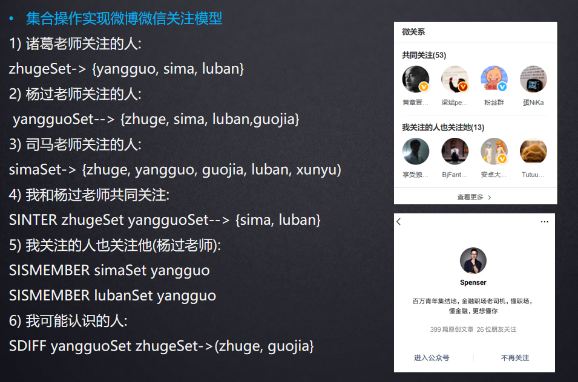


### 5、ZSet有序集合结构（带分值）

- 实现排行榜

  - ZADD添加热榜信息
  - ZINCRBY 每点击一次score自增一次
  - ZREVRANGE key start stop WITHSCORES 通过score来倒叙排序

- 7日热榜

  - ZUNIONSTORE hotNews:20210101-20210107 7 key...   取七日的热榜并集
  - ZREVRANGE  hotNews:20210101-20210107 0 10 WITHSCORES  倒叙排序

  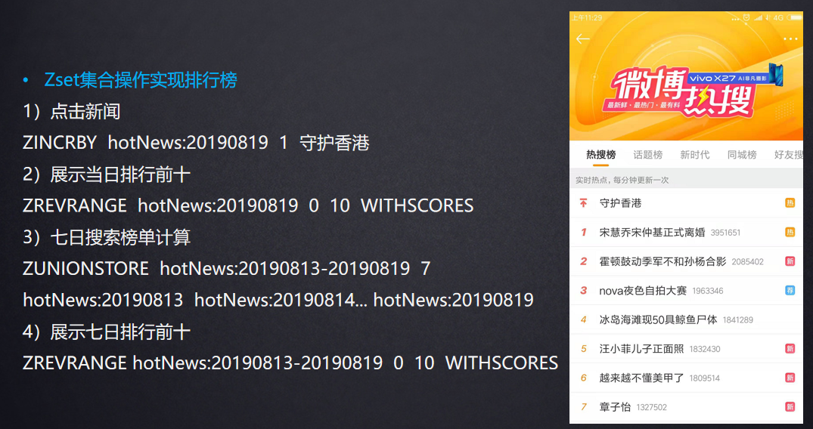

## 三、核心原理

### 1、redis单线程为什么这么快？

所有的数据都在内存当中，单线程避免了线程上下文的切换（一但上下文的切换就涉及用户态向内核态的转换，并且还会把线程栈中的数据全部挂到主内存中的TSS任务状态段中保存数据）

### 2、redis单线程如何处理那么多的并发客户端连接？

redis-server采用了io多路复用

### 3、高级命令

keys：在生产环境中会导致cpu使用率极高，解决方案将需要用到的key放到set中统一维护

scan：代替掉keys命令，类似分页查找key

info：查看redis的状态信息

### 4、Redis持久化

#### 4.1、RDB快照（数据恢复快）

将数据的日志快照保存到drmp.rdb的文件里面。

快照策略：

- save 60 1    # 60秒中修改了一次就执行快照。如果不需要快照将所有的save注释掉

客户端可以手动执行快照save和bgsave：

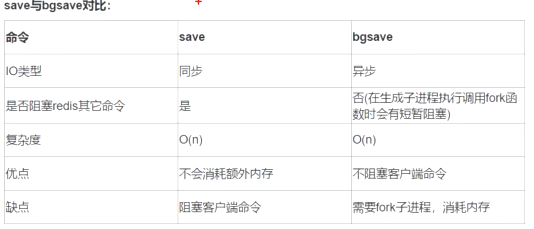

#### 4.2、AOF（数据恢复慢）

##### 4.2.1、特点

每执行一条指令都记录进appendonly.aof（采用resp格式）当中，会导致性能问题，因为每次都会跟磁盘做一次交互。重启的时候为一条一条的执行AOF的命令，redis会优先恢复aof再恢复rdb，aof的数据比较安全

##### 4.2.2、配置文件

- appendfsync always/everysec/no   #always每一条命令都执行一次（性能问题），everysec会先写入缓存每秒执行一次（可能会丢一秒的数据），no由操作系统来处理（数据不安全）

##### 4.2.3、AOF重写

AOF文件里面可能会有很多相同或者无用的指令，比如incr a命令执行6次，文件中会重写成set 6

配置AOF重写：

- auto-aof-rewrite-min-size 64mb  #文件至少要大于64m才会执行重写
- auto-aof-rewrite-percentage 100 #aof文件比上一次重写后文件大小增长了100%，就会执行重写

bgrewriteaof：手动重写

**AOF重写redis会fork出一个子进程来进行重写数据，其它命令阻塞也是阻塞在fork，但是会很快**

#### 4.3、redis4.0混合持久

##### 4.3.1、特点

使用RDB、AOF混合的方式进行持久化。在重写时不会再单纯的将数据转换为RESP格式，而是先把数据转换为RDB二进制压缩格式，然后存入到AOF当中

##### 4.3.2、配置文件：

- aof-use-rdb-preamble yes   #开启混合持久

## 四、主从架构

### 4.1、主从架构

全量复制：

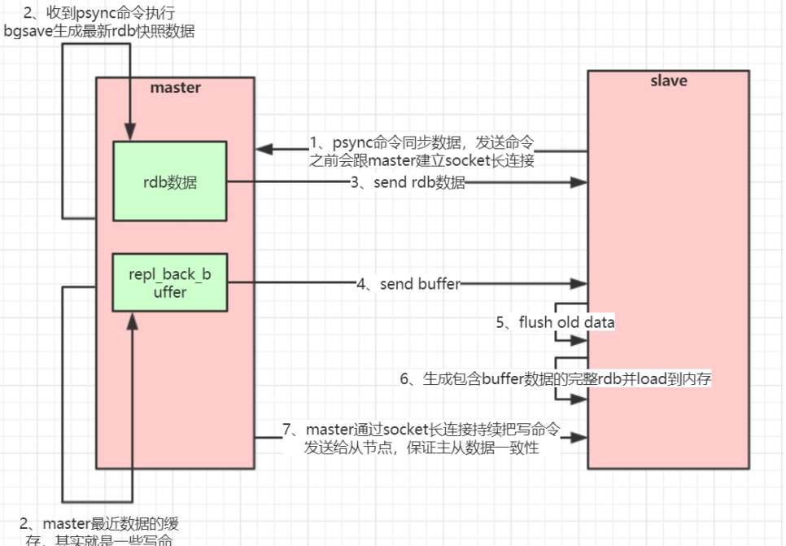

- salve启动发送psync命令
- master开始执行bgsave，生成最新的RDB
- 如果再生成RDB数据时，又有数据写入，redis维护了一个repl_back_buffer(最近数据缓存)，当RDB发送完了之后，再发送最近数据缓存
- 刷新原来的数据将最新缓存数据合并

增量同步：

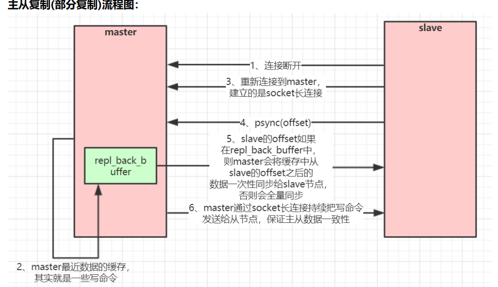

- salve会传当前节点最新数据的偏移量
- master先到repl_back_buffer中对比偏移量，如果repl_back_buffer发现偏移量没有需要的数据后，就会触发全量同步

### 4.2、哨兵架构

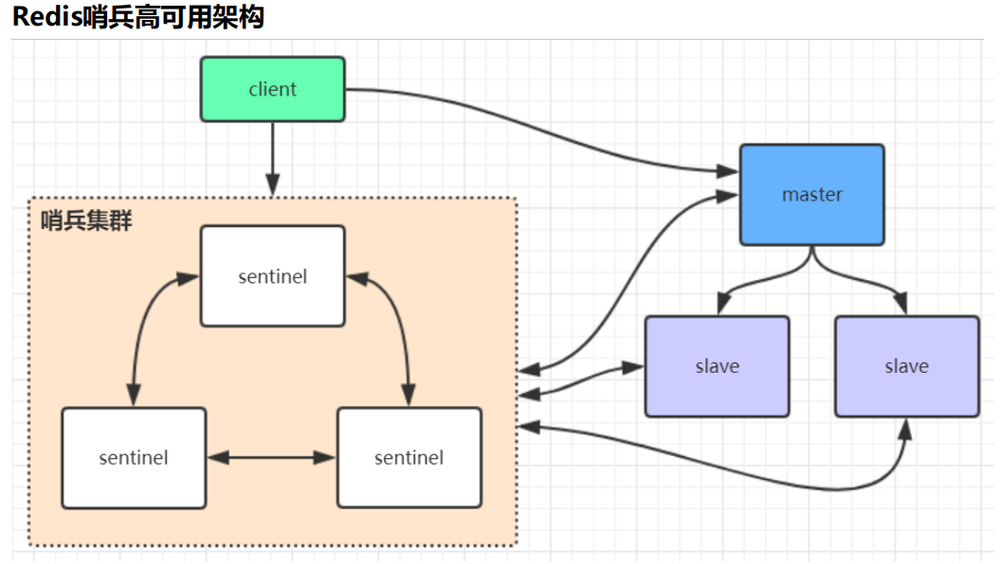

#### 4.2.1、哨兵搭建

```
#复制sentinel.conf文件
cp -R sentinel.conf sentinel-26379.conf
cp -R sentinel.conf sentinel-26380.conf
cp -R sentinel.conf sentinel-26380.conf

#修改哨兵配置
sentinel monitor mymaster 192.168.60.46 6380 2   #redis主节点的地址
sentinel auth-pass mymaster root  #连redis时的密码
dir ''  						  #持久化文件地址
logfile '' 						  #日志地址
pidfile '/var/run/redis-sentinel-26379.pid'    #进程文件地址，每一个sentinel都对应一个

#redis配置，主从配置的密码都需要
requirepass root #要求密码登陆
masterauth root  #连接主节点的密码
```

## 五、集群架构

### 1、集群方案比较

- 哨兵架构

  - 主从切换，配置略微复杂
  - 单节点不能设置很大的内存，并发性能不高
  - 主从切换的时间比较慢
  - 哨兵着眼于高可用，在主节点挂掉后可以选举master

- 多主从高可用架构

  - 复制、高可用分片的特性
  - 通过计算来选择对应的节点
  - 着眼于扩展性，分片进行存储

  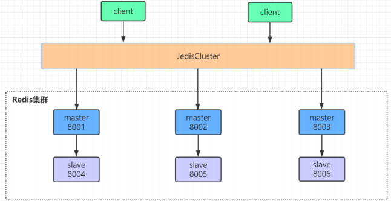

### 2、redis-cluster集群

**数据分片规则**：hash slot（hash槽）对key值进行hash运算根据16384进行取模（CRC(key)%16384），redis会按照计划对槽位进行默认分配，只有主节点进行分配槽位

**为什么redis的hash slot会设计成16384？**

- 槽位如果是65536，发送的心跳消息的头达8k，心跳包过于庞大
- 集群的节点最多不能超过1000，如果超过会导致网络的拥堵，16384够用了
- 槽位越小，节点少的情况下，压缩率越高
  - redis主节点中使用bitMap来存储hash槽，传输的时候会对bitMap进行压缩，16384 / 8 / 1024 = 2kb

#### 2.1、集群通信

通信：gossip协议

心跳机制：ping各个节点做心跳机制，让节点间可以进行通信（去中心化）

#### 2.2、网络抖动

配置：cluster-node-timeout，如果节点通信时间超过当前设置，就意味着下线，下线就会触发master进行选举，一般时间不能太短5秒

#### 2.3、选举原理

- slave发现master变为fail
- 将自己记录的集群currentEpoch加1（选举的周期），广播FAILOVER_AUTH_REQUEST消息，只有主节点会响应；只会响应最先过来的FAIL消息，响应一个ACK确认
- slave收到超过半数的master的ack后就会变成新的master。如果达不到epoch再加1次周期，重写发送
- 延迟计算公式：500ms + random(0-500ms)+SLAVE_RANK * 1000ms
  - SLAVE_RANK表示slave已经从master复制数据量的总量的rank，rank越小代表数据越新

**为什么master推荐奇数？**

主要是通过节省机器资源角度，如果3个master节点挂2个没法选举master了，如果4个master挂2个也不能选举master

**如果一段slot的分片全部挂了，如何提供服务？**

如果一个小集群全部挂了，整个集群就不能提供服务了。需要修改配置才能提供服务*cluster-require-full-coverage*为no时，一个小集群挂掉了仍然可以访问。

**批量命令是否支持？**

如果key的slot落在同一个区域就可以，如果不在同一个区域，就会报错。

支持批量操作的技巧例子：mset {user1}:id 1 {user1}:name zzzz {user1}:balance 1000

### 3、redis-cluster架构搭建

#### 3.1 架构

三个节点，每个节点，一主一从。

#### 3.2 配置

配置三个节点的文件夹


```
#修改配置文件 6379/redis-6379.conf
port 6379
pidfile ''  #进程文件每一个都要配置成唯一
logfile ''  #日志文件路径
dir ''      #持久化文件路径
cluster-enable yes  #打开集群支持
cluster-node-timeout #防止网络抖动，每个节点间通信时间设置为5秒
requirepass root  #登陆节点密码
masterauth  root  #从节点连接主节点需要验证

```

#### 3.3 创建集群

redis-cli create --cluster-replicas 1 ip:port ip:port

说明：--cluster-replicas 1    代表每个小集群需要配置几个从节点，如果为1，那么每个主节点就配置一个从节点，总过需要6个redis，如果为2总共需要9个redis服务

#### 3.4 添加节点

- redis-cli --cluster add-node 新节点 存在已知节点
- 进入节点：cluster replicate 节点id ；将当前进入节点添加为id节点的salve

说明：每个添加的新节点都是主节点

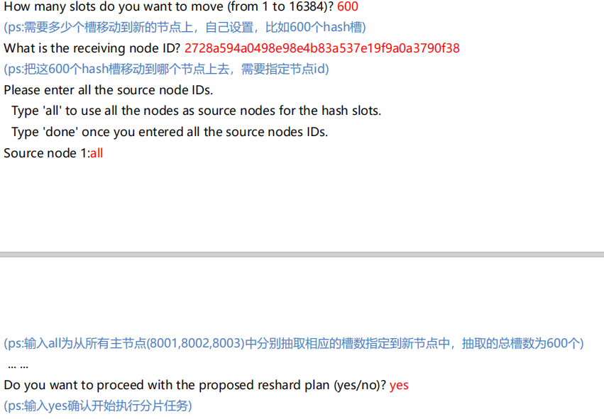

#### 3.5 删除节点

删除节点前，需要将删除节点的数据放到其它节点中

- redis-cli --cluster reshard 删除节点ip:port
- redis-cli --cluster del-node ip:port 节点id

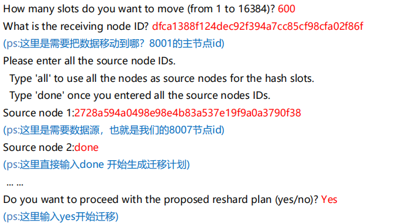

#### 3.6 启动节点

- redis-cli -p 6379 -a root -c  # -c代表设置集群启动，不然会导致重定向节点错误

## 六、Redis分布式锁

### 1、Lua脚本

优点：

- 减少网络开销：lua脚本可以将很多次操作，当成一次发送过去
- 保证原子性
- 保证事务

缺点：

- 不要在lua脚本重出现死循环和耗时的运算，否则会导致redis阻塞

### 2、Pipline管道

可以一次性发送多个命令到redis，并不是原子性操作，如果命令过多还是会处理过慢

### 3、RedLock

特点：同时对所有的节点发送加锁命令，只有超过半数后才会返回（不建议使用）

缺点：

- 性能低下

### 4、Redisson

分布式锁框架，只有等大部分的master节点数据同步完成才会返回

## 七、Redis缓存设计与性能优化

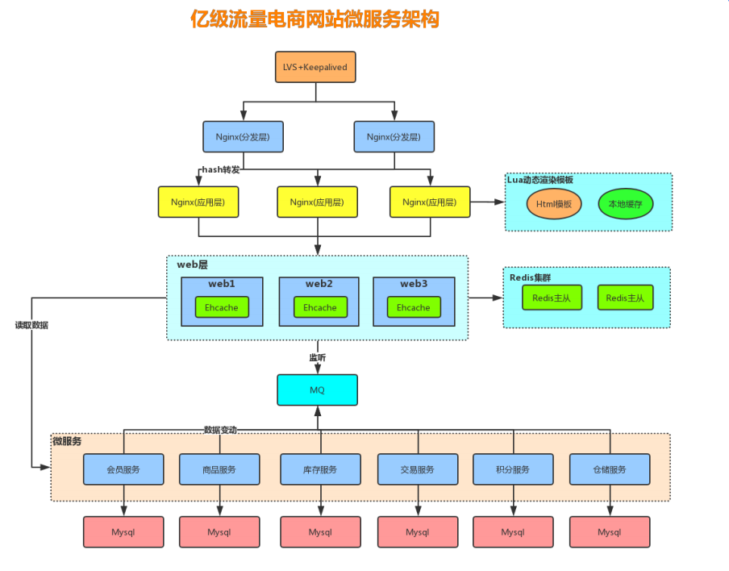

- 缓存穿透：查询了一个缓存中不存在的数据，直接穿透到了数据库，数据库中也没有的话容易导致数据库死机
  - 可以将数据库返回的null设置到缓存当中并且设置一个过期时间
  - 使用布隆过滤器
- 缓存失效（缓存击穿）：同一时间大量的缓存失效，请求全部打到了后端数据库中
  - 将超时时间设置不同的过期时间
- 缓存雪崩：缓存层挂掉了，整个请求全部请求到了数据库中将整个系统拖垮
  - 尽量使用主从、哨兵、集群的架构
  - 后端接口使用Hystrix限流
- 热点缓存key重建：突然某个不是热门的key，被大量访问
  - 在缓存失效的瞬间，大量线程来重建缓存，造成后端负载加大
  - 通过分布式锁，只让一个线程进行设置数据

### 1、设计规范

- value设计
  - 拒绝bigKey（防止网卡流量、慢查询）：一个字符串最大512MB，二级数据结构可以存储40亿个元素
    - 字符串类型：超过10KB，就是bigKey
    - 非字符串：超过5000个元素就视为bigKey
  - 非字符串的bigKey，不要使用del删除，使用hscan、sscan、zscan方式渐进式删除，注意bigKey过期时间自动删除问题（会触发del操作，造成阻塞。可以配置lazyfree-lazy-expire yes 异步删除）

### 2、连接池参数的设置

- maxTotal：最大连接数
  - 业务希望redis并发数
    - 一次命令时间平均耗时1ms，一次连接的QPS大约是1000
    - 业务期望QPS是50000，那么需要资源池大小理论值是50000/1000 = 50 个，一般需要比理论值大一些
  - 客户端执行命令的时间
  - redis资源：例如nodes（应用个数）* maxTotal时不能超过最大连接数maxcilents
  - 资源开销
- maxIdle和minIdle
  - maxIdle最大空闲连接，**连接池最佳性能是maxTotal=maxIdle**，这样就避免连接池伸缩带来的性能干扰，具体还是根据业务场景来设置
  - minIdle最小空闲连接

连接池预热：当系统刚启动时，就有大量的并发过来，这时连接池里面没有连接，那么就会导致性能问题。可以在启动的时候调用ping()命令，来进行预热。

### 3、redis清除策略

- 被动删除：读写一个已经过期的key时，会触发惰性删除策略，直接删除这个key
- 主动删除：惰性删除策略无法保证冷数据被及时删除，redis会定期主动淘汰一批已经过期的key
- 当前已用内存超过maxmemory限定时，触发主动清理策略
  - 根据自身业务，选好maxmemory-policy（最大内存淘汰策略），设置好过期时间
  - 默认策略是volatile-lru
    - allkeys-lru
    - allkeys-random
    - volatile-random
    - volatile-ttl
    - noeviction

**LRU算法：**最近最少使用。如果一个数据在最近一段时间没有被用到，那么将来被使用到的可能性也很小，所以就可以被淘汰掉；Redis中LRU算法是每次随机出5个key，淘汰掉最少使用的key，redis增加了一个24bit的字段，用来存放最后一次被访问的时间

**Redis3.0 LRU算法：**会维护一个候选池（大小为16），池中根据数据的访问时间进行排序，第一次随机选取的key都会放入池中，随后每次选取的key只有在访问时间小于池中最小的时间才会放入池中,直到放满。当放满后，如果新的key需要放入，则将池中最后访问时间最大的移除

**LRU缺点：**LRU是根据最近访问时间来进行数据淘汰，就容易导致，某个数据很久没有被访问，但是突然被访问了一次，那么Redis就会认为他是热点数据，就不会淘汰。

**Redis4.0 LFU算法**：根据key最近被访问频率进行淘汰，很少被访问的优先被淘汰

- volatile-lfu：在设置了过期时间中使用LFU进行淘汰
- allkeys-lfu：在所有key中使用LFU进行淘汰

### 4、布隆过滤器

一个大型的位数组和几个不一样的无偏hash函数，无偏就是能够把元素的hash值算的比较均匀。会进行很多的hash运算，然后对hash值跟数组的长度进行取模。如果存在大量的不存在的key，可以使用布隆过滤器（非常的节省空间）

适用场景：数据命中不高，数据相对固定，实时性低（通常是数据较大）的应用场景，代码维护较为复杂，但是缓存空间占用很少

## 八、redis实践问题

### 1、redis如何解决海量数据下的日活、月活问题

- 使用bitMap（精准、内存损耗一般）
  - 存放100万个id号需要100万个bit位，也就是 100w / 8 = 125k字节，直接用以id号和100w取模，余数作为索引
- 使用hyperLogLog（有误差、省空间）
  - 每个 HyperLogLog 键只需要花费 12 KB 内存，就可以计算接近 2^64 个不同元素的基 数；输入元素的数量或者体积非常非常大时，计算基数所需的空间总是固定 的、并且是很小的
  - 此时存储100万个独立用户只需要15K左右，一个月才480K左右

### 2、如何解决高并发下的黑名单、白名单问题


### 3、高并发下如何解决数据库和缓存的双写不一致的情况

可以采用队列来保证读操作和写操作的顺序执行。

- 单机情况：数据变动了，a删除掉了缓存，并且将修改DB操作放入到队列当中，DB修改成功了之后再添加一个redis的写操作；当b来查询缓存，发现没有这时候就要查询数据库并且将redis写操作放入队列中。
- 分布式情况：可以采用redis中的list来作为同步队列

### 4、如何计算key大小

- redis-cli --bigkeys  可以需找出较大的key
  - 使用scan方式对key进行统计，不会造成阻塞
  - 统计出key只有string类型是以字节长度为衡量标准，list\\set等以元素个数作为衡量标准，所以key主要以string类型存在，就比较适合
- redis-memory-for-key -s -p key : 查看单个key的大小
- debug object key: 查看序列化后的长度
- memory usage key: 查看某个key的大小

### 5、Set、List、Hash、Zset使用scan命令 Count失效的问题

如果遍历只包含了Integer值的set集合，或者符合ziplists类型编码的hash或者Sset集合（说明这些集合里面的元素占用的空间足够小）那么scan会返回所有元素，直接忽略count

- hash-max-ziplist-entries 512   #配置表示会对其进行内存优化，集合中的元素超过512时
- hash-max-ziplist-value 64        #key-value中的value长度超过64的时候

### 6、高性能秒杀架构

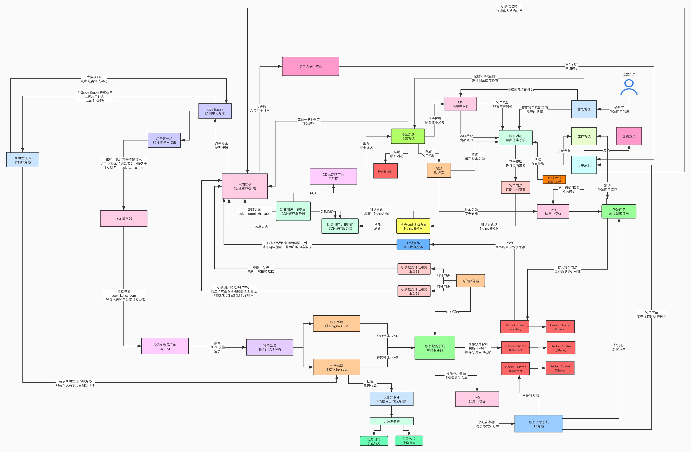