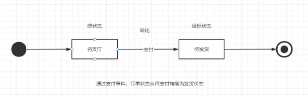

# spring状态机

## 1. State

一个状态机至少要包含两个状态

## 2. Event

事件就是执行某个操作的触发条件或者口令

## 3. Action

事件发生以后要执行的动作

## 4. Transition

也就是从一个状态变化为另一个状态

## 5. 状态机图

做需求时，需要了解以下六种元素：起始、终止、现态、次态（目标状态）、动作、条件，我们就可以完成一个状态机图了：

以订单为例：以从待支付状态转换为待发货状态为例