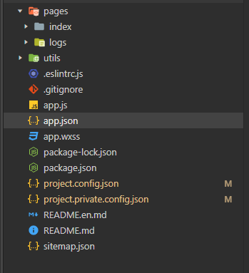

## 1. 页面结构

- pages：存储页面
- utils：工具文件夹

## 2. 全局配置文件

### app.json

- pages：用于记录当前小程序所有页面的路径
- window：定义小程序所有页面的背景眼色、文字眼色等
- style：全局定义小程序组件所使用的样式版本
- sitmapLocation：用来指明 sitemap.json 的位置

### project.config.json

用于记录小程序开发工具所做的个性化配置

- setting：保存编译相关的配置
- projectname：项目名称
- appid：小程序的账号ID

### sitmap.json

用于配置小程序页面是否允许微信索引

## 3. 页面配置文件

每个 `pages` 路径下面的 `*.json`  文件，用于对页面进行配置，页面的配置文件会覆盖全局的配置

## 4. 创建页面

在 `app.json` 配置文件中的 `pages` 数组中加入字符串，然后保存就会自动创建页面；微信默认将第一个页面按照首页进行渲染

## 5. WXML模板

下面是 html 对应微信标签

- div    ----->  view
- span ----->  text
- img   ----->  image
- a        -----> navigator

## 6. WXSS样式

- 新增了rpx尺寸单位
- 提供了全局的样式和局部样式
  - 根目录：app.wxss会作用全局
  - 局部页面.wxss样式仅对当前页面生效
- wxss仅支持部分css选择器
  - .class和#id
  - element
  - 并集选择器，后代选择器
  - ::after和::before等伪类选择器

## 7. JS交互逻辑

- app.js：入口文件，调用了 App() 函数启动小程序
- 页面.js：页面的js文件，调用了 Page() 函数
- 普通js：普通的功能模块文件，用于封装公共的函数或属性