# 一、WXSS模板样式
## 1. 扩展特性

- rpx尺寸单位
- @import样式导入

## 2. rpx尺寸单位

微信用于解决适配的尺寸单位，rpx的实现原理将设备的屏幕等分为750份（当前屏幕的总宽度为750rpx）

- 在较小的屏幕，rpx就小一些
- 在较大的屏幕，rpx就大一些

### rpx与px换算

iphone6上，屏幕宽度375px，等分为750rpx。则：750rpx=375px=750物理像素，1rpx = 0.5px = 1物理像素

## 3. 样式导入

**@import** 后面需要导入外联样式表（相对路径）

```css
@import "相对路径";

.userinfo {
    color: red;
}
```

## 4. 全局样式和局部样式

在项目根路径下面的 **app.wxss** 里面的样式会作用于所有的页面；在页面路径下面定义的 **.wxss** 就是局部样式

- 局部样式和全局样式冲突，以局部样式为准
- 局部样式的权重大于或等于全局样式的权重时，才会覆盖全局样式

# 二、常用语法
## 1. 数据绑定

使用 `Mustache` 语法，使用 `{{}}` 括号进行数据绑定

```json
Page({
    data: {
        info: 'hello world',
        imgSrc: 'http://www.logo.png'，
        randomNum: Math.random() * 10
    }
})
```

- 绑定内容

  ```html
  <view>{{info}}</view>
  ```

- 绑定属性

  ```html
  <image src="imgSrc" mode="widthFix"></image>
  ```

- 算数运算

```html
<view>{{randomNum >= 5 ? '数字大于等于5' : '数字小于5'}}</view>
<view>{{randomNum * 5}}</view>
```

## 2. 事件绑定

| 类型   | 绑定方式                | 事件描述                          |
| ------ | ----------------------- | --------------------------------- |
| tap    | bindtap或bind:tap       | 手指触摸后马上离开，类似click事件 |
| input  | bindinput或bind:input   | 文本框的输入事件                  |
| change | bindchange或bind:change | 状态改变时触发                    |

### 事件对象的属性列表

事件回调的时候，会收到一个事件对象 **Event** 对象

| 属性          | 类型    | 说明                                                     |
| ------------- | ------- | -------------------------------------------------------- |
| type          | String  | 事件类型                                                 |
| timeStamp     | integer | 页面打开触发事件所经过的毫秒数                           |
| target        | Object  | 触发事件的组件的一些属性值集合（重点）                   |
| currentTarget | Object  | 当前组件的一些属性值集合                                 |
| detail        | Object  | 额外的信息（重点）                                       |
| touches       | Array   | 触摸事件，当前停留在屏幕中的触摸点信息的数组（几个手指） |
| changeTouches | Array   | 触摸事件，当前变化的触摸点信息的数组                     |

### target和currentTarget的区别

target是 `触发该事件的源头`，而 currentTarget则是 `当前事件所绑定的组件`；点击时可能会通过事件冒泡导致外层的事件也执行，target就是指里层触发的组件

### bindtap语法

**func** 需要调用的函数

```html
<button type="primary" bindtap="func"></button>
```

### setData()

用于改变页面的数据，重新赋值

```js
this.setData({
    count: 'value'
})
```

### 事件传参

在vue中可以使用下面进行传参，但是小程序就不行

```html
<button type="primary" bindtap="func(123)"></button>
```

使用 **data-*** 自定义属性传参，* 代表参数名称，在处理函数中使用 **event. currentTarget .dataset.参数名** 获取到具体的参数值

```html
<button type="primary" bindtap="func" data-info="{{2}}"></button>
```

```js
func(event) {
    consolo.log(event.currentTarget.dataset.info)
}

```

## 3. 条件渲染

```html
<view wx:if="{{condition}}"></view>
<view wx:elif="{{condition}}"></view>
<view wx:else></view>

```

如果要一次性控制多个组件的展示与隐藏可以使用 <block\></block\> 标签将多个组件包装起来，并且在 <block\> 使用 wx:if 控制，在渲染时不会对 block 标签进行渲染 

```html
<block wx:if="false">
    <view>1</view>
    <view>2</view>
</block>

```

## 4. 列表渲染

```html
<view wx:for="{{array}}">
	索引：{{index}}，当前项：{{item}}
</view>

```

手动指定当前项索引名称和当前项名称

- wx:for-index="idx"
- wx:for-item="itemName"

### wx:key的使用

直接写属性值的key就行了，不需要使用 **{{ }}**

```html
<view wx:for="{{array}}" wx:key="id">
	索引：{{index}}，当前项：{{item}}
</view>

```

## 5. 全局配置

**app.json** 文件是小程序的全局配置文件

- pages
  - 记录小程序页面存放的路径
- window（navigationBar、background）
  - 全局设置小程序窗口的外观
- tabBar
  - 设置小程序底部的tabBar效果
- style
  - 是否启用新版的样式

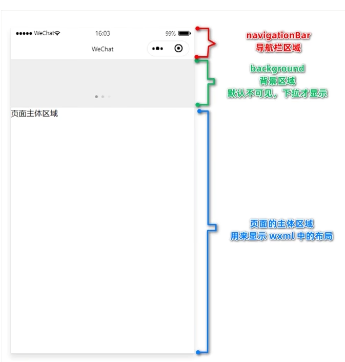

### 全局下拉刷新

**下拉刷新**：屏幕下拉滑动操作，重新刷新页面数据

> app.json --> window --> enablePullDownRefresh：true  #设置全局属性，会作用小程序每个页面
>
> app.json --> window --> backgroundTextStyle: dark（light） #设置下拉刷新的小圆点样式

### 设置上拉触底的距离

在滑动列表的时候，滑动到距离底部多远的距离可以请求新的数据（类似翻页）

> app.json --> window --> onReachBottomDistance: 50 #设置距离，默认50px（实际开发一般用默认的）

### tabBar

- 顶部tabBar：只会现实文本，最多5个
- 底部tabBar：可以现实图标和文本

编辑 **app.json** 文件

```json
{
    "tabBar": {
        "list": [
            {
            	"pagePath": "页面路径",
            	"text": "显示文本",
            	"iconPath": "未选中的图标",
            	"selectedIconPath": "选中时图片路径"
        	}
        ]
    }
}

```

### 自定义tabBar

**https://developers.weixin.qq.com/miniprogram/dev/framework/ability/custom-tabbar.html**

- 修改app.json配置文件

  ```json
  "tabBar": {
      "custom": true,
      "list":[]
  }
  ```

- 创建自定义文件夹（**custom-tab-bar**）：小程序默认会去找到这个路径下面进行渲染

  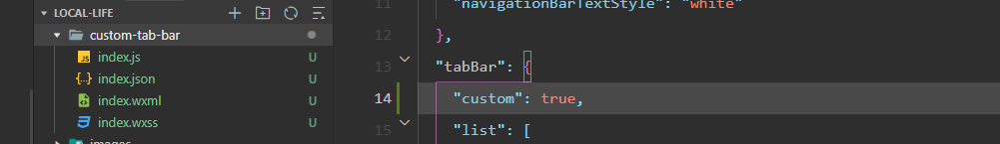

## 6. 页面配置

根目录下面的 **app.json** 是全局配置，而每个页面下面的 **app.json** 配置文件就可以单独配置当前页面，例如：全局配置中的 **window** 属性，用于配置全局的，也可以在单独 **app.json** 进行配置（就近原则）；下面是可以支持的配置属性

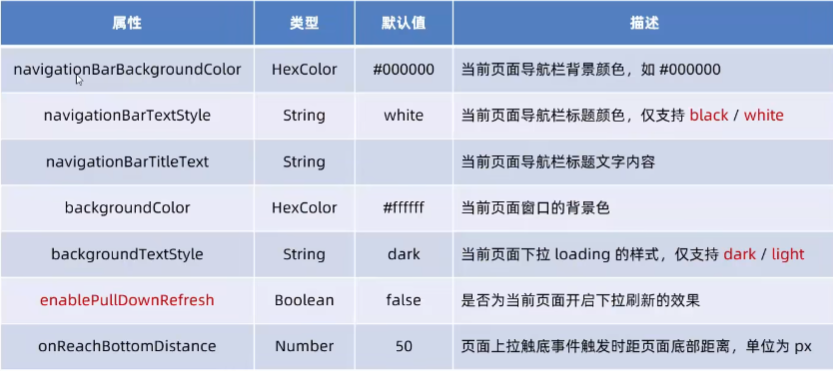

## 7. 网络请求

- 只能请求HTTPS的接口
- 必须将接口的域名添加到信任列表
- 域名不能使用ip地址或者localhost
- 域名必须经过ICP备案
- 服务器域名一月个最多修改5次

### 发起GET请求

```js
wx.request({
    url: 'https://',
    method: 'GET',
    data:{
        name: '',
    },
    success: (res)=> {
        
    }
})

```

### 跳过合法域名检查

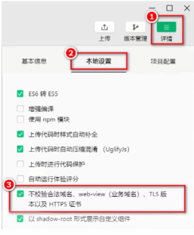

### 跨域问题

跨域问题只是基于web环境才会出现问题，微信小程序的运行环境不是web浏览器，所以不会出现跨域的问题

### ajax问题

ajax请求是基于 **XMLHttpRequest** 对象，小程序里面只能叫 **网络数据请求**

# 三、基础语法
## 1. 页面导航

### 1.1 声明式导航传参

**navigator** 组件的url属性用来指定将要跳转到的页面的路径。同时，路径后面还可以携带参数：

- 参数与路径使用？分割
- 参数键与参数值用 = 相连
- 不同参数用 & 分割

例如：

```html
<navigator url="/pages/info/info?user=name&age=20">跳转</navigator>
```

### 1.2 编程式传参

调用 **wx.navigateTo()** 方法跳转页面时，可以携带的参数

```html
<button bindtap="gotoInfo">跳转</button>
```

```js
gotoInfo() {
    wx.navigateTo({
        url: '/pages/info/info?name=zs&gender=男'
    })
}
```

通过 **声明式导航传参** 或 **编程式导航传参** 所携带的参数，可以直接在 **onLoad()** 事件中直接获取到，例如：

```js
onLoad:function(options) {
    console.log(options)
}
```

## 2. 页面事件

在js文件中通过对应的函数就可以监听到对应的事件

### 2.1 下拉刷新

**onPullDownRefresh()**，下拉刷新的 loading 效果会一直存在，不会主动消失，调用 **wx.stopPullDownRefresh()** 可以主动停止

### 2.2 上拉触底

用于加载更多的数据，**onReachBottom()**，这时需要进行截流否则会反复的执行发起请求

### 2.3 节流

节流的步骤

- data中定义一个表示 isLoading，表示已经开启了请求
- 在调用请求的方法中修改 isLoading
- 在 onReachBotton 中判断节流阀的值

### 2.4 显示Loading

**wx.showLoading()** 函数就可以显示 **load** 的加载

```js
get() {
    wx.showLoading({title: '数据加载中....'}) //显示loading效果
    wx.request({
        complete:()=> {
            wx.hideLoading() 				//隐藏loading效果
        }
    })
}
```

### 2.5 右上角分享

**onShareAppMessage()**

## 3. 生命周期

### 3.1 生命周期概念

- 应用生命周期
  - 小程序启动 -> 运行 -> 销毁的过程
- 页面生命周期
  - 每个页面的加载 -> 渲染 -> 销毁的过程


### 3.2 生命周期函数

- 应用生命周期函数
  - 小程序启动 -> 运行 -> 销毁的过程依次调用的函数

```js
App({
  /**
   * 当小程序初始化完成时，会触发 onLaunch（全局只触发一次）
   */
  onLaunch: function () {},

  /**
   * 当小程序启动，或从后台进入前台显示，会触发 onShow
   */
  onShow: function (options) {},

  /**
   * 当小程序从前台进入后台，会触发 onHide
   */
  onHide: function () {},

  /**
   * 当小程序发生脚本错误，或者 api 调用失败时，会触发 onError 并带上错误信息
   */
  onError: function (msg) {}
})
```

- 页面生命周期
  - 每个页面的加载 -> 渲染 -> 销毁的过程依次调用的函数

```js
//页面中.js文件声明
Page({
  /**
   * 监听页面加载，一个页面只会调用1次
   */
  onLoad: function (options) {},

  /**
   * 页面监听显示
   */
  onShow: function () {},

  /**
   * 监听页面初次渲染完成，一个页面只调用1次
   */
  onReady: function () {},

  /**
   * 监听页面隐藏
   */
  onHide: function () {},
    
  /**
   * 监听页面卸载
   */
  onUnLoad: function () {}
})
```

## 4. wxs脚本

跟 **javascript** 相似的一套内嵌的模板脚本，独立的一套语法；wxs代码可以编写在 wxml 文件中的 <wxs\> 标签类

### 4.1 内嵌

```html
<view>{{m1.toUpper(username)}}</view>
<wxs module="m1">
    module.exports.toUpper = function(str) {
    	return str.toUpperCase()
    }
</wxs>
```

### 4.2 外联

定义 **tools.wxs** 文件

```js
function toLower(str) {
    return str.toLowerCase()
}
//暴露出去
module.exports = {
    toLower: toLower
}
```

```html
<wxs module="m1" src="../../utils/tools.wxs"></wxs>
```

# 四、基础增强

## 1. 自定义组件

### 1.1 创建组件

- 项目根目录中创建 **components** 文件夹
- 在 **components** 中新建 **component**
- 输入组件的名称后会创建4个文件，后缀分别为 **js、json、wxml、wxss**

### 1.2 引用组件

#### 局部引用

在页面的 .json 配置文件中引入

```json
{
    "usingComponents":{
        "组件名称":"组件的路径（不需要后缀）"
    }
}
```

```html
<my-test></my-test>
```

#### 全局引用

在根目录下面的 app.json 文件

```json
{
    "usingComponents":{
        "组件名称":"组件的路径（不需要后缀）"
    }
}
```

### 1.3 组件页面和页面的区别

- 组件的.json文件中需要声明 **component:true**
- 组件的.js文件中调用的是 **Component()** 函数，页面是 **Page()** 函数
- 组件的事件函数需要定义到 **methods** 节点中，页面的就跟 **data** 同级就行

### 1.4 自定义组件样式

组件的样式相互之间是隔离的

- 组件的样式不会影响其他的组件
- 组件的样式不会影响小程序页面的样式

注意点：

- app.wxss 在组件中是无效的
- 只有class的选择器会有样式隔离，id选择器、标签选择器等都没有样式隔离（**建议使用class选择器，不要使用id、属性、标签选择器**）

### 1.5 修改组件的样式隔离

默认情况存在组件样式的隔离，但有时候希望外部可以修改组件的样式，此时就可以通过 **styleIsolation** 修改组件的样式隔离选项，例如：

在组件中新增样式

```js
Component({
    options: {
        styleIsolation: 'isolated'
    }
})
```

在组件的 json文件中新增配置

```json
{
    "styleIsolation": 'isolated'
}
```

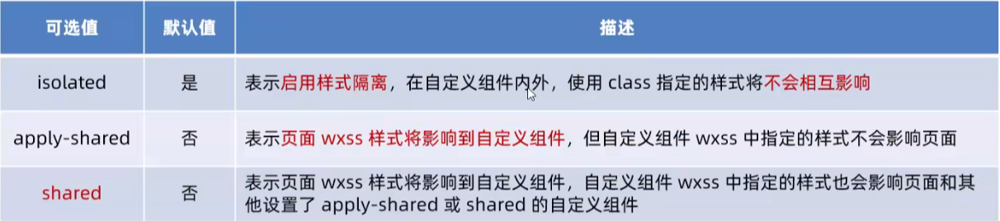

### 1.6 数据、方法、属性

```js
Component({
    //组件的私有数据
    data: {
        
    },
    //事件处理函数和自定义方法
    methods: {
        //没有下划线的就是事件处理函数，主要用于区分
        add(){
            
        },
        //下划线的开头都是自定义方法
        _show() {
            
        }
    },
    //接收外部传入的数据
    properties: {
        max: {					//完成定义属性的方式，需要指定默认值和类型
            type: Number,		//值的类型
            value: 10   		//属性默认值
        },
        max: Number				//简化的属性定义方式
    }
    // <my-test max="20"></my-test>   使用
})
```

#### data和properties区别

data和properties都是 **可读可写** ，只不过，data倾向于存储组件的私有数据，properties存储外部传入的数据；都可以使用 **setData()** 去修改 **properties** 的值，页面使用时也可以直接使用  **{{}}** 进行取值

### 1.7 数据监听器

用于监听和响应数据字段的变化

```js
Component({
    observers: {
        '字段A，字段B': function(字段A的新增，字段B的新增) {
            //do somthing
        }
    }
})
```

#### 监听基本数据变化

```js
Component({
    data: {
        max: 1,
        min: 0
    }
    observers: {
        'max，min': function(max，min) {
            setData({
                max: max,
                min: min
            })
        }
    }
})
```

#### 监听对象属性变化

```js
Component({
    data: {
        obj: {
            num: 1
        },
        obj2: {
            num: 0
        },
        f: {
            num1: 0,
            num2: 0
        }
    }
    observers: {
        'obj.num，obj2.num': function(a，b) {
            setData({
                f: {
                    num1: a,
                    num2: b
                }
            })
        },'obj.**': function(obj) {  //会监听obj所有的属性
            setData({
                f: {
                    num1: obj.num
                }
            })
        }
    }
})
```

### 1.8 纯数据字段

**不会传递给其他组件以及不会展示在页面上的字段可以定义为纯数据字段**，纯数据的性能非常高

```js
Component({
    data: {
        a: 1,
        _b: 1
    },
    options: { #正则表达式指定下划线开头的字段叫做纯数据字段
        pureDataPattern: /^_/
    }
})
```

### 1.9 组件的生命周期

#### 特点

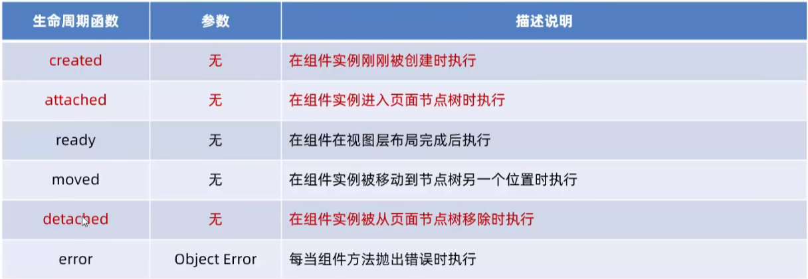

- 组件实例刚被创建好，**created** 生命周期函数会被触发
  - 此时不能调用 setData
  - 只应该给组件的this添加一些自定义的属性字段

- 在组件完全初始化完毕，进入页面节点树后，**attached** 生命周期函数会被触发
  - this.data已经被初始化完毕
  - 绝大多数初始化的工作可以在这个时机进行（例如：发送请求获取初始化数据）

- 在组件离开页面节点树后，detached 生命周期函数会被触发
  - 退出一个页面，会触发 detached
  - 适合做一些清理性质的工作

#### 定义

- 方法一：跟 data属性平级（不推荐使用）
- 方法二：在lifetimes节点中进行声明

```
Component({
    data: {
        a: 1,
        _b: 1
    },
    lifetimes: {
    	ready: function() {}
    }
})
```


### 1.10 组件所在页面的生命周期

**组件可以监听所在页面的生命周期阶段**，组件可以访问以下三个页面生命周期函数

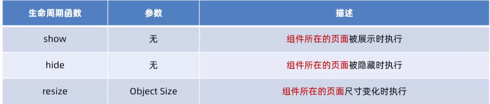

```js
Component({
    data: {
        a: 1,
        _b: 1
    },
    pagelifetimes: {
    	show: function() {}
	}
})
```

### 1.11 插槽

在自定义组件的 wxml 结构中，可以提供一个 <slot/> 节点标签，用于占位，使用者可以填充具体的标签；

在每个自定义的组件中只能使用一个 <slot/> 进行占位，这是单个插槽的使用

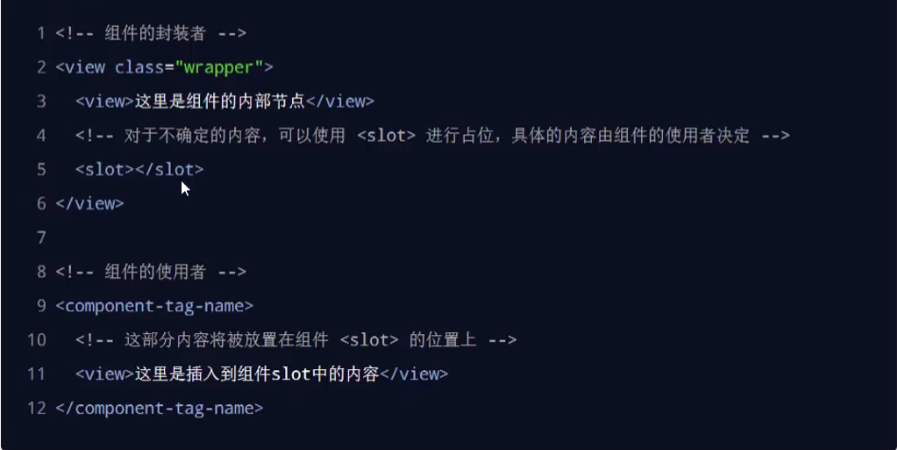

如果需要使用多个插槽的话，需要在 **options** 中进行配置

```js
Component({
    options: { 
    	multipleSlots: true
    }
})
```

```html
<view>
    // 名称可以随意定义
    <slot name="a"></slot>
    <slot name="b"></slot>
</view>
```

```html
<my-conponent>
    <view slot="a">123</view>
    <view slot="b">465</view>
</my-conponent>
```

## 2. 组件通信

### 2.1 父子组件通信

- 属性绑定
  - 用于父组件向子组件的指定属性设置数据，仅能设置json兼容的数据

```js
Component({
    properties: {
        count: Number
    }
})
```

```html
//父组件中使用子组件进行传值
<my-component count="{{count}}"></my-component>
```

- 事件绑定
  - 用于子组件向父组件传递数据

```js
#父组件中定义好 addCount() 方法
Page({
    data: {
        count: 0
    },
    parentAddCount(e){
        this.setData({
            count: e.detail.value
        })
    }
})
```

```html
//bind:padd="parentAddCount" 绑定事件名称为parentAddCount的方法在子组件中叫padd
<my-component count="{{count}}" bind:padd="parentAddCount"></my-component>
```

```js
Component({
    properties: {
        count: Number
    },
    methods: {
        addCount: function() {
            //使用 triggerEvent 父组件触发事件
            this.triggerEvent('padd', {
                value: this.properties.count
            })
        }
    }
})
```

- 获取组件实例
  - 父组件可以通过 this.selectComponent("id或者class选择器") 获取子组件实例对象，父组件就可以直接访问子组件的任意数据和方法

```html
<my-component count="{{count}}" bind:padd="parentAddCount" class="c" id="i"></my-component>
```

```js
Page({
    data: {
        count: 0
    },
    add(){
        //获取到子组件实例
        const child = this.selectComponent("c")
        child.setData({
            count: child.properties.count + 1
        })
        //也可以使用，原型的参数可以直接使用
        child.addCount()
    }
})
```

## 3. Behaviors

用于实现组件间代码共享的特性，相当于抽公共代码；每个 behavior 可以包含一组 **属性、数组、生命周期函数和方法**，组件引用它时，它的属性、数据和方法会合并到一个组件中

```js
module.exports = Behavior({
    //属性节点
    propeties:{},
    data: {
        user: 'zs'
    },
    //定义方法
    methods: {}
    //其它的节点...
})
```

在组件Component的js文件中通过 require() 引入即可

```js
require('../../../mybehavior')
```

## 4. API Promise

默认情况下官方提供的异步 API 都是基于回调函数实现的，例如：网络请求的api，会有一个 **complete: () => {} ** 指定完成之后的回调函数；容易出现 **回调地狱**

### 4.1 安装Promise

> npm install --save miniprogram-api-promise@1.0.4
>
> 删除 miniprogram_npm 后重新构建npm

### 4.2 引入Promise

```js
import { promisifyAll } from 'miniprogram-api-promise'
//将wxp赋值给wx.p内部的自定义属性，后续所有的页面都可以使用wx.p
const wxp = wx.p = {}
promisifyAll(wx, wxp)
```

### 4.3 使用Promise

这样的方式获取到的 res 是一个 **Promise** 对象

```js
getMenuList() {
    const res = wx.p.request({
        url: 'https://www.escook.cn/categories'
    })
}
```

通过 async 与 await 关键字标识之后，这个时候的 res 返回的就是一个结果

```js
async getMenuList() {
    const res = await wx.p.request({
        url: 'https://www.escook.cn/categories'
    })
    console.log(res);
},
```

# 五、vant

## 1. 使用npm

小程序中使用npm的限制：

- 不支持依赖于Node.js内置库的包
- 不支持依赖于浏览器器内置对象的包
- 不支持依赖于C++插件的包

## 2. 安装 Vant Weapp

> https://vant-contrib.gitee.io/vant-weapp/#/quickstart

- 初始化 package.json 的包
  
- npm init -y
  
- 通过npm安装（测试版本为@1.3.3）

  -  npm i @vant/weapp@1.3.3 -S --production 

- 去除根目录 app.json 中的 **sytle:v2** 属性

- 修改 **project.config.json** 文件，新增下面的配置

  ```json
  {
    ...
    "setting": {
      ...
      "packNpmManually": true,
      "packNpmRelationList": [
        {
          "packageJsonPath": "./package.json",
          "miniprogramNpmDistDir": "./"  #由于目前新版开发者工具创建的小程序目录文件结构问题，npm构建的文件目录为miniprogram_npm，并且开发工具会默认在当前目录下创建miniprogram_npm的文件名，所以新版本的miniprogramNpmDistDir配置为'./'即可
        }
      ]
    }
  }
  
  ```

- 构建npm包：打开微信开发工具的导航栏选择 **工具 --> npm构建**

如果出现下面忽略了依赖的问题，在 **project.config.json** 配置中加入下面的配置信息

```json
"setting": {
    "ignoreDevUnusedFiles": false,
	"ignoreUploadUnusedFiles": false
}
```

  

## 3. 定制主题

### 3.1 CSS自定义属性（变量）

定义的方法使用 **--** 作为前缀；例如：--main-bg-color: brown，最佳实践是定义在 **:root** 根伪类元素，所有都可以使用，变量也是有作用域的

```css
:root {  #全局生效
    --main-bg-color: brown
}

.container1 { #当前变量就只能在标签 container1下面生效
    --main-bg-color: brown  
}

----使用----
element {
    background-color: var(--main-bg-color);
}
```

### 3.2 自定义vant主题

在 **app.wxss** 直接全局样式表中进行写，然后定义下面的css变量，全局生效的话尽量定义根节点

```css
page {
    #下面的变量是在vant官网进行定义好的
    --button-danger-background-color: #c00000;
    --button-danger-border-color: #d60000;
}
```

# 六、全局数据共享

**全局数据共享** （状态管理）是为了解决组件之间数据共享的问题。目前有：Vuex、Redux、Mobx等

小程序中使用 **mobx-miniprogram 配合 mobx-miniprogram-bindings** 实现数据共享。

- mobx-miniprogram：创建 Store 实例对象
- mobx-miniprogram-bindings：用于把 Store 中的共享数据或方法，绑定到组件或者页面中使用

## 1. 安装Mobx

> npm install --save mobx-miniprogram@4.13.2 mobx-miniprogram-bindings@1.2.1
>
> 删除 miniprogram_npm 后重新构建npm

## 2. 使用Mobx

**get** ：标识符表示当前方法是只读的，不能进行修改；**action** ：函数是用与修改store内部的数据

```js
import {
  action,
  observable
} from 'mobx-miniprogram'


export const store = observable({
  //共享字段
  numA: 1,
  numB: 2,
  //get标识符是表示只读
  get sum() {
    return this.numA + this.numB
  },
  // action函数用于修改store中的数据
  updateNumA: action(function (step) {
    this.numA += step
  }),
  updateNumB: action(function (step) {
    this.numB += step
  })
})
```

### 2.1 页面绑定

```js
import { createStoreBindings } from 'mobx-miniprogram-bindings'
import { store } from '../../store/store'
Page({
    onLoad(options) {
    //绑定store到当前页面
    this.storeBindings = createStoreBindings(this, {
      //store表示绑定数据源
      store,
      //指定哪些字段需要绑定到当前页面
      fields: ['numA', 'numB', 'sum'],
      //绑定action方法到当前
      actions: ['updateNumA']
    })
  },
    onUnload() {
        //清除绑定
        this.storeBindings.destroyStoreBindings()
    },
    //直接调用绑定的函数即可
    add() {
      this.updateNumA(1)
    },
})
```

### 2.2 组件绑定

```js
import { createStoreBindings } from 'mobx-miniprogram-bindings'
import { store } from '../../store/store'
Component({
    behaviors: [storeBindingsBehavior], //通过 storeBindingsBehavior 来实现自动清理
    
    storeBindings: {
        //数据源
        store,
        //字段绑定
        fields: {
            numA: () => store.numA,		  //绑定字段的第一种方式
            numB: (store) => store.numB,  //绑定字段的第二种方式
            sum: 'sum'					  //绑定字段的第三种方式,最方便使用
        },
        actions: {  //指定要绑定的方法
        	updateNumA: 'updateNumA'
    	},
    },
    data: {
        
    }
})
```

# 七、分包

把一个完整的小程序项目，按照需求划分为不同的子包，在构建时打包成不同的分包，用户在使用时按需进行下载，分包后小程序项目由 **1个主包 + 多个分包组成**

- 主包：一般只包含项目的 **启动页面** 或 **TabBar页面**，以及所有分包都需要用到的一些 **公共资源**
- 分包：只包含和当前分包有关的页面和私有资源

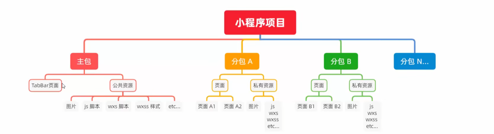

## 1. 分包的加载规则

- 小程序启动时，默认会 **下载主包** 并 **启动主包内页面**
  - tabBar页面需要放到主包中
- 当用户进行分包内某个页面时，客户端会把对应分包下载下来，下载完成后再次进行展示
  - 非tabBar页面可以按照功能的不同，划分为不同的分包之后，进行按需下载

## 2. 分包限制

- 整个小程序的分包大小不超过16M（主包+所有分包）
- 单个分包/主包大小不能超过2M

## 3. 配置分包

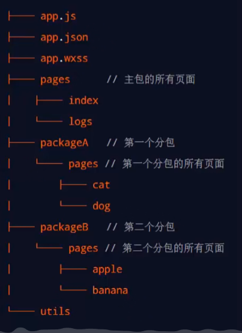

在 **app.json** 的 **subpackage** 节点中声明分包的结构，也可以在 **root** 节点平级通过 **name** 设置别名

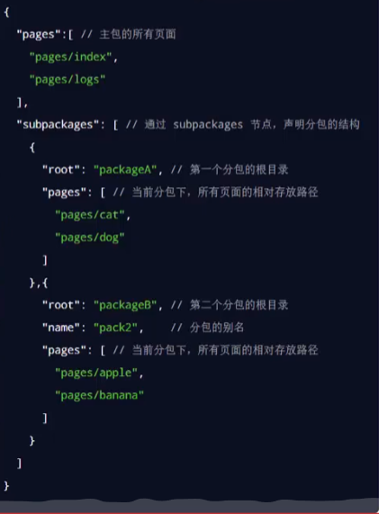

## 4. 打包原则

- 小程序会按 **subpackages** 的配置进行分包， **subpackages** 之外的目录将被打包到主包中
- 主包也可以有自己的 **pages**
- tabBar页面必须在主包内
- 分包之间不能相互嵌套

## 5. 引用原则

- 主包无法引用分包内的私有资源
- 分包之间不能互相引用私有资源
- 分包可以引用主包内的公共资源

## 6. 独立分包

可以独立于主包和其它分包而独立运行（**用户可以直接通过独立分包启动小程序**）

- 普通分包必须依赖主包运行
- 独立分包可以在不下载主包的情况下，独立运行

开发者可以按需，将某些具有一定功能独立性的页面配置到独立分包中，原因：

- 当小程序从普通的分包页面启动时，需要首先下载主包
- 独立分包不依赖主包即可运行，可以很大程序上提升分包页面的启动

节点中是否有 **independent** 属性

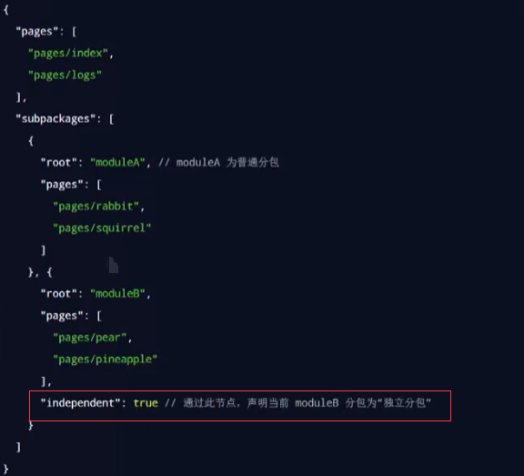

独立分包和普通分包相互隔绝，不能相互引用彼此的资源，例如：

- 主包无法引用独立分包内的私有资源
- 独立分包之间，不能相互引用私有资源
- 独立分包和普通分包之间，不能相互引用私有资源
- 特别注意：独立分包中不能引用主包内的公共资源

## 7. 分包预下载

在进入指定的页面时触发，提升后续进入小程序页面的启动速度；注意：分包预下载的大小不能超过2m

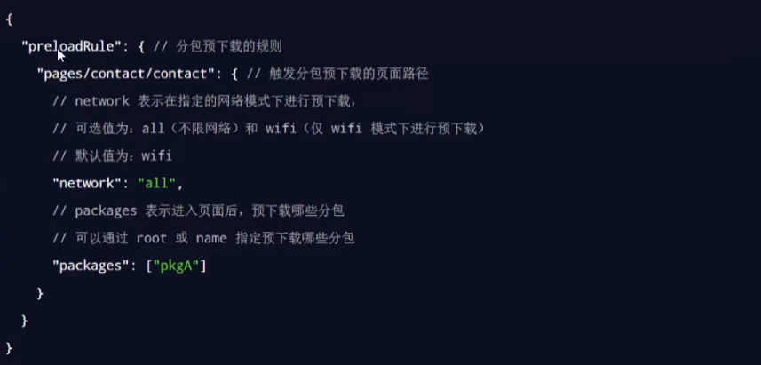

# 八、uniapp

是一个使用 **vue.js** 开发的前端框架，推荐使用 **HbuilderX** 工具进行开发

> [Headline | uniapp - 黑马优购 (escook.cn)](https://www.escook.cn/docs-uni-shop/) #黑马项目文档

## 1.项目结构

所有的组件和页面都是 **vue** 结尾的，因为 uni-app 是通过 **vue** 进行开发的

```text
┌─components            uni-app组件目录
│  └─comp-a.vue         可复用的a组件
├─pages                 业务页面文件存放的目录
│  ├─index
│  │  └─index.vue       index页面
│  └─list
│     └─list.vue        list页面
├─static                存放应用引用静态资源（如图片、视频等）的目录，注意：静态资源只能存放于此
├─main.js               Vue初始化入口文件
├─App.vue               应用配置，用来配置小程序的全局样式、生命周期函数等
├─manifest.json         配置应用名称、appid、logo、版本等打包信息
└─pages.json            配置页面路径、页面窗口样式、tabBar、navigationBar 等页面类信息
```

