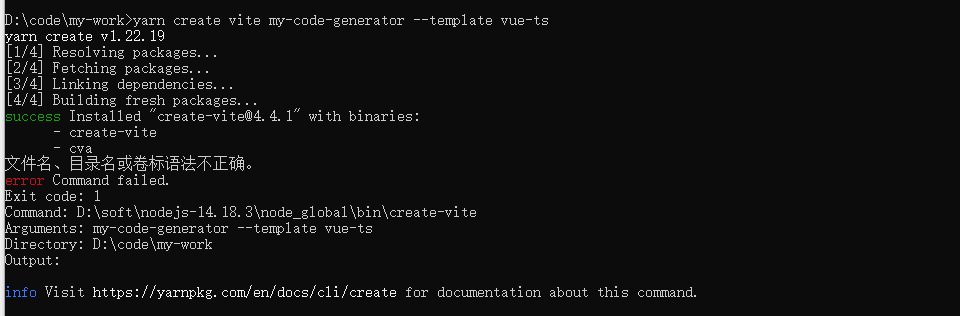
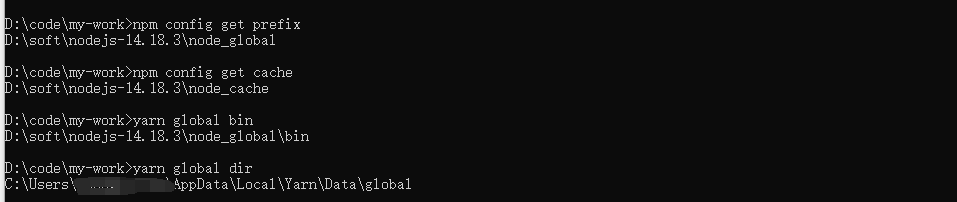
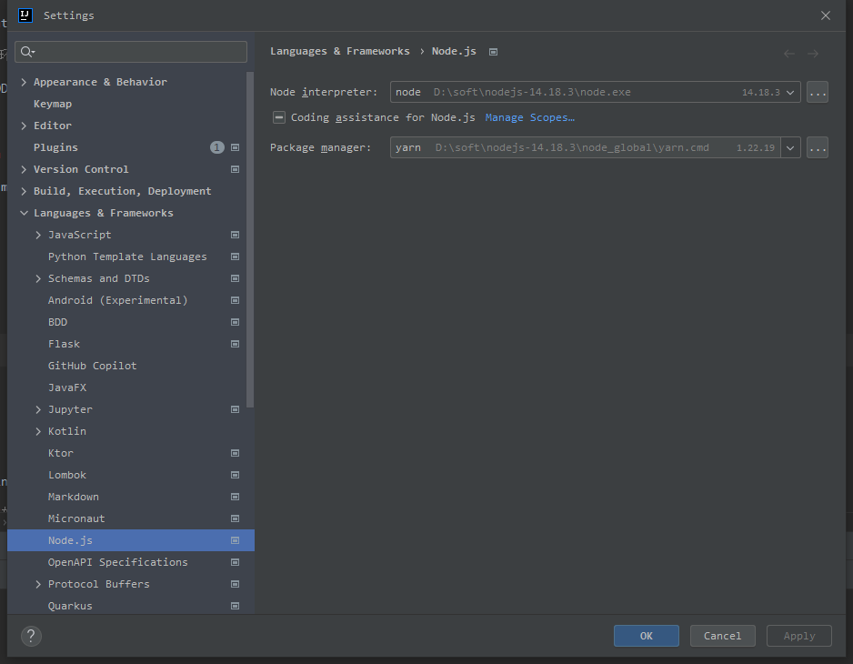

# vue开发桌面APP

通过使用 vue+vite+ts的语法创建项目

> yarn create vite my-test --template vue-ts

## 1. 配置yarn

出现以下问题是因为 **yarn** 的**yarn** 的全局安装位置与 bin 所在的位置不一致所导致的





在nodejs的目录下面创建对应的文件夹，例如我的路径

> D:\soft\nodejs-14.18.3\node_modules\yarn\cache
>
> D:\soft\nodejs-14.18.3\node_modules\yarn\global

然后设置yarn的位置

> yarn config set global-folder "D:\soft\nodejs-14.18.3\node_modules\yarn\global"
>
> yarn config set cache-folder "D:\soft\nodejs-14.18.3\node_modules\yarn\cache"

再次初始化项目，然后下载依赖 **yarn install**

## 2. 配置idea

如果是使用idea进行创建vue项目，可能会出现 **Unresolved function or method require()** 这种没有代码提示的问题，可以执行下面的配置

> **Preferences -> Languages & Frameworks -> Node.js and NPM -> Coding assistance for Node.js**
>
> 勾选 **Coding assistance for Node.js**



## 3. 添加electron

### 3.1下载依赖

```cmd
yarn add electron concurrently cross-env electron-builder -D
```

- electron：electron依赖
- concurently：用于简化启动方式
- cross-env：配置环境变量
- electron-builder：打包时使用
- wait-on：等待监听端口

### 3.2 创建main.js

electron需要启动自己的环境，所以我们把配置都放到项目根目录下面的 **electron/main.js** 中

```javascript
const { app, BrowserWindow, screen } = require("electron")
const path = require("path")
//获取到环境中的变量
const NODE_ENV = process.env.NODE_ENV

function createWindow() {
  const mainWindow = new BrowserWindow({
                                         widht: 800,
                                         height: 600,
                                         //预加载脚本
                                         webPreferences: {
                                           preload: path.join(__dirname, "preload.js")
                                         }
                                       });
  mainWindow.loadURL(
      //如果时开发模式采用http://localhost:3000方式进行监听nodejs的启动，如果是生产模式采用file://方式加载打包后的文件
      NODE_ENV === "development" ? "http://localhost:5173" : `file://${path.join(__dirname, "../dist/index.html")}`
  )
  if (NODE_ENV === "development") {
    mainWindow.webContents.openDevTools()
  }
}
//当程序启动时，会触发ready事件，然后执行createWindow方法
app.whenReady().then(() => {
  createWindow()
  app.on("activate", function () {
    if (BrowserWindow.getAllWindows().length === 0) createWindow()
  })
});
//所有窗口都关闭时退出程序
app.on("window-all-closed", function () {
  if (process.platform !== "darwin") app.quit()
});

```

### 3.3 启动命令

在 **packge.json** 中创建简化启动的命令

```json
"scripts": {
    "electron:serve": "concurrently -k \"yarn electron\" \"yarn dev\"",
    "dev": "vite",
    "build": "vue-tsc && vite build",
    "preview": "vite preview",
    "electron": "wait-on tcp:5173 && cross-env NODE_ENV=development electron ."
  },
```

- dev：默认vite的启动，我这里用的是vue4的版本vite的启动端口是5173
- electron：electron需要监听vite的端口启动，启动完成了之后再设置环境变量为development，然后再通过electron . 来进行启动
- electron:serve：通过concurrently将两个命令集合再一起进行启动

### 3.4 打包命令

先打包 **vite** 然后将页面打包到 **electron**

> "electron:build": "vite build && electron-builder",

- productName：包名
- copyright：版权
- mac：分发的包
- nsis：可以设置背景图
- files：代表打包时需要加入哪些文件
  - “electron/**/\*”：需要将main.js也打包进去
- directories：编译目录的路径放在哪里

```json
"build": {
    "productName": "my-code-generator",
    "copyright": "Copyright (c) 2023",
    "mac": {
      "category": "public.app-category.utilities"
    },
    "nsis": {
      "oneClick": false,
      "allowToChangeInstallationDirectory": true
    },
    "files": [
      "dist/**/*",
      "electron/**/*"
    ],
    "directories": {
      "buildResources": "assets",
      "output": "dist_electron"
    }
  }

```

修改 **vite.config.ts** ，添加 **base** 属性来修改文件的映射方式

```typescript
import {defineConfig} from 'vite'
import vue from '@vitejs/plugin-vue'

// https://vitejs.dev/config/
export default defineConfig({
    base: "./",
    plugins: [vue()],
})
```

解压 **asar** 文件，可以排查三方依赖的路径

> npm install -g asar

## 4. 添加跨域

在 **electron/main.js** 中添加 **webSecurity: false**，以及添加环境变量来规避跨域导致的警告

### 方案一

```typescript
process.env["ELECTRON_DISABLE_SECURITY_WARNINGS"] = "true"

new BrowserWindow({
                                         webPreferences: {
                                           // 设置跨域
                                           webSecurity: false,
                                         }
                                       });
```

### 方案二

在发起请求的时候设置头部请求字段设置跨域

```typescript
process.env["ELECTRON_DISABLE_SECURITY_WARNINGS"] = "true"
app.whenReady().then(() => {
   mainWindow = createWindow() mainWindow.webContents.session.webRequest.onBeforeSendHeaders((details, callback) => {
    callback({
               requestHeaders: { Origin: "*", ...details.requestHeaders }
             })
  })
  mainWindow.webContents.session.webRequest.onHeadersReceived((details, callback) => {
    callback({
               responseHeaders: { "Access-Control-Allow-Origin": ["*"], ...details.responseHeaders }
             })
  })
})
```

