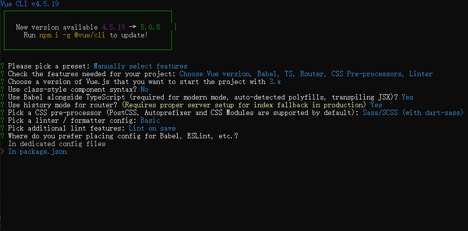

# vue3+ts开发项目

## 1. 创建项目

> vue create vue3-ts-demo

- 选择 Manually select features自定义安装
  - TypeScript：ts语法
  - Router：vue router
  - vuex：看情况是否需要引入
  - Css Pre-processors：css预处理器

- 然后选择vue 3.x的版本
- Use Class-style component syntax：是否使用class的方式创建组件选择No
- Use Babel alongside TypeScript：选择Yes，自动配置ts的一些基础配置
- Use history mode for router：路由器的模式



## 2. 导入ElementUI

导入 **ElementUI-Plus** 的依赖 **[快速开始 | Element Plus (gitee.io)](https://element-plus.gitee.io/zh-CN/guide/quickstart.html#完整引入)**

> yarn add element-plus

### 2.1 按需导入

按需导入需要对其进行相关的配置，先安装插件然后在 **vue.config.js** 文件中新增内容

> npm install -D unplugin-vue-components unplugin-auto-import

```javascript
const { defineConfig } = require('@vue/cli-service')
const AutoImport = require('unplugin-auto-import/vite')
const Components = require('unplugin-vue-components/vite')
const { ElementPlusResolver } = require('unplugin-vue-components/resolvers')
module.exports = defineConfig({
    transpileDependencies: true,
    configureWebpack: {
        plugins: [
            // ...
            AutoImport({
              resolvers: [ElementPlusResolver()],
            }),
            Components({
              resolvers: [ElementPlusResolver()],
            }),
          ],
    }
})
```

