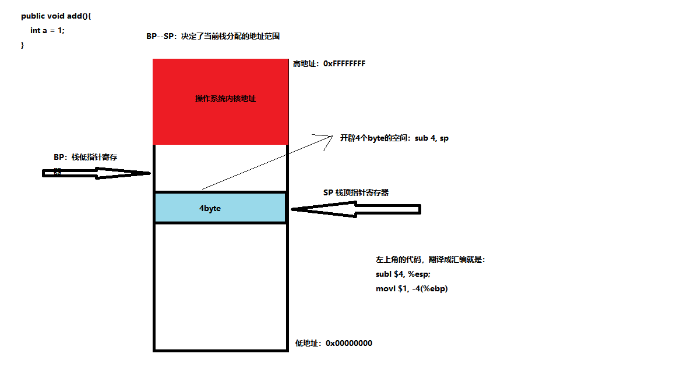

# 1. 概念

## 1.1 字节序

规定数据在内存单元中如何存放，Intel处理器使用 **小端序**（数据越往右越小） 进行字节序的存储：

- BP：用于存储栈底指针的寄存器（16位，32位叫EBP）
- SP：用于存储栈顶指针的寄存器（16位，32位叫ESP）

intel处理器栈名称的发展，AX通用寄存器，X：可以代表H或者L，只有带X的寄存器才可以替换高低位

> 16位：BP --------> 32位：EBP ----------> 64位：RBP

汇编指令中，对指令进行操作时需要指定当前指令所操作的位数，例如：subl $4, %esp

- b：8位
- w：16位
- l：32位
- q：64位

## 1.2 方法栈的调用

汇编中使用 **SP** 寄存器和 **BP** 寄存器保存栈顶和栈底，而32位机中为 **ESP** 和 **EBP** ， 32位就是 **RBP** 和 **RSP**

