# helloos第一天

## 1、准备工作

### 1.1 二进制编辑器

- Binary Editor
- HxD
- BZ（https://dwangshuo.jb51.net/201802/tools/Bz1621.lzh_jb51.rar）

### 1.2 虚拟机（VM）

- VMware Workstation Pro15

## 2、实际操作

### 2.1 二进制源码

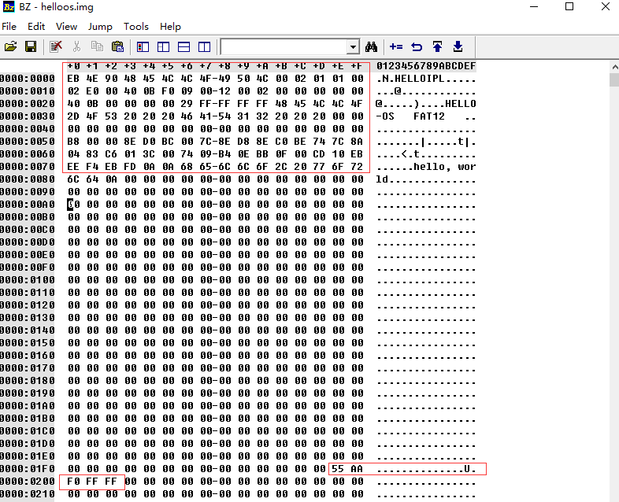

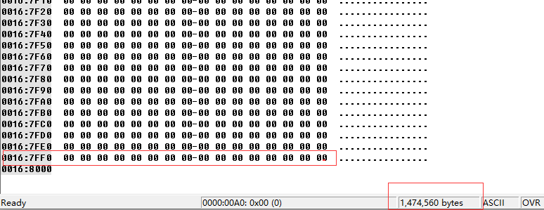

**其余部位全部用00进行填充，一直到167FF0行，文件大小为 1474560（1440 * 1024字节）**文件格式保存为.img文件。

### 2.2 虚拟机安装

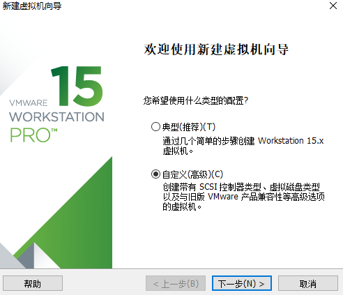

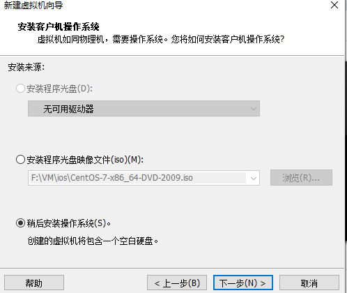

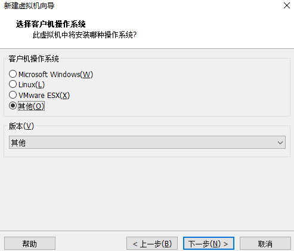

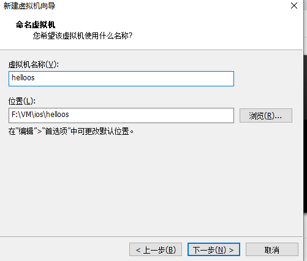

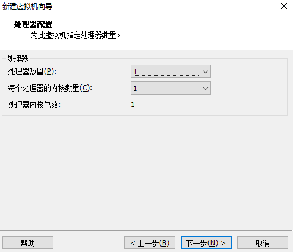

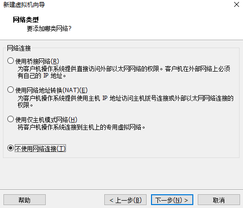

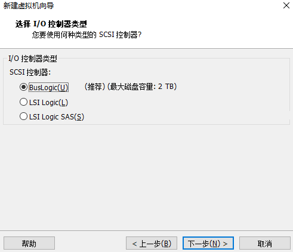

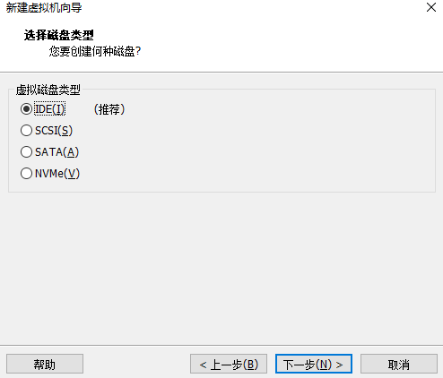

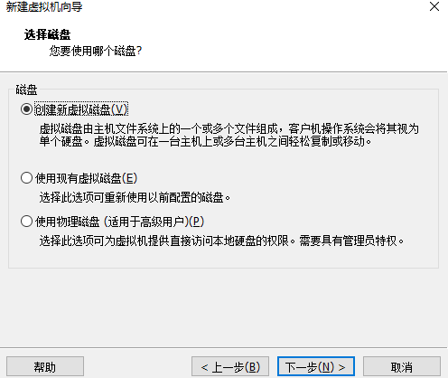

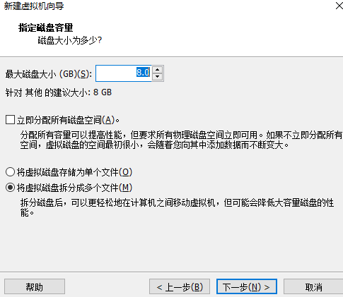

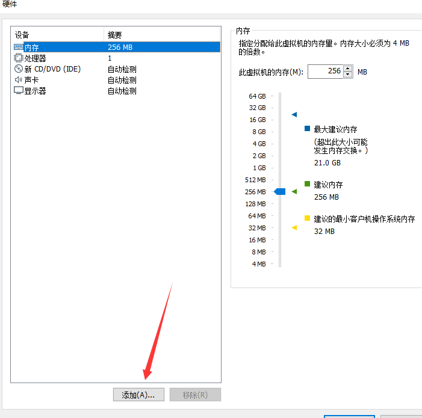

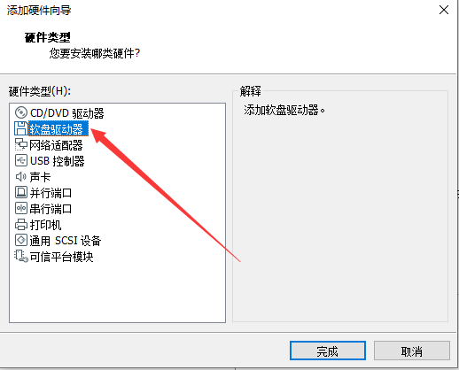

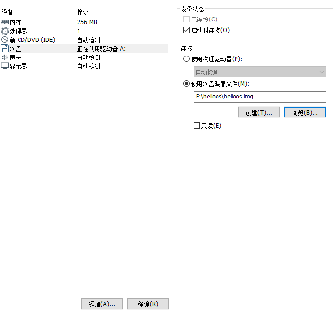

完成后，打开虚拟机，显示完成，如果有问题检查一下二进制文件是否输入正确。

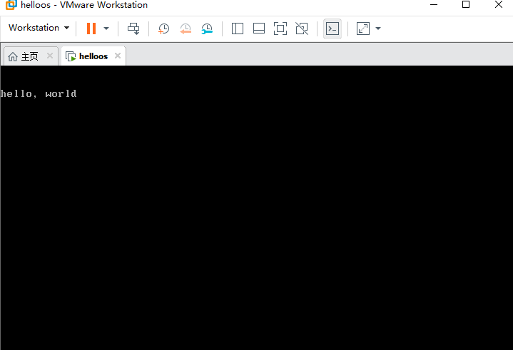

## 3、理论学习

### 3.1 CPU（central process unit）

中央处理单元：本质上我们在电脑所做的所有操作都是在跟CPU做电信号的交换，而CPU只懂 开（ON）关（OFF）两种状态，可以用：

0000 0000 0000 0000 0000 0000 0100 1010 0010 这个32位的电信号的集合来表示1186这个整数

0000 0100 1011 0100 1111 0100 1111 0100 0010 这个32位的电信号集合来表示”BOOK“这个单词

电信号跟0/1对应起来，就能将电信号转换为而进行，二进制也可以转换为电信号，再将文字都编上号（文字编码），就可以建立文字与数字的关系，从而就可以把文字转换成电信号，让CPU来处理文章等多媒体数据。而计算机行业普偏使用十六进制来进行编写。

### 3.2 寄存器

常用的代表性8种寄存器，每个寄存器都是16位，可以存储16位的二进制数，8个寄存器全部加起来只有16字节，只能存储16字节的数据

- AX：累加寄存器
- CX：计数寄存器
- DX：数据寄存器
- SP：栈指针寄存器
- BP：基址指针寄存器
- SI：源变址寄存器
- DI：目的变址寄存器

还有CPU中8个8位寄存器

- AL：累加寄存器低位
- CL：技术寄存器低位
- DL：数据寄存器低位
- BL：基址寄存器低位
- AH：累加寄存器高位
- CH：计数寄存器高位
- DH：数据寄存器高位
- BH：基址寄存器高位

待更新。。。。
