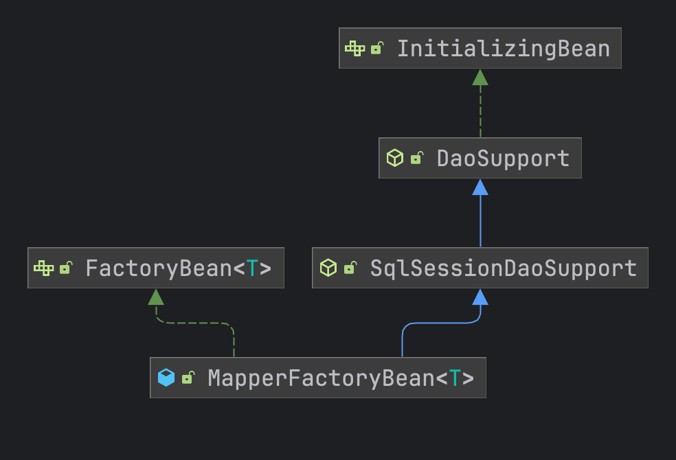

# mybatis plus源码解析

mybatis plus的源码以 **3.5.3** 的版本进行阅读

## 1. Configuration

mybatis plus复写了mybatis的 **Configuration** 类，**Configuration** 类将所有的配置信息都进行了保存

```java
public class Configuration {
  //构建的环境对象，里面包含了环境的id和数据源、事务工厂
  protected Environment environment;
  //是否允许在嵌套语句中使用分页，如果允许设置为false
  protected boolean safeRowBoundsEnabled;
  //是否允许在嵌套语句中使用结果处理器
  protected boolean safeResultHandlerEnabled = true;
  //开启下划线转驼峰
  protected boolean mapUnderscoreToCamelCase;
  //任一方法的调用都会加载该对象的所有延迟加载属性
  protected boolean aggressiveLazyLoading;
  //是否允许单个语句返回多结果集（需要数据库驱动支持）
  protected boolean multipleResultSetsEnabled = true;
  //允许 JDBC 支持自动生成主键，需要数据库驱动支持
  protected boolean useGeneratedKeys;
  //使用列标签代替列名
  protected boolean useColumnLabel = true;
  //开启全局性缓存
  protected boolean cacheEnabled = true;
  //指定当结果集中值为 null 的时候是否调用映射对象的 setter（map 对象时为 put）方法
  protected boolean callSettersOnNulls;
  //是否使用真实的参数名称
  protected boolean useActualParamName = true;
  //当返回行的所有列都是空时，MyBatis默认返回 null。 当开启这个设置时，MyBatis会返回一个空实例
  protected boolean returnInstanceForEmptyRow;
  //从SQL中删除多余的空格字符。会影响SQL中的文字字符串
  protected boolean shrinkWhitespacesInSql;
  //日志打印的前缀
  protected String logPrefix;
  //log的实现类
  protected Class<? extends Log> logImpl;
  //vfs实现类
  protected Class<? extends VFS> vfsImpl;
  //默认sql支持类
  protected Class<?> defaultSqlProviderType;
  /**
   * 利用本地缓存机制（Local Cache）防止循环引用和加速重复的嵌套查询
   * SESSION ：会缓存一个会话中执行的所有查询
   * STATEMENT：本地缓存将仅用于执行语句，对相同 SqlSession 的不同查询将不会进行缓存
   */
  protected LocalCacheScope localCacheScope = LocalCacheScope.SESSION;
  //当没有为参数指定特定的 JDBC 类型时，空值的默认 JDBC 类型。 某些数据库驱动需要指定列的 JDBC 类型，多数情况直接用一般类型即可，比如 NULL、VARCHAR 或 OTHER
  protected JdbcType jdbcTypeForNull = JdbcType.OTHER;
  //指定对象的哪些方法触发一次延迟加载
  protected Set<String> lazyLoadTriggerMethods = new HashSet<>(Arrays.asList("equals", "clone", "hashCode", "toString"));
  //设置超时时间，它决定数据库驱动等待数据库响应的秒数
  protected Integer defaultStatementTimeout;
  //默认拉取的数量
  protected Integer defaultFetchSize;
  /**
   * 默认的结果集的类型
   * DEFAULT
   * FORWARD_ONLY：只允许结果集的游标向下移动，读取了的记录会自动释放内存
   * SCROLL_INSENSITIVE、SCROLL_SENSITIVE：保证游标可以向上移动到任意位置，如果数据量过大了会出现OOM
   */
  protected ResultSetType defaultResultSetType;
  /**
   * 执行器的类型
   * SIMPLE：SimpleExecutor，每次都会关闭 Statement，每次操作都会开启新的
   * REUSE：ReuseExecutor：不会关闭 Statement，会存放在缓存中进行复用
   * BATCH：BatchExecutor：会重复使用Statement，并且会批量进行更新，事务没法自动提交
   */
  protected ExecutorType defaultExecutorType = ExecutorType.SIMPLE;

  /**
   * 指定 MyBatis 应如何自动映射列到字段或属性
   * NONE：关闭自动映射
   * PARTIAL：只会自动映射没有定义嵌套结果映射的字段
   * FULL：自动映射任何复杂的结果集
   */
  protected AutoMappingBehavior autoMappingBehavior = AutoMappingBehavior.PARTIAL;

  /**
   * 指定发现自动映射目标未知列（或未知属性类型）的行为
   * NONE：什么都不做
   * WARNING：打印告警日志（org.apache.ibatis.session.AutoMappingUnknownColumnBehavior）
   * FAILING：映射失败（SqlSessionException）
   */
  protected AutoMappingUnknownColumnBehavior autoMappingUnknownColumnBehavior = AutoMappingUnknownColumnBehavior.NONE;
  //自定义的配置类
  protected Properties variables = new Properties();
  //创建默认的反射工厂
  protected ReflectorFactory reflectorFactory = new DefaultReflectorFactory();
  //默认的对象工厂用于创建对象
  protected ObjectFactory objectFactory = new DefaultObjectFactory();
  //默认的包装对象的工厂类，默认实现类中并没有进行实现
  protected ObjectWrapperFactory objectWrapperFactory = new DefaultObjectWrapperFactory();
  //延迟加载的全局开关。当开启时，所有关联对象都会延迟加载。
  protected boolean lazyLoadingEnabled = false;
  //代理工厂对象
  protected ProxyFactory proxyFactory = new JavassistProxyFactory(); // #224 Using internal Javassist instead of OGNL
  //数据库的id
  protected String databaseId;
  /**
   * 指定一个提供 Configuration 实例的类，
   * 这个被返回的 Configuration 实例用来加载被反序列化对象的延迟加载属性值。
   * 这个类必须包含一个签名为static Configuration getConfiguration() 的方法
   *
   * @see <a href='https://github.com/mybatis/old-google-code-issues/issues/300'>Issue 300 (google code)</a>
   */
  protected Class<?> configurationFactory;
  //mapper接口的注册工厂
  protected final MapperRegistry mapperRegistry = new MapperRegistry(this);
  //连接器链用于对插件进行代理
  protected final InterceptorChain interceptorChain = new InterceptorChain();
  //类型处理器的注册工厂
  protected final TypeHandlerRegistry typeHandlerRegistry = new TypeHandlerRegistry(this);
  //别名注册工厂
  protected final TypeAliasRegistry typeAliasRegistry = new TypeAliasRegistry();
  //驱动注册工厂
  protected final LanguageDriverRegistry languageRegistry = new LanguageDriverRegistry();
  //保存所有的sql语句解析出来的 MappedStatement 对象
  protected final Map<String, MappedStatement> mappedStatements = new StrictMap<MappedStatement>("Mapped Statements collection")
      .conflictMessageProducer((savedValue, targetValue) ->
          ". please check " + savedValue.getResource() + " and " + targetValue.getResource());
  //保存解析出来的缓存
  protected final Map<String, Cache> caches = new StrictMap<>("Caches collection");
  //保存所有的ResultMap
  protected final Map<String, ResultMap> resultMaps = new StrictMap<>("Result Maps collection");
  //保存参数映射 ParameterMap 标签
  protected final Map<String, ParameterMap> parameterMaps = new StrictMap<>("Parameter Maps collection");
  //保存主键生成的策略
  protected final Map<String, KeyGenerator> keyGenerators = new StrictMap<>("Key Generators collection");
  //保存加载过的资源路径
  protected final Set<String> loadedResources = new HashSet<>();
  //xml解析的sql片段
  protected final Map<String, XNode> sqlFragments = new StrictMap<>("XML fragments parsed from previous mappers");

  //下面都是解析不完整的缓存
  protected final Collection<XMLStatementBuilder> incompleteStatements = new LinkedList<>();
  protected final Collection<CacheRefResolver> incompleteCacheRefs = new LinkedList<>();
  protected final Collection<ResultMapResolver> incompleteResultMaps = new LinkedList<>();
  protected final Collection<MethodResolver> incompleteMethods = new LinkedList<>();

  /*
   * A map holds cache-ref relationship. The key is the namespace that
   * references a cache bound to another namespace and the value is the
   * namespace which the actual cache is bound to.
   */
  protected final Map<String, String> cacheRefMap = new HashMap<>();
  
}
```

**MybatisConfiguration 继承至 Configuration** 新增了一些自己的逻辑注册了一些默认的处理器

```java
public class MybatisConfiguration extends Configuration {
  
  /**
     * Mapper 注册
     */
    protected final MybatisMapperRegistry mybatisMapperRegistry = new MybatisMapperRegistry(this);
    /**
     * 是否生成短key缓存
     */
    @Setter
    @Getter
    private boolean useGeneratedShortKey = true;

    public MybatisConfiguration(Environment environment) {
        this();
        this.environment = environment;
    }
    /**
     * 初始化调用
     */
    public MybatisConfiguration() {
        super();
        this.mapUnderscoreToCamelCase = true;
        typeHandlerRegistry.setDefaultEnumTypeHandler(CompositeEnumTypeHandler.class);
        languageRegistry.setDefaultDriverClass(MybatisXMLLanguageDriver.class);
    }
  
}
```

## 2. 解析类

### 2.1 SqlSessionFactoryBuilder

用于根据配置文件解析出 **SqlSessionFactory** 核心工厂类

```java
public SqlSessionFactory build(Reader reader, String environment, Properties properties) {
    try {
      //创建XML的解析器
      XMLConfigBuilder parser = new XMLConfigBuilder(reader, environment, properties);
      // parser.parse() 解析出对应的 Configuration对象进行构建
      return build(parser.parse());
    } catch (Exception e) {
      throw ExceptionFactory.wrapException("Error building SqlSession.", e);
    } finally {
      ErrorContext.instance().reset();
      try {
        reader.close();
      } catch (IOException e) {
        // Intentionally ignore. Prefer previous error.
      }
    }
  }
```

### 2.2 MybatisSqlSessionFactoryBuilder

mybatis plus定义的工厂构建器将mybatis的 **Builder** 进行了替换，修改成了自己实现的 **MybatisXMLConfigBuilder**，其中的逻辑都是差不多的

```java
public SqlSessionFactory build(Reader reader, String environment, Properties properties) {
        try {
            //TODO 这里换成 MybatisXMLConfigBuilder 而不是 XMLConfigBuilder
            MybatisXMLConfigBuilder parser = new MybatisXMLConfigBuilder(reader, environment, properties);
            return build(parser.parse());
        } catch (Exception e) {
            throw ExceptionFactory.wrapException("Error building SqlSession.", e);
        } finally {
            ErrorContext.instance().reset();
            try {
                reader.close();
            } catch (IOException e) {
                // Intentionally ignore. Prefer previous error.
            }
        }
    }
```

### 2.3 MybatisXMLConfigBuilder

**XMLConfigBuilder** myabtis的核心解析类，用于将xml配置的sql和配置构建为对应的实体类进行处理，mybatis plus进行了增强

```java
private void parseConfiguration(XNode root) {
    try {
      // issue #117 read properties first
      /**
       * 获取到 xml文件中 properties 的地址将下面的子节点 property解析成 Properties对象
       * 将 properties节点中的属性 resource以及url 加载出来，最后统一合并成 Properties（HashTable对象）
       * 最后设置到 Configuration对象中的 variables 属性
       */
      propertiesElement(root.evalNode("properties"));

      /**
       * 加载 settings 节点的配置信息，会检查 Configuration 对象中是否有对应属性的 set 方法
       */
      Properties settings = settingsAsProperties(root.evalNode("settings"));
      /**
       * 获取到 settings 里面的 vfsImpl的实现类进行加载，设置到 Configuration vfsImpl属性
       */
      loadCustomVfs(settings);
      /**
       * 设置自定义的日志实现
       */
      loadCustomLogImpl(settings);
      /**
       * 处理别名标签中子标签 package和typeAlias 前者是获取对应包下所有的子类，后面是单独的某个类的别名；然后根据 @Alias 注解来确定别名
       * 但是要注意两个标签的顺序 typeAlias在前；
       */
      typeAliasesElement(root.evalNode("typeAliases"));
      /**
       * 解析配置文件中的插件 Interceptor 添加到 configuration中
       */
      pluginElement(root.evalNode("plugins"));
      /**
       * 解析 ObjectFactory 对象，用于通过class创建实例化对象
       */
      objectFactoryElement(root.evalNode("objectFactory"));
      /**
       * 解析包装对象工厂，用于后续对结果集进行处理时，创建映射进行包装
       */
      objectWrapperFactoryElement(root.evalNode("objectWrapperFactory"));
      /**
       * 解析反射工厂
       */
      reflectorFactoryElement(root.evalNode("reflectorFactory"));
      /**
       * 将上面解析出来的 settings 配置给 configuration 对象进行赋值
       */
      settingsElement(settings);
      // read it after objectFactory and objectWrapperFactory issue #631
      /**
       * 解析环境，其中包含了 事务工厂以及数据源，以下默认的类型会创建的事务工厂以及数据源
       * JDBC: JdbcTransactionFactory
       * POOLED: PooledDataSourceFactory
       * 构建环境对象 Environment设置 事务工厂以及数据源
       */
      environmentsElement(root.evalNode("environments"));
      /**
       * 设置数据源的提供对象，主要用于设置 数据库Id到 configuration中
       */
      databaseIdProviderElement(root.evalNode("databaseIdProvider"));
      /**
       * 处理类型处理器，通过注解 MappedTypes 来标记java类型的处理，根据 MappedJdbcTypes 来对应jdbc的类型，然后关联上处理器
       * 最后存储的类型是 Map<JavaType, Map<JdbcType, Handler>> 首先通过java中的类型进行获取到对应的jdbc类型然后获取到对应的Handler
       */
      typeHandlerElement(root.evalNode("typeHandlers"));
      //解析mappers的文件
      mapperElement(root.evalNode("mappers"));
    } catch (Exception e) {
      throw new BuilderException("Error parsing SQL Mapper Configuration. Cause: " + e, e);
    }
  }
```

**解析Mapper接口信息**

```java
private void mapperElement(XNode parent) throws Exception {
    if (parent != null) {
      for (XNode child : parent.getChildren()) {
        //解析 package 标签
        if ("package".equals(child.getName())) {
          //解析 package 包路径下面的mapper接口
          String mapperPackage = child.getStringAttribute("name");
          configuration.addMappers(mapperPackage);
        } else {
          /**
           * 解析 mapper 标签
           * 处理：
           * 1. resource != null 并且 url和class 为空：
           *    解析 xml配置文件，解析mapper.xml中 namespace来设置命名空间，然后解析后续的节点
           *    解析完 xml配置后，会进行 mapper的解析，mapper对应的就是接口
           * 2. resource == null 和 class == null 并且 url != null
           *    按照url的io流进行解析
           * 3. resource == null 和 class != null 并且 url == null
           *    解析某个具体的mapper
           */
          String resource = child.getStringAttribute("resource");
          String url = child.getStringAttribute("url");
          String mapperClass = child.getStringAttribute("class");
          if (resource != null && url == null && mapperClass == null) {
            ErrorContext.instance().resource(resource);
            InputStream inputStream = Resources.getResourceAsStream(resource);
            //其中 MapperBuilderAssistant 属性比较重要用于关联缓存
            XMLMapperBuilder mapperParser = new XMLMapperBuilder(inputStream, configuration, resource, configuration.getSqlFragments());
            mapperParser.parse();
          } else if (resource == null && url != null && mapperClass == null) {
            ErrorContext.instance().resource(url);
            //根据url获取到数据流进行解析
            InputStream inputStream = Resources.getUrlAsStream(url);
            XMLMapperBuilder mapperParser = new XMLMapperBuilder(inputStream, configuration, url, configuration.getSqlFragments());
            mapperParser.parse();
          } else if (resource == null && url == null && mapperClass != null) {
            //解析 mapperClass 类型
            Class<?> mapperInterface = Resources.classForName(mapperClass);
            configuration.addMapper(mapperInterface);
          } else {
            throw new BuilderException("A mapper element may only specify a url, resource or class, but not more than one.");
          }
        }
      }
    }
  }
```


### 2.4 XMLMapperBuilder

用于解析 **xml** 文件，并且将对应的sql解析成实体类。在构建时会创建一下核心的类

- MapperBuilderAssistant：xml文件的构建助手
  - Cache：根据配置构建缓存
  - ParameterMap：映射xml配置中的 ParameterMap标签
  - ParameterMapping：根据xml每一行参数构建为参数映射对象
  - ResultMap：用于解析xml resultMap标签，下面会保存多个 ResultMapping
  - ResultMapping：更具xml resultMap中定义的结果集映射构建对应的实体
  - MappedStatement：将xml中对应的 select等语句解析的映射实体

```java
private void configurationElement(XNode context) {
    try {
      String namespace = context.getStringAttribute("namespace");
      if (namespace == null || namespace.isEmpty()) {
        throw new BuilderException("Mapper's namespace cannot be empty");
      }
      //设置上命名空间，mapper的完全限定名
      builderAssistant.setCurrentNamespace(namespace);
      /**
       * 解析缓存引用，解析成 CacheRefResolver，如果解析失败了 存入 configuration中
       * 通过 MapperBuilderAssistant 去从 configuration 中设置当前 Cache 对象用于本地缓存
       * 如果没有获取 Cache的话就会抛出异常，存放到 configuration中的 incompleteCacheRefs 集合中
       */
      cacheRefElement(context.evalNode("cache-ref"));
      /**
       * 解析缓存节点
       * 根据配置需要设置缓存中采用什么类型的进行缓存，以及设置淘汰策略，刷新间隔实践，是否只读，是否阻塞
       * 然后通过 MapperBuilderAssistant.useNewCache() 根据当前命名空间创建一个缓存
       */
      cacheElement(context.evalNode("cache"));
      /**
       * 解析 parameterMap 标签
       * 可以用于跟 result 标签进行配和使用，每个属性都可以关联一个resultMap，解析成 ParameterMapping
       */
      parameterMapElement(context.evalNodes("/mapper/parameterMap"));
      /**
       * 解析xml文件中的 resultMap
       */
      resultMapElements(context.evalNodes("/mapper/resultMap"));
      //解析sql标签
      sqlElement(context.evalNodes("/mapper/sql"));
      //解析sql语句的标签
      buildStatementFromContext(context.evalNodes("select|insert|update|delete"));
    } catch (Exception e) {
      throw new BuilderException("Error parsing Mapper XML. The XML location is '" + resource + "'. Cause: " + e, e);
    }
  }
```

#### 解析ResultMap

```java
private ResultMap resultMapElement(XNode resultMapNode, List<ResultMapping> additionalResultMappings, Class<?> enclosingType) {
    ErrorContext.instance().activity("processing " + resultMapNode.getValueBasedIdentifier());
    String type = resultMapNode.getStringAttribute("type",
        resultMapNode.getStringAttribute("ofType",
            resultMapNode.getStringAttribute("resultType",
                resultMapNode.getStringAttribute("javaType"))));
    //解析resultMap返回的type
    Class<?> typeClass = resolveClass(type);
    if (typeClass == null) {
      typeClass = inheritEnclosingType(resultMapNode, enclosingType);
    }
    Discriminator discriminator = null;
    List<ResultMapping> resultMappings = new ArrayList<>(additionalResultMappings);
    //获取到下面的子标签
    List<XNode> resultChildren = resultMapNode.getChildren();
    /**
     * 遍历resultMap下面的节点
     * 1. 先判断是否是 constructor 节点，解析构造函数
     * 2. discriminator 节点，解析鉴别器
     * 3. 其他节点，解析普通的字段映射
     * 4. 如果节点是id节点，那么就添加到flags中，表示是主键
     */
    for (XNode resultChild : resultChildren) {
      if ("constructor".equals(resultChild.getName())) {
        processConstructorElement(resultChild, typeClass, resultMappings);
      } else if ("discriminator".equals(resultChild.getName())) {
        discriminator = processDiscriminatorElement(resultChild, typeClass, resultMappings);
      } else {
        List<ResultFlag> flags = new ArrayList<>();
        if ("id".equals(resultChild.getName())) {
          flags.add(ResultFlag.ID);
        }
        //构建 ResultMapping 对象，每个 ResultMap有多个字段映射对象
        resultMappings.add(buildResultMappingFromContext(resultChild, typeClass, flags));
      }
    }
    String id = resultMapNode.getStringAttribute("id",
            resultMapNode.getValueBasedIdentifier());
    //解析是否继承某个ResultMap
    String extend = resultMapNode.getStringAttribute("extends");
    Boolean autoMapping = resultMapNode.getBooleanAttribute("autoMapping");
    ResultMapResolver resultMapResolver = new ResultMapResolver(builderAssistant, id, typeClass, extend, discriminator, resultMappings, autoMapping);
    try {
      //将resultMap添加到配置文件对象中
      return resultMapResolver.resolve();
    } catch (IncompleteElementException e) {
      configuration.addIncompleteResultMap(resultMapResolver);
      throw e;
    }
  }
```

解析 **ResultMap** 主要比较重要的点是对 **typeHandler** 的解析，xml解析的时候会将对应的数据类型注册到 **typeHandlerRegistry** 中

```java
protected TypeHandler<?> resolveTypeHandler(Class<?> javaType, Class<? extends TypeHandler<?>> typeHandlerType) {
    if (typeHandlerType == null) {
      return null;
    }
    //获取到TypeHandler，是通过 allTypeHandlersMap 这个map获取的，因为这里面是保存的所有类型处理器，不需要通过jdbc或者javaType进行获取
    TypeHandler<?> handler = typeHandlerRegistry.getMappingTypeHandler(typeHandlerType);
    if (handler == null) {
      // 通过java的类型去获取到jdbc的处理器
      handler = typeHandlerRegistry.getInstance(javaType, typeHandlerType);
    }
    return handler;
  }
```


#### 解析SQL

```java
public void parseStatementNode() {
    //解析当前sql的id
    String id = context.getStringAttribute("id");
    //解析当前数据的数据库id，可以配置多数据库
    String databaseId = context.getStringAttribute("databaseId");

    if (!databaseIdMatchesCurrent(id, databaseId, this.requiredDatabaseId)) {
      return;
    }
    //获取到节点标签的名称
    String nodeName = context.getNode().getNodeName();
    //将标签名称转换为枚举类型，判断是 select还是什么类型
    SqlCommandType sqlCommandType = SqlCommandType.valueOf(nodeName.toUpperCase(Locale.ENGLISH));
    //是否是查找类型
    boolean isSelect = sqlCommandType == SqlCommandType.SELECT;
    //是否需要刷新缓存
    boolean flushCache = context.getBooleanAttribute("flushCache", !isSelect);
    //是否需要使用缓存
    boolean useCache = context.getBooleanAttribute("useCache", isSelect);
    boolean resultOrdered = context.getBooleanAttribute("resultOrdered", false);

    // Include Fragments before parsing
    XMLIncludeTransformer includeParser = new XMLIncludeTransformer(configuration, builderAssistant);
    includeParser.applyIncludes(context.getNode());

    //解析参数的类型
    String parameterType = context.getStringAttribute("parameterType");
    //解析出class对象
    Class<?> parameterTypeClass = resolveClass(parameterType);
    //解析出语言驱动
    String lang = context.getStringAttribute("lang");
    //通过语言驱动器，用xml或者string字符串创建出SqlSource对象用于保存sql语句
    LanguageDriver langDriver = getLanguageDriver(lang);

    // Parse selectKey after includes and remove them.
    //解析下面 selectKey 节点
    processSelectKeyNodes(id, parameterTypeClass, langDriver);

    // Parse the SQL (pre: <selectKey> and <include> were parsed and removed)
    //key生成器
    KeyGenerator keyGenerator;
    String keyStatementId = id + SelectKeyGenerator.SELECT_KEY_SUFFIX;
    keyStatementId = builderAssistant.applyCurrentNamespace(keyStatementId, true);
    if (configuration.hasKeyGenerator(keyStatementId)) {
      keyGenerator = configuration.getKeyGenerator(keyStatementId);
    } else {
      keyGenerator = context.getBooleanAttribute("useGeneratedKeys",
          configuration.isUseGeneratedKeys() && SqlCommandType.INSERT.equals(sqlCommandType))
          ? Jdbc3KeyGenerator.INSTANCE : NoKeyGenerator.INSTANCE;
    }
    /**
     * 创建 SqlSource对象其中会判断 sql语句的类型根据 ${} 是动态sql还是 预处理sql
     * 调用：XMLLanguageDriver类
     * 如果是 #{} 节点会添加 StaticTextSqlNode类型
     * 如果是 ${} 节点会添加 TextSqlNode类型
     * 最终返回的是一个 MixedSqlNode 对象其中包含了一个 List<SqlNode>
     *
     * 如果是 ${} : SqlSource 类型为：DynamicSqlSource，
     * 如果是 #{} : RawSqlSource，其中内部包含了一个 StaticSqlSource类型的 SqlSource
     *
     * 实际：${}采用 DynamicSqlSource 处理，#{} 采用 StaticSqlSource进行处理
     */
    SqlSource sqlSource = langDriver.createSqlSource(configuration, context, parameterTypeClass);
    //解析采用什么 StatementType 进行后续的sql处理
    StatementType statementType = StatementType.valueOf(context.getStringAttribute("statementType", StatementType.PREPARED.toString()));
    //每次拉取的条数
    Integer fetchSize = context.getIntAttribute("fetchSize");
    //超时时间
    Integer timeout = context.getIntAttribute("timeout");
    //解析使用到的 parameterMap 名称
    String parameterMap = context.getStringAttribute("parameterMap");
    //解析resultType的名称
    String resultType = context.getStringAttribute("resultType");
    Class<?> resultTypeClass = resolveClass(resultType);
    //解析使用到的resultMap名称
    String resultMap = context.getStringAttribute("resultMap");
    String resultSetType = context.getStringAttribute("resultSetType");
    ResultSetType resultSetTypeEnum = resolveResultSetType(resultSetType);
    if (resultSetTypeEnum == null) {
      resultSetTypeEnum = configuration.getDefaultResultSetType();
    }
    String keyProperty = context.getStringAttribute("keyProperty");
    String keyColumn = context.getStringAttribute("keyColumn");
    String resultSets = context.getStringAttribute("resultSets");
    //构建 MapperBuilderAssistant
    builderAssistant.addMappedStatement(id, sqlSource, statementType, sqlCommandType,
        fetchSize, timeout, parameterMap, parameterTypeClass, resultMap, resultTypeClass,
        resultSetTypeEnum, flushCache, useCache, resultOrdered,
        keyGenerator, keyProperty, keyColumn, databaseId, langDriver, resultSets);
  }
```


## 3. MapperBuilderAssistant

mapper构建的助手，所有的配置以及sql在解析的时候都会通过 **MapperBuilderAssistant** 构建到 **Configuration** 类当中进行存储

### 3.1 构建缓存

根据配置中指定的缓存类

- PerpetualCache：永久缓存
- LruCache：lru算法换成

```java
public Cache useNewCache(Class<? extends Cache> typeClass,
      Class<? extends Cache> evictionClass,
      Long flushInterval,
      Integer size,
      boolean readWrite,
      boolean blocking,
      Properties props) {
    Cache cache = new CacheBuilder(currentNamespace)
        .implementation(valueOrDefault(typeClass, PerpetualCache.class))
        .addDecorator(valueOrDefault(evictionClass, LruCache.class))
        .clearInterval(flushInterval)
        .size(size)
        .readWrite(readWrite)
        .blocking(blocking)
        .properties(props)
        .build();
    configuration.addCache(cache);
    currentCache = cache;
    return cache;
  }
```


### 3.2 构建ParameterMap

构建 **ParameterMap** 将其添加到 **configuration** 当中，其中包括了多个 **ParameterMapping**

```java
public ParameterMap addParameterMap(String id, Class<?> parameterClass, List<ParameterMapping> parameterMappings) {
    id = applyCurrentNamespace(id, false);
    ParameterMap parameterMap = new ParameterMap.Builder(configuration, id, parameterClass, parameterMappings).build();
    configuration.addParameterMap(parameterMap);
    return parameterMap;
  }
```

构建 **ParameterMapping** 其中会指定参数的类型处理器以及jdbc的类型等，在执行sql的时候会进行调用处理

```java
public ParameterMapping buildParameterMapping(
      Class<?> parameterType,
      String property,
      Class<?> javaType,
      JdbcType jdbcType,
      String resultMap,
      ParameterMode parameterMode,
      Class<? extends TypeHandler<?>> typeHandler,
      Integer numericScale) {
    resultMap = applyCurrentNamespace(resultMap, true);

    // Class parameterType = parameterMapBuilder.type();
    Class<?> javaTypeClass = resolveParameterJavaType(parameterType, property, javaType, jdbcType);
    TypeHandler<?> typeHandlerInstance = resolveTypeHandler(javaTypeClass, typeHandler);

    return new ParameterMapping.Builder(configuration, property, javaTypeClass)
        .jdbcType(jdbcType)
        .resultMapId(resultMap)
        .mode(parameterMode)
        .numericScale(numericScale)
        .typeHandler(typeHandlerInstance)
        .build();
  }
```

### 3.3 构建ReusltMap

**ResultMap** 用来记录字段对应的映射信息

- id
- type：实体类的类型
- resultMappings：每个字段的映射类型
- idResultMappings：id映射类型
- constructorResultMappings：构造函数

```java
public class ResultMap {
  private Configuration configuration;

  private String id;
  private Class<?> type;
  private List<ResultMapping> resultMappings;
  private List<ResultMapping> idResultMappings;
  private List<ResultMapping> constructorResultMappings;
  private List<ResultMapping> propertyResultMappings;
  private Set<String> mappedColumns;
  private Set<String> mappedProperties;
  private Discriminator discriminator;
  private boolean hasNestedResultMaps;
  private boolean hasNestedQueries;
  private Boolean autoMapping;
}
```

```java
public ResultMap addResultMap(
      String id,
      Class<?> type,
      String extend,
      Discriminator discriminator,
      List<ResultMapping> resultMappings,
      Boolean autoMapping) {
    //获取到当前的命名空间
    id = applyCurrentNamespace(id, false);
    extend = applyCurrentNamespace(extend, true);
    //是否有继承的resultMap
    if (extend != null) {
      if (!configuration.hasResultMap(extend)) {
        throw new IncompleteElementException("Could not find a parent resultmap with id '" + extend + "'");
      }
      //根据标签是否需要继承某一个resultMap，如果需要继承，则将父类的resultMap的resultMappings添加到当前的resultMap中
      ResultMap resultMap = configuration.getResultMap(extend);
      //获取到父类的resultMap的resultMappings
      List<ResultMapping> extendedResultMappings = new ArrayList<>(resultMap.getResultMappings());
      //删除相同的数据
      extendedResultMappings.removeAll(resultMappings);
      // Remove parent constructor if this resultMap declares a constructor.
      boolean declaresConstructor = false;
      for (ResultMapping resultMapping : resultMappings) {
        if (resultMapping.getFlags().contains(ResultFlag.CONSTRUCTOR)) {
          declaresConstructor = true;
          break;
        }
      }
      if (declaresConstructor) {
        extendedResultMappings.removeIf(resultMapping -> resultMapping.getFlags().contains(ResultFlag.CONSTRUCTOR));
      }
      resultMappings.addAll(extendedResultMappings);
    }
    
    //直接构建，然后保存到configuration
    ResultMap resultMap = new ResultMap.Builder(configuration, id, type, resultMappings, autoMapping)
        .discriminator(discriminator)
        .build();
    configuration.addResultMap(resultMap);
    return resultMap;
  }
```

**ResultMapping** 则是用来记录字段的映射类型，也就是xml中的 <property\> 标签：

- property：配置的字段名称
- column：配置的数据库对应的名称
- javaType：java对应的类型
- JdbcType：数据库的类型
- typeHandler：当前字段数据类型的处理器
- nestedResultMapId：内嵌的resultMap的id
- nestedQueryId：内嵌查询的id
- foreignColumn：外键的列
- lazy：懒加载

```java
public class ResultMapping {
  private Configuration configuration;
  private String property;
  private String column;
  private Class<?> javaType;
  private JdbcType jdbcType;
  private TypeHandler<?> typeHandler;
  private String nestedResultMapId;
  private String nestedQueryId;
  private Set<String> notNullColumns;
  private String columnPrefix;
  private List<ResultFlag> flags;
  private List<ResultMapping> composites;
  private String resultSet;
  private String foreignColumn;
  private boolean lazy;
}
```

```java
/**
   * Build result mapping
   *
   * @param resultType      result的类型
   * @param property        属性名称
   * @param column          列名
   * @param javaType        java类型
   * @param jdbcType        jdbc类型
   * @param nestedSelect    内嵌的select语句
   * @param nestedResultMap 内嵌的resultMap
   * @param notNullColumn   not null column
   * @param columnPrefix    列的前缀名称
   * @param typeHandler     对应的TypeHandler
   * @param flags           标识当前配置的列是id还是constructor
   * @param resultSet       result set
   * @param foreignColumn   外键的列名
   * @param lazy            是否懒加载
   * @return the result mapping
   * @since 3.5.6
   */
  public ResultMapping buildResultMapping(
      Class<?> resultType,
      String property,
      String column,
      Class<?> javaType,
      JdbcType jdbcType,
      String nestedSelect,
      String nestedResultMap,
      String notNullColumn,
      String columnPrefix,
      Class<? extends TypeHandler<?>> typeHandler,
      List<ResultFlag> flags,
      String resultSet,
      String foreignColumn,
      boolean lazy) {
    //解析java的类型
    Class<?> javaTypeClass = resolveResultJavaType(resultType, property, javaType);
    //根据resultMap字段指定的typeHandler的类型，获取对应的TypeHandler实例
    TypeHandler<?> typeHandlerInstance = resolveTypeHandler(javaTypeClass, typeHandler);
    List<ResultMapping> composites;
    //判断是否有内嵌的查询语句，如果有的话，就需要解析出来，判断外键值的名称是否为空
    if ((nestedSelect == null || nestedSelect.isEmpty()) && (foreignColumn == null || foreignColumn.isEmpty())) {
      composites = Collections.emptyList();
    } else {
      composites = parseCompositeColumnName(column);
    }
    return new ResultMapping.Builder(configuration, property, column, javaTypeClass)
        .jdbcType(jdbcType)
        .nestedQueryId(applyCurrentNamespace(nestedSelect, true))
        .nestedResultMapId(applyCurrentNamespace(nestedResultMap, true))
        .resultSet(resultSet)
        .typeHandler(typeHandlerInstance)
        .flags(flags == null ? new ArrayList<>() : flags)
        .composites(composites)
        .notNullColumns(parseMultipleColumnNames(notNullColumn))
        .columnPrefix(columnPrefix)
        .foreignColumn(foreignColumn)
        .lazy(lazy)
        .build();
  }
```

### 3.4 构建MappedStatement

将sql语句进行构建成对应的实体

```java
/**
   * Add mapped statement
   *
   * @param id             sql id
   * @param sqlSource      sql解析时的类
   * @param statementType  预构件的类型，默认 PREPARED
   * @param sqlCommandType sql的命令类型
   * @param fetchSize      fetch size
   * @param timeout        超时时间
   * @param parameterMap   参数的map id
   * @param parameterType  参数的类型
   * @param resultMap      结果的map id
   * @param resultType     结果类型
   * @param resultSetType  结果集类型
   * @param flushCache     是否刷新换成
   * @param useCache       是否使用换成
   * @param resultOrdered  result ordered
   * @param keyGenerator   key生成器
   * @param keyProperty    key属性名称
   * @param keyColumn      key列的名称
   * @param databaseId     database id
   * @param lang           驱动
   * @param resultSets     result sets
   * @return the mapped statement
   * @since 3.5.6
   */
  public MappedStatement addMappedStatement(
      String id,
      SqlSource sqlSource,
      StatementType statementType,
      SqlCommandType sqlCommandType,
      Integer fetchSize,
      Integer timeout,
      String parameterMap,
      Class<?> parameterType,
      String resultMap,
      Class<?> resultType,
      ResultSetType resultSetType,
      boolean flushCache,
      boolean useCache,
      boolean resultOrdered,
      KeyGenerator keyGenerator,
      String keyProperty,
      String keyColumn,
      String databaseId,
      LanguageDriver lang,
      String resultSets) {

    if (unresolvedCacheRef) {
      throw new IncompleteElementException("Cache-ref not yet resolved");
    }

    id = applyCurrentNamespace(id, false);
    boolean isSelect = sqlCommandType == SqlCommandType.SELECT;

    MappedStatement.Builder statementBuilder = new MappedStatement.Builder(configuration, id, sqlSource, sqlCommandType)
        .resource(resource)
        .fetchSize(fetchSize)
        .timeout(timeout)
        .statementType(statementType)
        .keyGenerator(keyGenerator)
        .keyProperty(keyProperty)
        .keyColumn(keyColumn)
        .databaseId(databaseId)
        .lang(lang)
        .resultOrdered(resultOrdered)
        .resultSets(resultSets)
        .resultMaps(getStatementResultMaps(resultMap, resultType, id))
        .resultSetType(resultSetType)
        .flushCacheRequired(valueOrDefault(flushCache, !isSelect))
        .useCache(valueOrDefault(useCache, isSelect))
        .cache(currentCache);
    //需要的参数类型去构建ParameterMap，注意这里创建的 List<ParameterMapping> 是一个无法修改的集合，真正执行的时候是重新进行构建的ArrayList
    ParameterMap statementParameterMap = getStatementParameterMap(parameterMap, parameterType, id);
    if (statementParameterMap != null) {
      statementBuilder.parameterMap(statementParameterMap);
    }

    MappedStatement statement = statementBuilder.build();
    configuration.addMappedStatement(statement);
    return statement;
  }
```

## 4. MybatisPlusAutoConfiguration

自动装配类没有什么特别的说 ，基本上就是将spring容器中定义好的一些插件全部读取出来设置到 **SqlSessionFactory** 类当中

```java
@Configuration(proxyBeanMethods = false)
@ConditionalOnClass({SqlSessionFactory.class, SqlSessionFactoryBean.class})
@ConditionalOnSingleCandidate(DataSource.class)
@EnableConfigurationProperties(MybatisPlusProperties.class)
@AutoConfigureAfter({DataSourceAutoConfiguration.class, MybatisPlusLanguageDriverAutoConfiguration.class})
public class MybatisPlusAutoConfiguration implements InitializingBean {
  /** mybatis的配置 */
    private final MybatisPlusProperties properties;

    /** 插件 */
    private final Interceptor[] interceptors;

    /** 自定义的typeHandler */
    private final TypeHandler[] typeHandlers;

    /** 语言驱动 */
    private final LanguageDriver[] languageDrivers;

    /** 资源加载器 */
    private final ResourceLoader resourceLoader;

    /** 数据库id的支撑器 */
    private final DatabaseIdProvider databaseIdProvider;

    /** 自定义的配置初始化器 */
    private final List<ConfigurationCustomizer> configurationCustomizers;

    /** SqlSessionFactoryBean的自定义器 */
    private final List<SqlSessionFactoryBeanCustomizer> sqlSessionFactoryBeanCustomizers;

    /** mybatis plus配置的自定义器 */
    private final List<MybatisPlusPropertiesCustomizer> mybatisPlusPropertiesCustomizers;
  
}
```

### 4.1 MybatisSqlSessionFactoryBean

替换了mybatis中的 **SqlSessionFactoryBean** 自定义了很多逻辑的实现，其中比较核心的是会更具 **GlobalConfig** 配置注入一些对实体的处理例如：MetaObjectHandler（用于注入默认的一些属性值）

```java
@Bean
    @ConditionalOnMissingBean
    public SqlSessionFactory sqlSessionFactory(DataSource dataSource) throws Exception {
        // TODO 使用 MybatisSqlSessionFactoryBean 而不是 SqlSessionFactoryBean
        MybatisSqlSessionFactoryBean factory = new MybatisSqlSessionFactoryBean();
        //设置数据源
        factory.setDataSource(dataSource);
        //设置vfs虚拟文件系统
        factory.setVfs(SpringBootVFS.class);
        //设置mybatis配置文件的路径
        if (StringUtils.hasText(this.properties.getConfigLocation())) {
            factory.setConfigLocation(this.resourceLoader.getResource(this.properties.getConfigLocation()));
        }
        //执行ConfigurationCustomizer
        applyConfiguration(factory);
        //设置配置文件
        if (this.properties.getConfigurationProperties() != null) {
            factory.setConfigurationProperties(this.properties.getConfigurationProperties());
        }
        //设置容器中的拦截器
        if (!ObjectUtils.isEmpty(this.interceptors)) {
            factory.setPlugins(this.interceptors);
        }
        //设置数据库的名称
        if (this.databaseIdProvider != null) {
            factory.setDatabaseIdProvider(this.databaseIdProvider);
        }
        //设置别名的包路径
        if (StringUtils.hasLength(this.properties.getTypeAliasesPackage())) {
            factory.setTypeAliasesPackage(this.properties.getTypeAliasesPackage());
        }
        //设置别名的父类
        if (this.properties.getTypeAliasesSuperType() != null) {
            factory.setTypeAliasesSuperType(this.properties.getTypeAliasesSuperType());
        }
        //设置 TypeHandler 的包路径
        if (StringUtils.hasLength(this.properties.getTypeHandlersPackage())) {
            factory.setTypeHandlersPackage(this.properties.getTypeHandlersPackage());
        }
        //设置容器中的 TypeHandler
        if (!ObjectUtils.isEmpty(this.typeHandlers)) {
            factory.setTypeHandlers(this.typeHandlers);
        }
        //设置Mapper的路径
        if (!ObjectUtils.isEmpty(this.properties.resolveMapperLocations())) {
            factory.setMapperLocations(this.properties.resolveMapperLocations());
        }
        // TODO 修改源码支持定义 TransactionFactory
        this.getBeanThen(TransactionFactory.class, factory::setTransactionFactory);

        // 设置使用默认的语法驱动
        Class<? extends LanguageDriver> defaultLanguageDriver = this.properties.getDefaultScriptingLanguageDriver();
        if (!ObjectUtils.isEmpty(this.languageDrivers)) {
            factory.setScriptingLanguageDrivers(this.languageDrivers);
        }
        Optional.ofNullable(defaultLanguageDriver).ifPresent(factory::setDefaultScriptingLanguageDriver);

        applySqlSessionFactoryBeanCustomizers(factory);

        // TODO 此处必为非 NULL
        GlobalConfig globalConfig = this.properties.getGlobalConfig();
        // TODO 注入填充器
        this.getBeanThen(MetaObjectHandler.class, globalConfig::setMetaObjectHandler);
        // TODO 注入参与器
        this.getBeanThen(PostInitTableInfoHandler.class, globalConfig::setPostInitTableInfoHandler);
        // TODO 注入主键生成器
        this.getBeansThen(IKeyGenerator.class, i -> globalConfig.getDbConfig().setKeyGenerators(i));
        // TODO 注入sql注入器
        this.getBeanThen(ISqlInjector.class, globalConfig::setSqlInjector);
        // TODO 注入ID生成器
        this.getBeanThen(IdentifierGenerator.class, globalConfig::setIdentifierGenerator);
        // TODO 设置 GlobalConfig 到 MybatisSqlSessionFactoryBean
        factory.setGlobalConfig(globalConfig);
        return factory.getObject();
    }
```

### 4.2 SqlSessionTemplate

**mybatis-spring** 出的用于适配spring容器来创建 **SqlSession** 模板构建器

```java
@Bean
@ConditionalOnMissingBean
public SqlSessionTemplate sqlSessionTemplate(SqlSessionFactory sqlSessionFactory) {
    ExecutorType executorType = this.properties.getExecutorType();
    if (executorType != null) {
        return new SqlSessionTemplate(sqlSessionFactory, executorType);
    } else {
        return new SqlSessionTemplate(sqlSessionFactory);
    }
}
```

### 4.3 AutoConfiguredMapperScannerRegistrar

用于定义扫描 **@Mapper** 注解标识的接口类，实际注入的类是 **MapperScannerConfigurer** 

```java
public static class AutoConfiguredMapperScannerRegistrar
        implements BeanFactoryAware, EnvironmentAware, ImportBeanDefinitionRegistrar {
  
  @Override
        public void registerBeanDefinitions(AnnotationMetadata importingClassMetadata, BeanDefinitionRegistry registry) {

            if (!AutoConfigurationPackages.has(this.beanFactory)) {
                logger.debug("Could not determine auto-configuration package, automatic mapper scanning disabled.");
                return;
            }

            logger.debug("Searching for mappers annotated with @Mapper");

            List<String> packages = AutoConfigurationPackages.get(this.beanFactory);
            if (logger.isDebugEnabled()) {
                packages.forEach(pkg -> logger.debug("Using auto-configuration base package '{}'", pkg));
            }

            BeanDefinitionBuilder builder = BeanDefinitionBuilder.genericBeanDefinition(MapperScannerConfigurer.class);
            builder.addPropertyValue("processPropertyPlaceHolders", true);
            builder.addPropertyValue("annotationClass", Mapper.class);
            builder.addPropertyValue("basePackage", StringUtils.collectionToCommaDelimitedString(packages));
            BeanWrapper beanWrapper = new BeanWrapperImpl(MapperScannerConfigurer.class);
            Set<String> propertyNames = Stream.of(beanWrapper.getPropertyDescriptors()).map(PropertyDescriptor::getName)
                .collect(Collectors.toSet());
            if (propertyNames.contains("lazyInitialization")) {
                // Need to mybatis-spring 2.0.2+
                // TODO 兼容了mybatis.lazy-initialization配置
                builder.addPropertyValue("lazyInitialization", "${mybatis-plus.lazy-initialization:${mybatis.lazy-initialization:false}}");
            }
            if (propertyNames.contains("defaultScope")) {
                // Need to mybatis-spring 2.0.6+
                builder.addPropertyValue("defaultScope", "${mybatis-plus.mapper-default-scope:}");
            }

            // for spring-native
            boolean injectSqlSession = environment.getProperty("mybatis.inject-sql-session-on-mapper-scan", Boolean.class,
                Boolean.TRUE);
            if (injectSqlSession && this.beanFactory instanceof ListableBeanFactory) {
                ListableBeanFactory listableBeanFactory = (ListableBeanFactory) this.beanFactory;
                Optional<String> sqlSessionTemplateBeanName = Optional
                    .ofNullable(getBeanNameForType(SqlSessionTemplate.class, listableBeanFactory));
                Optional<String> sqlSessionFactoryBeanName = Optional
                    .ofNullable(getBeanNameForType(SqlSessionFactory.class, listableBeanFactory));
                if (sqlSessionTemplateBeanName.isPresent() || !sqlSessionFactoryBeanName.isPresent()) {
                    builder.addPropertyValue("sqlSessionTemplateBeanName",
                        sqlSessionTemplateBeanName.orElse("sqlSessionTemplate"));
                } else {
                    builder.addPropertyValue("sqlSessionFactoryBeanName", sqlSessionFactoryBeanName.get());
                }
            }
            builder.setRole(BeanDefinition.ROLE_INFRASTRUCTURE);

            registry.registerBeanDefinition(MapperScannerConfigurer.class.getName(), builder.getBeanDefinition());
        }


}
```

**MapperScannerConfigurer** 定义了扫描类 **ClassPathMapperScanner** 用于扫描对应的 @Mapper 注解的标识类，其中内部用到了 **MapperFactoryBean** 来作为动态代理的生成

```java
public void postProcessBeanDefinitionRegistry(BeanDefinitionRegistry registry) {
        if (this.processPropertyPlaceHolders) {
            this.processPropertyPlaceHolders();
        }

        ClassPathMapperScanner scanner = new ClassPathMapperScanner(registry);
        scanner.setAddToConfig(this.addToConfig);
        scanner.setAnnotationClass(this.annotationClass);
        scanner.setMarkerInterface(this.markerInterface);
        scanner.setSqlSessionFactory(this.sqlSessionFactory);
        scanner.setSqlSessionTemplate(this.sqlSessionTemplate);
        scanner.setSqlSessionFactoryBeanName(this.sqlSessionFactoryBeanName);
        scanner.setSqlSessionTemplateBeanName(this.sqlSessionTemplateBeanName);
        scanner.setResourceLoader(this.applicationContext);
        scanner.setBeanNameGenerator(this.nameGenerator);
        scanner.setMapperFactoryBeanClass(this.mapperFactoryBeanClass);
        if (StringUtils.hasText(this.lazyInitialization)) {
            scanner.setLazyInitialization(Boolean.valueOf(this.lazyInitialization));
        }

        if (StringUtils.hasText(this.defaultScope)) {
            scanner.setDefaultScope(this.defaultScope);
        }

        scanner.registerFilters();
        scanner.scan(StringUtils.tokenizeToStringArray(this.basePackage, ",; \t\n"));
    }
```


### 4.4 MapperScannerRegistrarNotFoundConfiguration

用于导入 **AutoConfiguredMapperScannerRegistrar** 扫描类，用于扫描**Mapper** 接口

```java
@org.springframework.context.annotation.Configuration
    @Import(AutoConfiguredMapperScannerRegistrar.class)
    @ConditionalOnMissingBean({MapperFactoryBean.class, MapperScannerConfigurer.class})
    public static class MapperScannerRegistrarNotFoundConfiguration implements InitializingBean {

        @Override
        public void afterPropertiesSet() {
            logger.debug(
                "Not found configuration for registering mapper bean using @MapperScan, MapperFactoryBean and MapperScannerConfigurer.");
        }
    }
```

## 5. 动态代理

目前mybatis用到的动态代理类是 **MapperFactoryBean** 这个类型，在spring扫描是就会将对应的**@Mapper**标识的接口类替换为 **MapperFactoryBean**

### 5.1 MapperFactoryBean



mybatis使用的是动态代理创建接口对象，然后通过 **SqlSessionTemplate** 将对应的代理对象添加到 **Configuration**中，在使用的时候通过 **getObject()** 方法获取到代理对象来进行处理

```java
public class MapperFactoryBean<T> extends SqlSessionDaoSupport implements FactoryBean<T> {
  
  protected void checkDaoConfig() {
    super.checkDaoConfig();

    notNull(this.mapperInterface, "Property 'mapperInterface' is required");

    Configuration configuration = getSqlSession().getConfiguration();
    if (this.addToConfig && !configuration.hasMapper(this.mapperInterface)) {
      try {
        //在配置类中添加 @Mapper标识的类，在Configuration中添加MapperProxyFactory，在使用时通过MapperProxyFactory创建代理对象
        configuration.addMapper(this.mapperInterface);
      } catch (Exception e) {
        logger.error("Error while adding the mapper '" + this.mapperInterface + "' to configuration.", e);
        throw new IllegalArgumentException(e);
      } finally {
        ErrorContext.instance().reset();
      }
    }
  }
  
  @Override
  public T getObject() throws Exception {
    //获取代理对象时，通过 SqlSessionTemplate来调用 MybatisConfiguration对象获取 Mapper的代理对象
    return getSqlSession().getMapper(this.mapperInterface);
  }
  
}
```

#### 5.1.1 DaoSupport

顶层的抽象类，在代理类被扫描到进行初始化时，就会调用 **checkDaoConfig()** 方法，具体的实现交给子类

```java
public abstract class DaoSupport implements InitializingBean {
  @Override
	public final void afterPropertiesSet() throws IllegalArgumentException, BeanInitializationException {
		// Let abstract subclasses check their configuration.
		checkDaoConfig();

		// Let concrete implementations initialize themselves.
		try {
			initDao();
		}
		catch (Exception ex) {
			throw new BeanInitializationException("Initialization of DAO failed", ex);
		}
	}
  
}
```

#### 5.1.2 SqlSessionDaoSupport

核心是通过 **SqlSessionTemplate** 创建 **SqlSession** 进行处理调用

```java
public abstract class SqlSessionDaoSupport extends DaoSupport {

  private SqlSession sqlSession;

  private boolean externalSqlSession;

  public void setSqlSessionFactory(SqlSessionFactory sqlSessionFactory) {
    //如果没有设置对应的 SqlSessionTemplate，那么创建一个新的
    if (!this.externalSqlSession) {
      this.sqlSession = new SqlSessionTemplate(sqlSessionFactory);
    }
  }

  public void setSqlSessionTemplate(SqlSessionTemplate sqlSessionTemplate) {
    this.sqlSession = sqlSessionTemplate;
    this.externalSqlSession = true;
  }

  /**
   * 获取到当前的 SqlSession
   */
  public SqlSession getSqlSession() {
    return this.sqlSession;
  }

  /**
   * 检查dao的配置
   */
  @Override
  protected void checkDaoConfig() {
    notNull(this.sqlSession, "Property 'sqlSessionFactory' or 'sqlSessionTemplate' are required");
  }

}
```


#### 5.1.3 SqlSessionTemplate

**SqlSessionTemplate**实现了 **SqlSession** 的接口，然后在内部通过动态代理又创建了一个内部的 **SqlSession** 来进行处理对应的调用逻辑，最终执行的是通过 **sqlSessionProxy** 代理类来进行处理，默认使用的是 **SqlSessionInterceptor**

```java
public class SqlSessionTemplate implements SqlSession, DisposableBean {

  private final SqlSessionFactory sqlSessionFactory;

  private final ExecutorType executorType;

  private final SqlSession sqlSessionProxy;

  private final PersistenceExceptionTranslator exceptionTranslator;
  
  public SqlSessionTemplate(SqlSessionFactory sqlSessionFactory, ExecutorType executorType,
      PersistenceExceptionTranslator exceptionTranslator) {

    notNull(sqlSessionFactory, "Property 'sqlSessionFactory' is required");
    notNull(executorType, "Property 'executorType' is required");

    this.sqlSessionFactory = sqlSessionFactory;
    this.executorType = executorType;
    this.exceptionTranslator = exceptionTranslator;
    this.sqlSessionProxy = (SqlSession) newProxyInstance(
        SqlSessionFactory.class.getClassLoader(),
        new Class[] { SqlSession.class },
        new SqlSessionInterceptor());
  }
}
```

#### 5.1.4 SqlSessionInterceptor

**SqlSessionInterceptor** 最终的动态代理执行逻辑，先从事务管理器中获取对应的 **SqlSession** 会话，确保同一个线程使用的是同一个会话，如果没有的话就通过 **sqlSessionFactory** 创建一个新的会话进行操作

```java
private class SqlSessionInterceptor implements InvocationHandler {
    @Override
    public Object invoke(Object proxy, Method method, Object[] args) throws Throwable {
      //获取到对应的会话 默认是 DefaultSqlSession
      SqlSession sqlSession = getSqlSession(
          SqlSessionTemplate.this.sqlSessionFactory,
          SqlSessionTemplate.this.executorType,
          SqlSessionTemplate.this.exceptionTranslator);
      try {
        //通过方法直接调用 DefaultSqlSession
        Object result = method.invoke(sqlSession, args);
        //判断是否开启了事务，强制提交事务
        if (!isSqlSessionTransactional(sqlSession, SqlSessionTemplate.this.sqlSessionFactory)) {
          // 提交事务
          sqlSession.commit(true);
        }
        return result;
      } catch (Throwable t) {
        Throwable unwrapped = unwrapThrowable(t);
        if (SqlSessionTemplate.this.exceptionTranslator != null && unwrapped instanceof PersistenceException) {
          //关闭session，以及事务然后进行释放对应的资源
          closeSqlSession(sqlSession, SqlSessionTemplate.this.sqlSessionFactory);
          sqlSession = null;
          Throwable translated = SqlSessionTemplate.this.exceptionTranslator.translateExceptionIfPossible((PersistenceException) unwrapped);
          if (translated != null) {
            unwrapped = translated;
          }
        }
        throw unwrapped;
      } finally {
        if (sqlSession != null) {
          closeSqlSession(sqlSession, SqlSessionTemplate.this.sqlSessionFactory);
        }
      }
    }
  }

public static SqlSession getSqlSession(SqlSessionFactory sessionFactory, ExecutorType executorType, PersistenceExceptionTranslator exceptionTranslator) {

    notNull(sessionFactory, NO_SQL_SESSION_FACTORY_SPECIFIED);
    notNull(executorType, NO_EXECUTOR_TYPE_SPECIFIED);
		
  //先通过事务管理器来获取对应的 SqlSessionHolder，确保事务使用的是通过Session
    SqlSessionHolder holder = (SqlSessionHolder) TransactionSynchronizationManager.getResource(sessionFactory);
		//从持有器中获取到 SqlSession
    SqlSession session = sessionHolder(executorType, holder);
    if (session != null) {
      return session;
    }

    if (LOGGER.isDebugEnabled()) {
      LOGGER.debug("Creating a new SqlSession");
    }
		//如果没有对应的SqlSession，那么直接开启一个新的会话
    session = sessionFactory.openSession(executorType);
		//注册到事务管理器中
    registerSessionHolder(sessionFactory, executorType, exceptionTranslator, session);

    return session;
  }
```

#### 5.1.5 创建流程

容器启动时，所有的 **@Mapper** 标识的接口都会被替换为 **MapperFactoryBean.class** 而**MapperFactoryBean.class** 需要依赖 **SqlSessionTemplate** 来创建对应的 **SqlSession** 类来进行处理

### 5.6 MapperProxyFactory与MybatisMapperProxyFactory

所有的 **@Mapper** 进行创建的工厂类，通过工厂类来进行创建，两个类都是一样的功能，只是创建的代理对象不同

- MapperProxyFactory：mybatis提供的创建类，创建的代理类为 **MapperProxy**
- MybatisMapperProxyFactory：mybatis plus提供的工厂类，创建代理类为 **MybatisMapperProxy**

```java
public T newInstance(SqlSession sqlSession) {
    final MapperProxy<T> mapperProxy = new MapperProxy<T>(sqlSession, mapperInterface, methodCache);
    return newInstance(mapperProxy);
  }
```


### 5.7 MybatisMapperProxy与MapperProxy

**Mapper** 接口的动态代理的接口，也是最终会进行调用执行的类，默认使用 **PlainMethodInvoker**

- MybatisMapperProxy：mybatis plus提供的代理类
- MapperProxy：mybatis提供的类

```java
private MapperMethodInvoker cachedInvoker(Method method) throws Throwable {
        try {
            return CollectionUtils.computeIfAbsent(methodCache, method, m -> {
                if (m.isDefault()) {
                    try {
                        if (privateLookupInMethod == null) {
                            return new DefaultMethodInvoker(getMethodHandleJava8(method));
                        } else {
                            return new DefaultMethodInvoker(getMethodHandleJava9(method));
                        }
                    } catch (IllegalAccessException | InstantiationException | InvocationTargetException
                        | NoSuchMethodException e) {
                        throw new RuntimeException(e);
                    }
                } else {
                  //通过 PlainMethodInvoker 进行调用
                    return new PlainMethodInvoker(new MybatisMapperMethod(mapperInterface, method, sqlSession.getConfiguration()));
                }
            });
        } catch (RuntimeException re) {
            Throwable cause = re.getCause();
            throw cause == null ? re : cause;
        }
    }
```

### 5.8 调用逻辑


## 6. MybatisMapperRegistry

Mybatis plus复写的 **MapperRegistry**，用于记录 **@Mapper** 的动态代理注册工厂

### 6.1 获取Mapper

业务在执行的时候通过注册工厂去获取到对应的接口代理对象工厂然后进行创建

```java
public <T> T getMapper(Class<T> type, SqlSession sqlSession) {
        // TODO 这里换成 MybatisMapperProxyFactory 而不是 MapperProxyFactory
        // fix https://github.com/baomidou/mybatis-plus/issues/4247
        MybatisMapperProxyFactory<T> mapperProxyFactory = (MybatisMapperProxyFactory<T>) knownMappers.get(type);
        if (mapperProxyFactory == null) {
            mapperProxyFactory = (MybatisMapperProxyFactory<T>) knownMappers.entrySet().stream()
                .filter(t -> t.getKey().getName().equals(type.getName())).findFirst().map(Map.Entry::getValue)
                .orElseThrow(() -> new BindingException("Type " + type + " is not known to the MybatisPlusMapperRegistry."));
        }
        try {
            return mapperProxyFactory.newInstance(sqlSession);
        } catch (Exception e) {
            throw new BindingException("Error getting mapper instance. Cause: " + e, e);
        }
    }
```

### 6.2 添加Mapper

**MybatisMapperRegistry** 跟 mybatis 的 **MapperRegistry** 在添加 Mapper时采用的对象不一样，mybatis plus在添加Mapper对象是会解析自己的逻辑，使用的是 **MybatisMapperAnnotationBuilder**

```java
public <T> void addMapper(Class<T> type) {
        if (type.isInterface()) {
            if (hasMapper(type)) {
                // TODO 如果之前注入 直接返回
                return;
            }
            boolean loadCompleted = false;
            try {
                // TODO 这里也换成 MybatisMapperProxyFactory 而不是 MapperProxyFactory
                knownMappers.put(type, new MybatisMapperProxyFactory<>(type));
                // TODO 这里也换成 MybatisMapperAnnotationBuilder 而不是 MapperAnnotationBuilder
                MybatisMapperAnnotationBuilder parser = new MybatisMapperAnnotationBuilder(config, type);
                parser.parse();
                loadCompleted = true;
            } finally {
                if (!loadCompleted) {
                    knownMappers.remove(type);
                }
            }
        }
    }
```

解析 @Mapper 标识的接口中的注解以及方法的注入

```java
public void parse() {
        String resource = type.toString();
        //判断xml文件是否被加载了
        if (!configuration.isResourceLoaded(resource)) {
            //加载对应的xml
            loadXmlResource();
            configuration.addLoadedResource(resource);
            //设置当前命名空间
            String mapperName = type.getName();
            assistant.setCurrentNamespace(mapperName);
            //解析class对应的缓存，解析 @CacheNamespace
            parseCache();
            //解析@CacheNamespaceRef
            parseCacheRef();
            //解析 @InterceptorIgnore 注解信息，根据配置信息来判断需要根据那些数据进行忽略
            IgnoreStrategy ignoreStrategy = InterceptorIgnoreHelper.initSqlParserInfoCache(type);
            for (Method method : type.getMethods()) {
                if (!canHaveStatement(method)) {
                    continue;
                }
                if (getAnnotationWrapper(method, false, Select.class, SelectProvider.class).isPresent()
                    && method.getAnnotation(ResultMap.class) == null) {
                    parseResultMap(method);
                }
                try {
                    // 有限使用方法上面的 @InterceptorIgnore 配置
                    InterceptorIgnoreHelper.initSqlParserInfoCache(ignoreStrategy, mapperName, method);
                    /**
                     * 解析以下注解：
                     * 1. @Options：参数信息
                     * 2. @SelectKey
                     * 3. @ResultMap：解析需要使用的 ResultMap 的id
                     */
                    parseStatement(method);
                } catch (IncompleteElementException e) {
                    // TODO 使用 MybatisMethodResolver 而不是 MethodResolver
                    configuration.addIncompleteMethod(new MybatisMethodResolver(this, method));
                }
            }
            // TODO 注入 CURD 动态 SQL , 放在在最后, because 可能会有人会用注解重写sql
            try {
                // https://github.com/baomidou/mybatis-plus/issues/3038
                if (GlobalConfigUtils.isSupperMapperChildren(configuration, type)) {
                    /**
                     * 解析接口是 Mapper 的子接口时需要注入CRUD方法
                     * 使用 ISqlInjector 接口来进行注入，AbstractSqlInjector
                     */
                    parserInjector();
                }
            } catch (IncompleteElementException e) {
                configuration.addIncompleteMethod(new InjectorResolver(this));
            }
        }
        parsePendingMethods();
    }
```

### 6.3 动态SQL注入

当mapper接口是 Mapper.class 的实现子类是，需要通过 spring 容器注入的 **ISqlInjector** 来进行动态方法的注入，mybatis plus使用的默认方法是 **DefaultSqlInjector**，其中根据方法名称注入了动态的方法名称，如果想要自己注入动态sql，可以继承 **DefaultSqlInjector** 然后复写 **getMethodList()**

```java
public class DefaultSqlInjector extends AbstractSqlInjector {

    @Override
    public List<AbstractMethod> getMethodList(Class<?> mapperClass, TableInfo tableInfo) {
        Stream.Builder<AbstractMethod> builder = Stream.<AbstractMethod>builder()
            .add(new Insert())
            .add(new Delete())
            .add(new DeleteByMap())
            .add(new Update())
            .add(new SelectByMap())
            .add(new SelectCount())
            .add(new SelectMaps())
            .add(new SelectMapsPage())
            .add(new SelectObjs())
            .add(new SelectList())
            .add(new SelectPage());
        if (tableInfo.havePK()) {
            builder.add(new DeleteById())
                .add(new DeleteBatchByIds())
                .add(new UpdateById())
                .add(new SelectById())
                .add(new SelectBatchByIds());
        } else {
            logger.warn(String.format("%s ,Not found @TableId annotation, Cannot use Mybatis-Plus 'xxById' Method.",
                tableInfo.getEntityType()));
        }
        return builder.build().collect(toList());
    }
}
```

**AbstractSqlInjector.inspectInject()** 负责逻辑的处理，具体的动态sql注入的逻辑参考 **AbstractMethod** ，其中又主要分为了 **TableInfo** 和 **List<AbstractMethod\>** 的执行

```java
public abstract class AbstractSqlInjector implements ISqlInjector {

    protected final Log logger = LogFactory.getLog(this.getClass());

    @Override
    public void inspectInject(MapperBuilderAssistant builderAssistant, Class<?> mapperClass) {
        Class<?> modelClass = ReflectionKit.getSuperClassGenericType(mapperClass, Mapper.class, 0);
        if (modelClass != null) {
            String className = mapperClass.toString();
            Set<String> mapperRegistryCache = GlobalConfigUtils.getMapperRegistryCache(builderAssistant.getConfiguration());
            if (!mapperRegistryCache.contains(className)) {
                /**
                 * 1. 初始化 @TableName 注解，包括表名、是否自动映射
                 * 2. 处理 @TableId、 @TableLogic 、@OrderBy、@TableField 等注解添加到 TableInfo 对象中
                 * 3. 根据 @TableName 中配置的自动映射，然后将@TableField 构建ResultMap和ResultMapping对象
                 */
                TableInfo tableInfo = TableInfoHelper.initTableInfo(builderAssistant, modelClass);
                /**
                 * 通过 DefaultSqlInjector 获取到自动注入 BaseMapper 中定义的方法
                 * 例如：SelectList方法，mybatis plus 会进行动态构建sql，将sql构建为 SqlSource,然后将SqlSource添加到Configuration中
                 * mybatis plus QueryWrapper 会将查询条件封装到一个叫 ew.sqlSegment 的字段中，然后在执行sql的时候，会将这个字段的值动态拼接到sql中
                 */
                List<AbstractMethod> methodList = this.getMethodList(mapperClass, tableInfo);
                if (CollectionUtils.isNotEmpty(methodList)) {
                    // 循环注入自定义方法
                    methodList.forEach(m -> m.inject(builderAssistant, mapperClass, modelClass, tableInfo));
                } else {
                    logger.debug(mapperClass.toString() + ", No effective injection method was found.");
                }
                mapperRegistryCache.add(className);
            }
        }
    }

    /**
     * <p>
     * 获取 注入的方法
     * </p>
     *
     * @param mapperClass 当前mapper
     * @return 注入的方法集合
     * @since 3.1.2 add  mapperClass
     */
    public abstract List<AbstractMethod> getMethodList(Class<?> mapperClass,TableInfo tableInfo);

}
```

**TableInfo** 实体类比较核心的属性

- 配置主键的类型 **IdType**
- 表字段信息：**fieldList** 
- 逻辑删除字段信息：**logicDeleteFieldInfo** 
- 排序字段的列表：**orderByFields**

```java
TableInfo tableInfo = TableInfoHelper.initTableInfo(builderAssistant, modelClass);
```

**注意：@@TableField注解中配置的 TypeHandler 只有在 @TableName 中标识了 autoResultMap 才会生效**

```java
private synchronized static TableInfo initTableInfo(Configuration configuration, String currentNamespace, Class<?> clazz) {
        /* 没有获取到缓存信息,则初始化 */
        TableInfo tableInfo = new TableInfo(configuration, clazz);
        tableInfo.setCurrentNamespace(currentNamespace);
        GlobalConfig globalConfig = GlobalConfigUtils.getGlobalConfig(configuration);

        /**
         * 1. 处理 @TableName 注解配置的表名
         * 2. 处理 @TableName 配置的需要排除的字段
         * 3. 处理 @KeySequence 自定义id生成器
         */
        final String[] excludeProperty = initTableName(clazz, globalConfig, tableInfo);

        List<String> excludePropertyList = excludeProperty != null && excludeProperty.length > 0 ? Arrays.asList(excludeProperty) : Collections.emptyList();

        /**
         * 1. 初始化 @TableId 标识的字段
         * 2. 初始化 @OrderBy 标识的字段
         * 3. 初始化 @TableField 标识的字段，创建 TableFieldInfo 类型，包含了字段的填充策略等信息
         */
        initTableFields(configuration, clazz, globalConfig, tableInfo, excludePropertyList);

        //是否需要自动构建 resultMap，如果填写了 true，那么会根据fieldList标识的字段信息来构建 ResultMapping，这样 @TableField 标识的 TypeHandler 才会生效
        tableInfo.initResultMapIfNeed();
        globalConfig.getPostInitTableInfoHandler().postTableInfo(tableInfo, configuration);
        TABLE_INFO_CACHE.put(clazz, tableInfo);
        TABLE_NAME_INFO_CACHE.put(tableInfo.getTableName(), tableInfo);

        /* 缓存 lambda */
        LambdaUtils.installCache(tableInfo);
        return tableInfo;
    }
```


### 6.4 动态SQL注入的流程

构建对应的sql信息，然后添加对应的 **MappedStatement** 到 **Configuration**

```java
public class SelectList extends AbstractMethod {

    public SelectList() {
        this(SqlMethod.SELECT_LIST.getMethod());
    }

    /**
     * @param name 方法名
     * @since 3.5.0
     */
    public SelectList(String name) {
        super(name);
    }

    @Override
    public MappedStatement injectMappedStatement(Class<?> mapperClass, Class<?> modelClass, TableInfo tableInfo) {
        SqlMethod sqlMethod = SqlMethod.SELECT_LIST;
        /**
         * tableInfo：实体类对应的表信息
         * 1. sqlMethod.getSql(): 模板的sql
         * 2. sqlSelectColumns(tableInfo, true)：需要查询的字段，会根据实体类的字段名称进行生成查询字段
         * 3. tableInfo.getTableName()：表名
         * 4. sqlWhereEntityWrapper(true, tableInfo)：where条件，会根据实体类的字段名称进行生成查询条件，其中的条件是mybatis的语法，例如：if条件等
         * 5. sqlOrderBy(tableInfo)：排序字段
         */
        String sql = String.format(sqlMethod.getSql(), sqlFirst(), sqlSelectColumns(tableInfo, true), tableInfo.getTableName(),
            sqlWhereEntityWrapper(true, tableInfo), sqlOrderBy(tableInfo), sqlComment());
        //通过驱动创建sqlSource
        SqlSource sqlSource = languageDriver.createSqlSource(configuration, sql, modelClass);
        //创建一个MappedStatement对象，用于执行sql
        return this.addSelectMappedStatementForTable(mapperClass, methodName, sqlSource, tableInfo);
    }
}
```


## 7. 执行流程

整个mybatis plus的调用流程以 **selectList()** 方法为例子

### 7.1 SqlSessionTemplate

获取到实际的代理对象，mybatis plus返回的是 **MybatisMapperProxy**

```java
public T getObject() throws Exception {
  return getSqlSession().getMapper(this.mapperInterface);
}
```

代理类中调用的是 **cachedInvoker(method).invoke(proxy, method, args, sqlSession);** 执行器是 **PlainMethodInvoker**，最终调用的方法是 **MybatisMapperMethod**

```java
public Object invoke(Object proxy, Method method, Object[] args) throws Throwable {
    try {
        if (Object.class.equals(method.getDeclaringClass())) {
            return method.invoke(this, args);
        } else {
            return cachedInvoker(method).invoke(proxy, method, args, sqlSession);
        }
    } catch (Throwable t) {
        throw ExceptionUtil.unwrapThrowable(t);
    }
}
```

### 7.2 MybatisMapperMethod

```java
public class MybatisMapperMethod {
    //标记的是sql类型
    private final MapperMethod.SqlCommand command;

    //方法的签名，包含的属性就是入参和出参的类型
    private final MapperMethod.MethodSignature method;

    public MybatisMapperMethod(Class<?> mapperInterface, Method method, Configuration config) {
        this.command = new MapperMethod.SqlCommand(config, mapperInterface, method);
        /**
         * 1. 解析方法的返回值类型
         * 2. 判断返回的类型是否是集合
         * 3. 判断返回的类型是否是 Cursor、Optional
         * 4. 获取到 RowBounds 在参数中的索引位置
         * 5. 获取到 ResultHandler 在参数中的位置
         * 6. 通过 ParamNameResolver 解析@Param注解，获取到参数在参数列表中的索引位置，存储的是Map<Int, 参数的名称>
         */
        this.method = new MapperMethod.MethodSignature(config, mapperInterface, method);
    }
}
```

执行方法，mybatis plus适配了一下 IPage 类型的处理

- convertArgsToSqlCommandParam()：根据@Param的参数来包装一层参数
- rowCountResult()：转换返回的影响的类型

```java
public Object execute(SqlSession sqlSession, Object[] args) {
        Object result;
        //根据sql类型执行不同的操作
        switch (command.getType()) {
            case INSERT: {
                //包装一层参数
                Object param = method.convertArgsToSqlCommandParam(args);
                //根据插入的返回转换为对应的类型，插入、修改、删除都是相同的操作
                result = rowCountResult(sqlSession.insert(command.getName(), param));
                break;
            }
            case SELECT:
                if (method.returnsVoid() && method.hasResultHandler()) {
                    executeWithResultHandler(sqlSession, args);
                    result = null;
                } else if (method.returnsMany()) { //返回的是collection集合
                    result = executeForMany(sqlSession, args);
                } else if (method.returnsMap()) { //返回的是Map集合
                    result = executeForMap(sqlSession, args);
                } else if (method.returnsCursor()) { //返回的是Cursor
                    result = executeForCursor(sqlSession, args);
                } else {
                    // 如果是返回的IPage类型
                    if (IPage.class.isAssignableFrom(method.getReturnType())) {
                        //查询 IPage类型
                        result = executeForIPage(sqlSession, args);
                    } else {
                        Object param = method.convertArgsToSqlCommandParam(args);
                        //查询一条数据
                        result = sqlSession.selectOne(command.getName(), param);
                        if (method.returnsOptional()
                            && (result == null || !method.getReturnType().equals(result.getClass()))) {
                            result = Optional.ofNullable(result);
                        }
                    }
                }
                break;
            case FLUSH:
                result = sqlSession.flushStatements();
                break;
            default:
                throw new BindingException("Unknown execution method for: " + command.getName());
        }
        return result;
    }
```

最终调用的还是 **sqlSession.selectList()** 查询

```java
private <E> Object executeForIPage(SqlSession sqlSession, Object[] args) {
        IPage<E> result = null;
        for (Object arg : args) {
            if (arg instanceof IPage) {
                result = (IPage<E>) arg;
                break;
            }
        }
        Assert.notNull(result, "can't found IPage for args!");
        Object param = method.convertArgsToSqlCommandParam(args);
        List<E> list = sqlSession.selectList(command.getName(), param);
        result.setRecords(list);
        return result;
    }
```

### 7.3 DefaultSqlSession

- 先从配置中获取到 **MappedStatement** sql的映射实体类
- 再通过执行器执行，这里的 executor 是从 **DefaultSqlSessionFactory** 进行创建的，在创建时是通过 **MybatisConfiguration** 进行创建，如果配置有插件会返回 **代理类（Interceptor）**； Executor分为了3种类型，如果不配置执行器这里直接返回的默认
  - BatchExecutor：批量执行
  - ReuseExecutor：可重复使用执行器
  - SimpleExecutor：基础的执行器（默认）
  - CachingExecutor：带缓存的执行器

```java
private <E> List<E> selectList(String statement, Object parameter, RowBounds rowBounds, ResultHandler handler) {
    try {
      MappedStatement ms = configuration.getMappedStatement(statement);
      return executor.query(ms, wrapCollection(parameter), rowBounds, handler);
    } catch (Exception e) {
      
    } finally {
      ErrorContext.instance().reset();
    }
  }
```

- configuration.newStatementHandler()：创建处理器，**StatementHandler** ，这个处理器有4种，通过 **Configuration** 进行创建处理器，依旧是，如果配置有插件会返回 **代理类（Interceptor）**
  - RoutingStatementHandler：最外层的处理器，也是第一步调入进来的
  - SimpleStatementHandler：基础的处理器
  - PreparedStatementHandler：预处理器的处理器，也是默认的
  - CallableStatementHandler：可执行数据库存储过程的处理器

```java
public <E> List<E> query(MappedStatement ms, Object parameter, RowBounds rowBounds, ResultHandler resultHandler) throws SQLException {
  //创建BoundSql，这里创建BoundSql时会根据sql进行解析，并且根据#{}配置的属性构建ParameterMapping
    BoundSql boundSql = ms.getBoundSql(parameter);
    CacheKey key = createCacheKey(ms, parameter, rowBounds, boundSql);
    return query(ms, parameter, rowBounds, resultHandler, key, boundSql);
 }
```

```java
public <E> List<E> doQuery(MappedStatement ms, Object parameter, RowBounds rowBounds, ResultHandler resultHandler, BoundSql boundSql) throws SQLException {
    Statement stmt = null;
    try {
      Configuration configuration = ms.getConfiguration();
      StatementHandler handler = configuration.newStatementHandler(wrapper, ms, parameter, rowBounds, resultHandler, boundSql);
      stmt = prepareStatement(handler, ms.getStatementLog());
      return handler.query(stmt, resultHandler);
    } finally {
      closeStatement(stmt);
    }
  }
```

- 第一步先获取到连接通过事务进行创建，这里的事务管理器如果是spring工程，应该是使用的 **SpringManagedTransaction**
- 第二步通过handler来创建预处理器，也就是通过 **PreparedStatementHandler** 创建 **Statement**
- 第三步handler来设置参数，通过 **MybatisParameterHandler** 进行设置参数

```java
private Statement prepareStatement(StatementHandler handler, Log statementLog) throws SQLException {
  Statement stmt;
  Connection connection = getConnection(statementLog);
  stmt = handler.prepare(connection, transaction.getTimeout());
  handler.parameterize(stmt);
  return stmt;
}
```


### 7.4 StatementHandler

所有的 **StatementHandler** 都继承至于 **BaseStatementHandler** 

- RoutingStatementHandler：最外层的处理器，也是第一步调入进来的
- SimpleStatementHandler：基础的处理器
- PreparedStatementHandler：预处理器的处理器，也是默认的
- CallableStatementHandler：可执行数据库存储过程的处理器

```java
protected BaseStatementHandler(Executor executor, MappedStatement mappedStatement, Object parameterObject, RowBounds rowBounds, ResultHandler resultHandler, BoundSql boundSql) {
    this.configuration = mappedStatement.getConfiguration();
    this.executor = executor;
    this.mappedStatement = mappedStatement;
    this.rowBounds = rowBounds;
    this.typeHandlerRegistry = configuration.getTypeHandlerRegistry();
    this.objectFactory = configuration.getObjectFactory();
    if (boundSql == null) {
      generateKeys(parameterObject);
      boundSql = mappedStatement.getBoundSql(parameterObject);
    }
    this.boundSql = boundSql;
  //创建参数的处理器 ，mybatis plus的是MybatisParameterHandler，mybatis的是ParameterHandler
    this.parameterHandler = configuration.newParameterHandler(mappedStatement, parameterObject, boundSql);
  //创建ResultSetHandler，默认使用的 DefaultResultSetHandler
    this.resultSetHandler = configuration.newResultSetHandler(executor, mappedStatement, rowBounds, parameterHandler, resultHandler, boundSql);
  }
```

#### 7.4.1 prepare()

调用的是 **PreparedStatementHandler.instantiateStatement()** 方法

- 设置key的生成器
- 设置主键列的名称
- 设置 ResultSet的类型

```java
protected Statement instantiateStatement(Connection connection) throws SQLException {
    String sql = boundSql.getSql();
    if (mappedStatement.getKeyGenerator() instanceof Jdbc3KeyGenerator) {
      String[] keyColumnNames = mappedStatement.getKeyColumns();
      if (keyColumnNames == null) {
        return connection.prepareStatement(sql, PreparedStatement.RETURN_GENERATED_KEYS);
      } else {
        return connection.prepareStatement(sql, keyColumnNames);
      }
    } else if (mappedStatement.getResultSetType() == ResultSetType.DEFAULT) {
      return connection.prepareStatement(sql);
    } else {
      return connection.prepareStatement(sql, mappedStatement.getResultSetType().getValue(), ResultSet.CONCUR_READ_ONLY);
    }
  }
```

#### 7.4.2 parameterize()

调用的是 **PreparedStatementHandler.parameterize()** 方法来进行参数设置

```java
public void parameterize(Statement statement) throws SQLException {
  parameterHandler.setParameters((PreparedStatement) statement);
}
```

- boundSql：通过 **MappedStatement** 根据参数进行构建的，里面会保存sql数据和对应的参数映射
  - 注意的是，如果xml中使用for标签来遍历的话，**MappedStatement**会根据List构建多个ParameterMapping，key值是参数的 **名称+下划线+索引** 
- 通过配置对象获取到对应的类型处理器

```java
public void setParameters(PreparedStatement ps) {
        ErrorContext.instance().activity("setting parameters").object(this.mappedStatement.getParameterMap().getId());
        //获取到对应的sql参数映射，boundSql中会对sql字符串进行解析，在构建boundSql的时解析sql中的#{}占位符并且解析出对应的参数映射器
        List<ParameterMapping> parameterMappings = this.boundSql.getParameterMappings();
        if (parameterMappings != null) {
            for (int i = 0; i < parameterMappings.size(); i++) {
                ParameterMapping parameterMapping = parameterMappings.get(i);
                //参数模式不是输出的时候才进行设置参数
                if (parameterMapping.getMode() != ParameterMode.OUT) {
                    Object value;
                    //获取到参数的名称
                    String propertyName = parameterMapping.getProperty();
                    //是否有额外的参数信息
                    if (this.boundSql.hasAdditionalParameter(propertyName)) { // issue #448 ask first for additional params
                        value = this.boundSql.getAdditionalParameter(propertyName);
                    } else if (this.parameterObject == null) {
                        value = null;
                        //根据参数的类型获取对应的类型处理器
                    } else if (this.typeHandlerRegistry.hasTypeHandler(this.parameterObject.getClass())) {
                        value = parameterObject;
                    } else {
                        //创建元数据对象，帮助获取到参数的数据
                        MetaObject metaObject = this.configuration.newMetaObject(this.parameterObject);
                        //然后根据参数的名称来获取到传入的对象数据
                        value = metaObject.getValue(propertyName);
                    }
                    TypeHandler typeHandler = parameterMapping.getTypeHandler();
                    JdbcType jdbcType = parameterMapping.getJdbcType();
                    if (value == null && jdbcType == null) {
                        jdbcType = this.configuration.getJdbcTypeForNull();
                    }
                    try {
                        //根据类型处理器设置参数到对应的 ？
                        typeHandler.setParameter(ps, i + 1, value, jdbcType);
                    } catch (TypeException | SQLException e) {
                        throw new TypeException("Could not set parameters for mapping: " + parameterMapping + ". Cause: " + e, e);
                    }
                }
            }
        }
    }
```

#### 7.4.3 query()

执行查询，调用的是 **PreparedStatementHandler.query()**，根据结果通过 **DefaultResultSetHandler** 进行处理

```java
public <E> List<E> query(Statement statement, ResultHandler resultHandler) throws SQLException {
  PreparedStatement ps = (PreparedStatement) statement;
  //执行sql查询
  ps.execute();
  return resultSetHandler.handleResultSets(ps);
}
```

## 8. ResultSetHandler

Mybatis 使用的是 **DefaultResultSetHandler** 