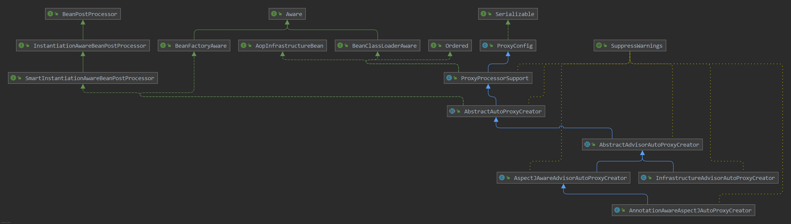

# Spring AOP体系源码

在spring中我们知道 `AOP` 切面是对事务、动态代理等功能增强的实现，现在我们就看看spring中是如何扫描并且创建出对应的代理对象并且添加切面的

 ## 1. 扫描器

下面三个扫描器，是在spring启动时根据是否开启 AOP、事务等功能时会自动注入类，根据优先级来进行注入

- InfrastructureAdvisorAutoProxyCreator：事务自动扫描器
- AspectJAwareAdvisorAutoProxyCreator：动态织入自动扫描器
- AnnotationAwareAspectJAutoProxyCreator：注解自动扫描器

其中继承体系，**AnnotationAwareAspectJAutoProxyCreator** 注解扫描器是等级最低的扫描器，它们都继承自 **AbstractAutoProxyCreator** 类

