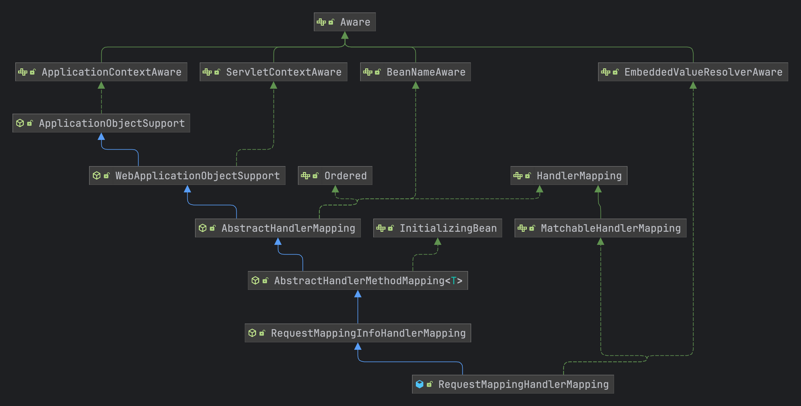
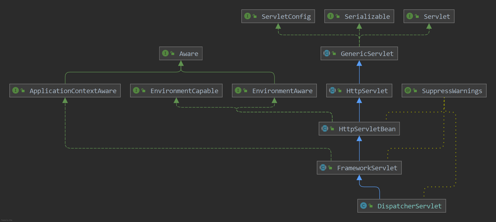

# Spring MVC源码流程

## 1. Spring Boot如何挂在DispatcherServlet？

在 **Springboot** 启动时我们都知道内部内置了一个 **tomcat** 的容器，然后将 **DispatcherServlet** 挂载到了容器的内部从而实现了 **Spring MVC** 机制，下面的链接说明了如何将 **DispatcherServlet** 挂载到了 **Spring Boot** 中

[SpringBoot如何挂载DispatcherServlet](https://blog.csdn.net/weixin_43915643/article/details/125421616)


## 2. WebMvcConfigurationSupport

spring mvc的配置类 **@EnableWebMvc** 注解会导入的配置类，用于注入spring mvc中的一些核心的配置类，其中有的一些核心配置方法如下：

- requestMappingHandlerMapping：用于创建 **RequestMappingHandlerMapping** 用于处理 **@RequestMapping** 注解的类
- mvcPatternParser：创建 **PathPatternParser** 路径表达式解析器
- mvcUrlPathHelper：创建 **UrlPathHelper** url路径解析器，用于解析http请求的路径
- mvcPathMatcher：创建 **PathMatcher** 路径匹配器
- viewControllerHandlerMapping：用于创建视图控制器的方法，创建的类为 **SimpleUrlHandlerMapping**
- requestMappingHandlerAdapter：创建处理器的适配器，比较重要 **RequestMappingHandlerAdapter**
- httpRequestHandlerAdapter：http请求的处理器适配器，**HttpRequestHandlerAdapter**


## 3. RequestMappingHandlerMapping

请求映射器的处理器，用于解析 @RequestMapping 注解，将对应的controller中的方法解析成对应的 **HandlerMethod**



### 3.1 AbstractHandlerMethodMapping

继承的核心方法主要是在 **AbstractHandlerMethodMapping** 中的 **afterPropertiesSet()** 方法中进行初始化处理，因为实现了 **InitializingBean** 接口，所以容器启动时就会进行初始化的解析

```java
@Override
	public void afterPropertiesSet() {
		//调用初始化 handler方法，RequestMappingHandlerMapping子类将这个方法进行覆写了，只在里面配置相关配置信息，然后调用父类
		initHandlerMethods();
	}
```

从spring容器中会获取到所有的bean对象

```java
protected void initHandlerMethods() {
		//获取到spring容器中所有的bean的名称
		for (String beanName : getCandidateBeanNames()) {
			//这里判断了一下bean的名称是否是 scopedTarget. 开头的，如果是的话，就不处理了，因为这个是spring内部使用的
			if (!beanName.startsWith(SCOPED_TARGET_NAME_PREFIX)) {
				//处理Bean对象
				processCandidateBean(beanName);
			}
		}
		handlerMethodsInitialized(getHandlerMethods());
	}
```

处理的方法主要的步骤是

- 先调用子类实现的方法 **isHandler()** 方法判断是否是需要处理的类，这里是 **RequestMappingHandlerMapping**进行实现的方法
- 将所有的方法中所有标识了 **@RequestMapping** 注解的方法全部解析为 **RequestMappingInfo** 类
- 最后将对应的关系，目标类、执行的方法、映射的配置类（RequestMappingInfo）注册到 **MappingRegistry** 中

```java
protected void processCandidateBean(String beanName) {
		Class<?> beanType = null;
		try {
			//通过spring容器获取到bean的类型
			beanType = obtainApplicationContext().getType(beanName);
		}
		catch (Throwable ex) {
			// An unresolvable bean type, probably from a lazy bean - let's ignore it.
			if (logger.isTraceEnabled()) {
				logger.trace("Could not resolve type for bean '" + beanName + "'", ex);
			}
		}
		//判断bean对象是否有 RequestMapping或者Controller注解
		if (beanType != null && isHandler(beanType)) {
			//处理 mvc请求类的方法
			detectHandlerMethods(beanName);
		}
	}
```

```java
protected void detectHandlerMethods(Object handler) {
		//获取到处理bean的类型
		Class<?> handlerType = (handler instanceof String ?
				obtainApplicationContext().getType((String) handler) : handler.getClass());

		if (handlerType != null) {
			Class<?> userType = ClassUtils.getUserClass(handlerType);
			//将所有的方法都解析为 RequestMappingInfo 类型
			Map<Method, T> methods = MethodIntrospector.selectMethods(userType,
					(MethodIntrospector.MetadataLookup<T>) method -> {
						try {
							//将method方法对象转换为 T 的泛型对象，是由 RequestMappingHandlerMapping实现所以T是RequestMappingInfo类型
							return getMappingForMethod(method, userType);
						}
						catch (Throwable ex) {
							throw new IllegalStateException("Invalid mapping on handler class [" +
									userType.getName() + "]: " + method, ex);
						}
					});
			if (logger.isTraceEnabled()) {
				logger.trace(formatMappings(userType, methods));
			}
			else if (mappingsLogger.isDebugEnabled()) {
				mappingsLogger.debug(formatMappings(userType, methods));
			}
			methods.forEach((method, mapping) -> {
				//将方法对象转换为可执行的方法对象
				Method invocableMethod = AopUtils.selectInvocableMethod(method, userType);
				//将bean和执行方法以及 RequestMappingInfo对象注册到mappingRegistry中，进行关联起来
				registerHandlerMethod(handler, invocableMethod, mapping);
			});
		}
	}
```

### 3.2 MappingRegistry

- 先将类和方法创建一个 **HandlerMethod** 关联类
- 存入到缓存中的是 **RequestMappingInfo** 作为key，value值创建一个 **MappingRegistration** 对象，里面保存了映射的路径、目标的对象等信息

```java
public void register(T mapping, Object handler, Method method) {
			this.readWriteLock.writeLock().lock();
			try {
				HandlerMethod handlerMethod = createHandlerMethod(handler, method);
				validateMethodMapping(handlerMethod, mapping);

				Set<String> directPaths = AbstractHandlerMethodMapping.this.getDirectPaths(mapping);
				for (String path : directPaths) {
					this.pathLookup.add(path, mapping);
				}

				String name = null;
				if (getNamingStrategy() != null) {
					name = getNamingStrategy().getName(handlerMethod, mapping);
					addMappingName(name, handlerMethod);
				}
				/**
				 * 处理 @CrossOrigin 注解，将注解构建成为 CorsConfiguration 配置对象
				 * 先获取到类上面的 @CrossOrigin 注解，在获取到方法上面的 @CrossOrigin 注解
				 */
				CorsConfiguration corsConfig = initCorsConfiguration(handler, method, mapping);
				if (corsConfig != null) {
					corsConfig.validateAllowCredentials();
					this.corsLookup.put(handlerMethod, corsConfig);
				}

				this.registry.put(mapping,
						new MappingRegistration<>(mapping, handlerMethod, directPaths, name, corsConfig != null));
			}
			finally {
				this.readWriteLock.writeLock().unlock();
			}
		}
```


## 2. DispatcherServlet

下面就是 **DispatcherServlet** 的继承图，从 **HttpServlet** 截至到上面部分都是 **Javax.servlet.http** 所提供的功能，而 **HttpServletBean** 开始就是 **spring** 实现的功能



DispatcherServlet比较核心的属性有以下：

- MultipartResolver：文件的解析器
- LocaleResolver：国际化的解析器
- ThemeResolver：主题解析器
- **HandlerMapping**：处理器映射器，从容器中获取出的 **List** 

### 2.1 init()

在 tomcat 启动时并不会去对 **DispatcherServlet** 进行初始化，而是会在 **tomcat** 接收到请求时，如果 **Dispatcher** 还没有被初始化时，这是就会调用 **DispatcherServlet** 的 **init()** 方法进行初始化。初始化方法 **init()** 定义在 **GenericServlet** 中，交给子类进行实现，实际实现类是 **HttpServletBean** 类中对其进行实现

```java
public final void init() throws ServletException {

		//设置Servlet的配置属性
		PropertyValues pvs = new ServletConfigPropertyValues(getServletConfig(), this.requiredProperties);
		//判断配置属性是否是空的
		if (!pvs.isEmpty()) {
			try {
				//将当前HttpServletBean创建一个 BeanWrapperImpl包装实现类
				BeanWrapper bw = PropertyAccessorFactory.forBeanPropertyAccess(this);
				//获取到资源加载器
				ResourceLoader resourceLoader = new ServletContextResourceLoader(getServletContext());
				//注册自定义编辑器
				bw.registerCustomEditor(Resource.class, new ResourceEditor(resourceLoader, getEnvironment()));
				//初始化
				initBeanWrapper(bw);
				//注入配置信息
				bw.setPropertyValues(pvs, true);
			}
			catch (BeansException ex) {
				if (logger.isErrorEnabled()) {
					logger.error("Failed to set bean properties on servlet '" + getServletName() + "'", ex);
				}
				throw ex;
			}
		}
		//初始化DispatcherServlet，将所有请求的方法和适配器类初始化出来
		initServletBean();
	}
```

### 2.2 initServletBean()

**initServletBean() 方法交给子类来进行实现**

```java
protected void initServletBean() throws ServletException {
}
```

实际实现的类是 **FrameworkServlet.initServletBean()** 进行初始化，然后调用 **initWebApplicationContext()** 继续交给子类进行实现

```java
protected final void initServletBean() throws ServletException {
		try {
			//初始化web应用的上下文
			this.webApplicationContext = initWebApplicationContext();
			initFrameworkServlet();
		}
		catch (ServletException | RuntimeException ex) {
			logger.error("Context initialization failed", ex);
			throw ex;
		}
	}
```

### 2.3 initWebApplicationContext()

**initWebApplicationContext() ** 方法调用 **onRefresh()** 进行初始化

```java
protected WebApplicationContext initWebApplicationContext() {
		WebApplicationContext rootContext =
				WebApplicationContextUtils.getWebApplicationContext(getServletContext());
		WebApplicationContext wac = null;

		if (this.webApplicationContext != null) {
			// A context instance was injected at construction time -> use it
			wac = this.webApplicationContext;
			if (wac instanceof ConfigurableWebApplicationContext) {
				ConfigurableWebApplicationContext cwac = (ConfigurableWebApplicationContext) wac;
				if (!cwac.isActive()) {
					// The context has not yet been refreshed -> provide services such as
					// setting the parent context, setting the application context id, etc
					if (cwac.getParent() == null) {
						// The context instance was injected without an explicit parent -> set
						// the root application context (if any; may be null) as the parent
						cwac.setParent(rootContext);
					}
					configureAndRefreshWebApplicationContext(cwac);
				}
			}
		}
		if (wac == null) {
			// No context instance was injected at construction time -> see if one
			// has been registered in the servlet context. If one exists, it is assumed
			// that the parent context (if any) has already been set and that the
			// user has performed any initialization such as setting the context id
			wac = findWebApplicationContext();
		}
		if (wac == null) {
			// No context instance is defined for this servlet -> create a local one
			wac = createWebApplicationContext(rootContext);
		}

		if (!this.refreshEventReceived) {
			// Either the context is not a ConfigurableApplicationContext with refresh
			// support or the context injected at construction time had already been
			// refreshed -> trigger initial onRefresh manually here.
			synchronized (this.onRefreshMonitor) {
				onRefresh(wac);
			}
		}
		if (this.publishContext) {
			// Publish the context as a servlet context attribute.
			String attrName = getServletContextAttributeName();
			getServletContext().setAttribute(attrName, wac);
		}
		return wac;
	}
```

### 2.4 onRefresh()

**onRefresh** 方法交给子类进行实现，具体的子类是 **DispatcherServlet** 类，也是核心类

```java
protected void onRefresh(ApplicationContext context) {
  initStrategies(context);
}
```

### 2.5 initStrategies()

```java
/**
	 * WebMvcConfigurationSupport：给容器中添加了很多的组件，
	 * 	例如：RequestMappingHandlerMapping 用于处理@RequestMapping 注解的类，RequestMappingHandlerAdapter处理器适配器，SimpleUrlHandlerMapping
	 * 	处理静态资源（通过WebMvcConfigurer进行注册静态资源的处理路径）
	 *
	 * @EnableWebMvc：注解导入了 DelegatingWebMvcConfiguration 它继承至 WebMvcConfigurationSupport，其中通过自动注入注入了所有的 WebMvcConfigurer 实现类
	 */
	protected void initStrategies(ApplicationContext context) {
		//初始化多部分文件解析器，请求头中是否有 multipart/form-data 属性，文件上传
		initMultipartResolver(context);
		//初始化本地化解析器
		initLocaleResolver(context);
		//初始化主题解析器
		initThemeResolver(context);
		/**
		 * 初始化处理器映射器，获取到容器中所有 HandlerMapping 实现类
		 * 配置时只需要配置 AbstractHandlerMethodMapping 的实现类就可以自动扫描出所有的 @RequestMapping 的类到容器中
		 * AbstractHandlerMethodMapping：实现了 InitializingBean 接口会调用 afterPropertiesSet() 去容器中获取到所有的bean对象，
		 * 								然后进行判断bean对象@Controller注解或者@RequestMapping注解，然后获取到其中的方法中含有
		 * 								注解@RequestMapping的方法，将其注册到内部的 MappingRegistry容器中
		 */
		initHandlerMappings(context);
		/**
		 * 初始化处理器是配置，接口类型是 HandlerAdapter 接口
		 * 使用的实现类：RequestMappingHandlerAdapter；其中会处理 @ControllerAdvice注解
		 */
		initHandlerAdapters(context);
		/**
		 * 从spring中获取到所有的异常处理器，然后将其注册到容器中
		 * HandlerExceptionResolver：
		 * 	ExceptionHandlerExceptionResolver.afterPropertiesSet() 中取读取到 @ControllerAdvice 注解的类
		 * 	然后通过ExceptionHandlerMethodResolver 处理@ExceptionHandler，进行异常方法的映射
		 * 	对于异常的执行来说是通过 DispatcherServlet.processDispatchResult() 中进行处理的
		 */
		initHandlerExceptionResolvers(context);
		//请求视图名称转换器
		initRequestToViewNameTranslator(context);
		//视图解析器
		initViewResolvers(context);
		//初始化缓存管理器
		initFlashMapManager(context);
	}s
```

