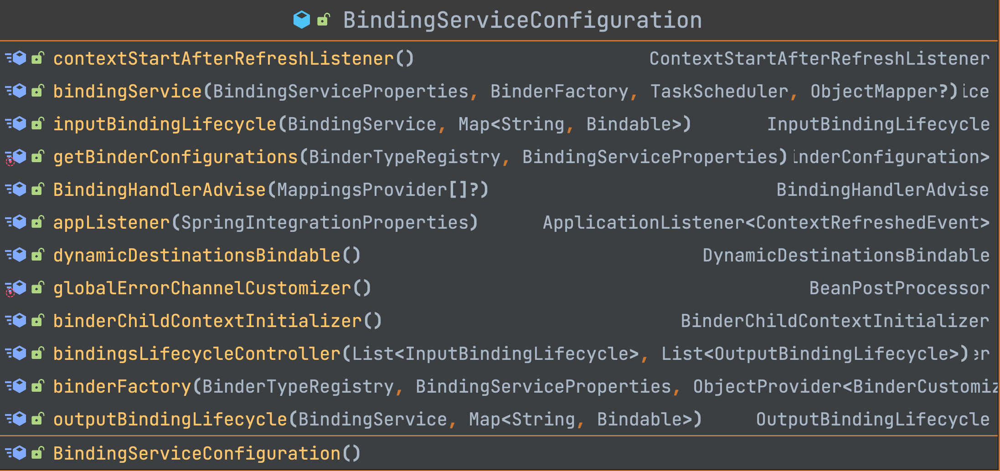
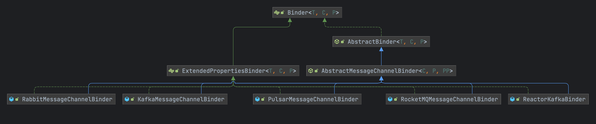

# Spring Cloud Stream

## 一、简介

spring cloud stream是spring cloud抽象出来用于屏蔽各种中间件的对接而提供的组件,使用者只需要掌握spring cloud stream的配置信息就可以实现各种消息中间件的使用.目前主流的中间件如下:

- rabbitmq
- rocketmq
- kafka
- activemq

> [spring cloud stream官方使用文档](https://docs.spring.io/spring-cloud-stream/docs/current/reference/html/spring-cloud-stream.html#spring-cloud-stream-preface-notable-deprecations)

官方所提供的架构图


spring cloud stream抽象出了几个比较核心的组件

- Binder:绑定器,通过各个中间件提供商来进行实现,屏蔽了不同中间的不同实现
- Binding:用于绑定容器的生产者和消费者
- Input:输入流,用于对应消费者
- Output:输出流,用于对应生产者

## 二、实战

[SpringCloud之Stream消息驱动RocketMQ讲解_spring cloud stream rocketmq-CSDN博客](https://blog.csdn.net/u012060033/article/details/131271733)

### 1. rocketmq

**spring-cloud-starter-stream-rocketmq** 实现了 rocketmq和spring cloud stream的集成

#### 配置

```yaml
spring:
  cloud:
    stream:
      function:
        definition: producer;consumer;
      rocketmq:
        binder:
          name-server: rocketmq.server:9876
        bindings:
          producer-out-0:
            producer:
              group: atom-demo-producer
          consumer-in-0:
            consumer:
              group: atom-demo-consumer
      bindings:
        producer-out-0: #输出到对应到topic名称为 atom-demo-topic，内容为json
          destination: atom-demo-topic
          content-type: application/json
        consumer-in-0: #构建消费者
          destination: atom-demo-topic
          content-type: text/plain
  application:
    name: atom-mq-spring-boot-sample
server:
  port: 8900
```

#### 依赖

- jdk17
- spring cloud alibaba:2023.0.0.0-RC1
- spring cloud stream:4.1.0

```xml
<dependency>
    <groupId>com.alibaba.cloud</groupId>
    <artifactId>spring-cloud-starter-stream-rocketmq</artifactId>
    <version>2023.0.0.0-RC1</version>
</dependency>
```


#### 代码

生产者

```java
@SpringBootApplication
public class RocketmqApplication {

    @Resource
    private StreamBridge streamBridge;

    /**
     * After
     *
     * @since 2024.2.0
     */
    protected void after() {
        Message<String> message = new GenericMessage<>("hello world");
        //跟配置文件中的生产者名称需要对应上
        this.streamBridge.send("producer-out-0", message);
    }
}
```

消费者

消费者的名称需要跟配置文件中的 **spring.cloud.stream.function.definition** 对应上

```java
@Configuration
public class AtomConsumerConfiguration {


    /**
     * Receive input
     *
     * @return the consumer
     * @since 2024.2.0
     */
    @Bean
    public Consumer<Message<String>> consumer() {
        return message -> System.out.println("接收到消息：" + message.getPayload());
    }

}
```

## 三、源码

### 1. 自动装配

**spring cloud stream** 作为顶级依赖,定义了基础接口类供后续各种中间件的实现以及无缝衔接,在通过自动装配类来跟 **spring boot** 进行自动绑定生产者和消费者,**spring cloud stream** 定义的比较核心的自动装配类如下

- BindingServiceProperties:消息生产者和消费者的配置类
- BindingServiceConfiguration:绑定服务自动装配(核心)
- BinderFactoryAutoConfiguration:绑定器需要的一些工厂类自动装配类


#### 1.1 BinderFactoryAutoConfiguration


#### 1.2 BindingServiceConfiguration




### 2. Binder

**Binder** 通过spring cloud stream抽象为中间件跟spring cloud的连接器,通过各个中间件厂商来进行分别实现,下面 **Binder** 的依赖关系图可以看到 **rocketmq、kafka、rabbitmq** 等都实现了自己中间件的 **Binder** 绑定器

